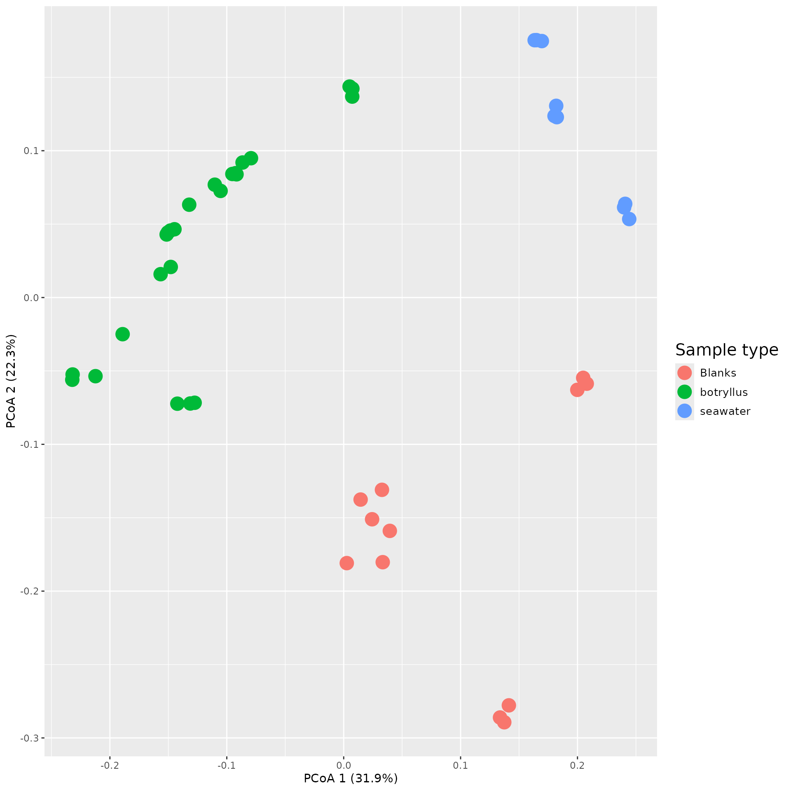
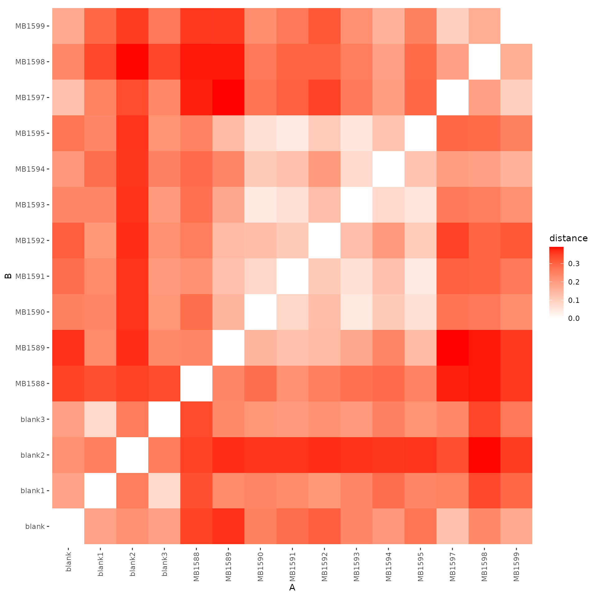
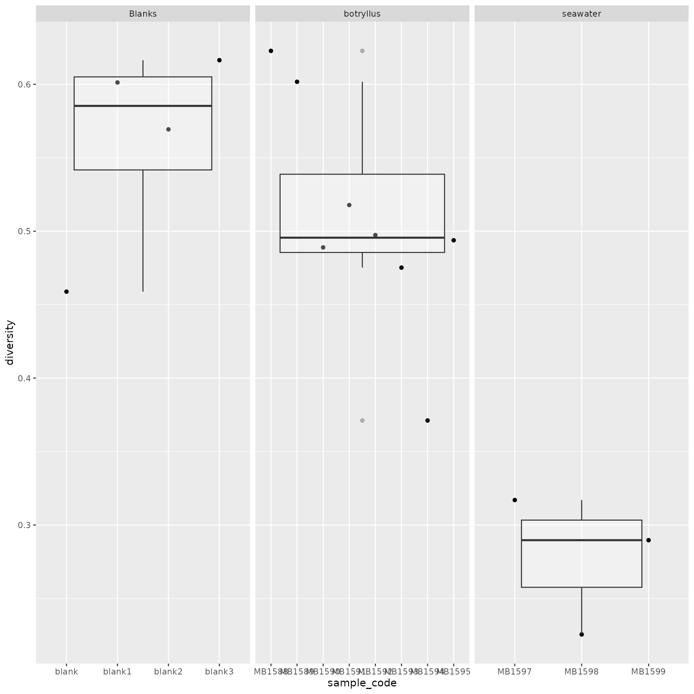

# mums2

The mums2 package is designed to provide researchers with tools to
analyze untargeted metabolomics data generated using tandem mass
spectroscopy from microbial communities. The overall approach taken to
analyze metabolomics data parallels that used to analyze microbial
communities using 16S rRNA gene sequencing data. To showcase how this,
we will be using a previously published database that analyzed the
metabolome of [Botryllus
Schlosseri](https://doi.org/10.1128/msystems.00793-25).

``` r
library(mums2)
library(ggplot2)
library(mpactr)
library(networkD3)
library(reshape2)
```

## Process data

Before we begin to analyze your data, we have to process it into a
readable `data.frame` or object that we can view and transform. To
process your data we need to run a two functions:
[`import_all_data()`](https://www.mums2.org/mums2/reference/import_all_data.md),
and
[`ms2_ms1_compare()`](https://www.mums2.org/mums2/reference/ms2_ms1_compare.md).
[`import_all_data()`](https://www.mums2.org/mums2/reference/import_all_data.md)
creates an object reflecting MS1 data, and
[`ms2_ms1_compare()`](https://www.mums2.org/mums2/reference/ms2_ms1_compare.md)
assigns MS2 spectra to your MS1 data. At this point, you may need to
filter out noise, or transform it before you can properly analyze it. To
accommodate for those issues, we have two other functions:
[`filter_peak_table()`](https://www.mums2.org/mums2/reference/filter_peak_table.md),
[`change_rt_to_seconds_or_minute()`](https://www.mums2.org/mums2/reference/change_rt_to_seconds_or_minute.md).
[`filter_peak_table()`](https://www.mums2.org/mums2/reference/filter_peak_table.md)
allows your to remove low-quality features and
[`change_rt_to_seconds_or_minute()`](https://www.mums2.org/mums2/reference/change_rt_to_seconds_or_minute.md)
allows you to transform your retention time to minutes or seconds. This
allows you to ensure your MS1 data retention time matches your MS2 data
retention time. Below will explain in more detail what each function
does and how to go through the pipeline.

### Import

The
[`import_all_data()`](https://www.mums2.org/mums2/reference/import_all_data.md)
function takes in a peak_table and meta_data tables as input and
converts them into a `mpactr` object (its a wrapper for
[`mpactr::import_data()`](https://www.mums2.org/mpactr/reference/import_data.html)).
The format parameter accepts three different formats: Metaboscape,
Progenesis, and None. You can read up more about each of the formats
here([`mpactr::import_data()`](https://www.mums2.org/mpactr/reference/import_data.html)).
If you need a deeper understanding of what format the peak_table and
meta_data file should be in, take a look at mpactr’s [getting started
page](https://www.mums2.org/mpactr/articles/mpactr.html).

Meta_data is a csv that provides information about the samples. In order
for your meta_data to be valid, it needs the following columns:
“Injection”, “Sample_Code”, ” Biological_Group.” The “Injection” column
is the name of the samples, it should match the samples inside of the
peak_table. “Sample_Code” is the id for you technical replicates.
Finally, “Biological_Group” is another id, but for your biological
replicate groups (you can learn more here
[`mpactr::import_data()`](https://www.mums2.org/mpactr/reference/import_data.html)).

``` r
data <- import_all_data(
  peak_table = mums2::mums2_example("230112_botryllus_peaktable.csv"), 
  meta_data = mums2::mums2_example("meta_data_boryillus.csv"), 
  format = "Progenesis")
#> If peak table has corrupted compound names they will be converted to
#>       utf-8 and if there are any commas, they will be converted to periods(.).
```

#### Peak Table

Below is the expected format for a progenesis peak table. It contains
samples as columns and features as rows. The feature intensities are
expected to be un-normalized.

``` r
read.csv(mums2::mums2_example("230112_botryllus_peaktable.csv"), check.names = FALSE)
#>            Raw abundance                                                      
#>                       
#>  [ reached 'max' / getOption("max.print") -- omitted 8 columns ]
#>  [ reached 'max' / getOption("max.print") -- omitted 12824 rows ]
```

#### Metadata

The expected format for metadata is below. The metadata file needs to
contain at minimum columns for “Injection”, “Sample_Code”, and ”
Biological_Group.”

``` r
read.csv(mums2::mums2_example("meta_data_boryillus.csv"), check.names = FALSE)
#>                   Injection File Text Sample_Notes MS method LC method
#> 1 221012_DGM_Blank1_1_1_390        NA           NA        NA        NA
#> 2 221012_DGM_Blank1_1_2_391        NA           NA        NA        NA
#> 3 221012_DGM_Blank1_1_3_392        NA           NA        NA        NA
#> 4 221012_DGM_MB1588_3_1_395        NA           NA        NA        NA
#>   Vial_Position Injection volume Sample_Code Biological_Group
#> 1            NA                2       blank           Blanks
#> 2            NA                2       blank           Blanks
#> 3            NA                2       blank           Blanks
#> 4            NA                2      MB1588        botryllus
#>  [ reached 'max' / getOption("max.print") -- omitted 41 rows ]
```

### Filter

After importing the data, you can use functions from mpactR to filter
the data. There are four different filters included in mpactR:
[`mpactr::filter_mispicked_ions()`](https://www.mums2.org/mpactr/reference/filter_mispicked_ions.html),
[`mpactr::filter_group()`](https://www.mums2.org/mpactr/reference/filter_group.html),
[`mpactr::filter_cv()`](https://www.mums2.org/mpactr/reference/filter_cv.html),
and
[`mpactr::filter_insource_ions()`](https://www.mums2.org/mpactr/reference/filter_insource_ions.html)
(You can find more information on
[mpactR’s](https://www.mums2.org/mpactr/) website). Although data
fitlering is not required, it will help reduce noise and correct peak
selection errors, which will also speed up the analysis.

``` r
filtered_data <- data |>
  filter_peak_table(filter_mispicked_ions_params()) |>
  filter_peak_table(filter_cv_params(cv_threshold = 0.2)) |>
  filter_peak_table(filter_group_params(group_threshold = 0.1,
                                            "Blanks")) |>
  filter_peak_table(filter_insource_ions_params())
#> ℹ Checking 12822 peaks for mispicked peaks.
#> ℹ Argument merge_peaks is: TRUE. Merging mispicked peaks with method sum.
#> ✔ 2429 ions failed the mispicked filter, 10393 ions remain.
#> ℹ Parsing 10393 peaks for replicability across technical replicates.
#> ✔ 2229 ions failed the cv_filter filter, 8164 ions remain.
#> ℹ Parsing 8164 peaks based on the sample group: Blanks.
#> ℹ Argument remove_ions is: TRUE.Removing peaks from Blanks.
#> ✔ 2538 ions failed the Blanks filter, 5626 ions remain.
#> ℹ Parsing 5626 peaks for insource ions.
#> ✔ 1082 ions failed the insource filter, 4544 ions remain.

head(get_peak_table(filtered_data), 3)
#> Key: <Compound, mz, kmd, rt>
#>                  Compound       mz     kmd    rt 221012_DGM_Blank1_1_1_390
#>                    <char>    <num>   <num> <num>                     <num>
#> 1: 1000.05311 Da 399.15 s 1001.060 0.06039  6.65                         0
#> 2: 1000.20067 Da 536.14 s 1001.208 0.20795  8.94                         0
#> 3: 1000.54504 Da 353.23 s 1023.534 0.53397  5.89                         0
#>    221012_DGM_Blank1_1_2_391 221012_DGM_Blank1_1_3_392
#>                        <num>                     <num>
#> 1:                         0                         0
#> 2:                         0                         0
#> 3:                         0                         0
#>    221012_DGM_Blank2_1_1_404 221012_DGM_Blank2_1_2_405
#>                        <num>                     <num>
#> 1:                         0                         0
#> 2:                         0                         0
#> 3:                         0                         0
#>    221012_DGM_Blank2_1_3_406 221012_DGM_Blank3_1_1_419
#>                        <num>                     <num>
#> 1:                         0                         0
#> 2:                         0                         0
#> 3:                         0                         0
#>    221012_DGM_Blank3_1_2_420 221012_DGM_Blank3_1_3_421
#>                        <num>                     <num>
#> 1:                         0                         0
#> 2:                         0                         0
#> 3:                         0                         0
#>    221012_DGM_Blank4_1_1_434 221012_DGM_Blank4_1_2_435
#>                        <num>                     <num>
#> 1:                         0                         0
#> 2:                         0                         0
#> 3:                         0                         0
#>    221012_DGM_Blank4_1_3_436 221012_DGM_MB1588_3_1_395
#>                        <num>                     <num>
#> 1:                         0                      0.00
#> 2:                         0                  13693.07
#> 3:                         0                      0.00
#>    221012_DGM_MB1588_3_2_396 221012_DGM_MB1588_3_3_397
#>                        <num>                     <num>
#> 1:                      0.00                      0.00
#> 2:                  16856.57                  16332.37
#> 3:                      0.00                      0.00
#>    221012_DGM_MB1589_4_1_398 221012_DGM_MB1589_4_2_399
#>                        <num>                     <num>
#> 1:                         0                         0
#> 2:                         0                         0
#> 3:                         0                         0
#>    221012_DGM_MB1589_4_3_400 221012_DGM_MB1590_5_1_401
#>                        <num>                     <num>
#> 1:                         0                         0
#> 2:                         0                         0
#> 3:                         0                         0
#>    221012_DGM_MB1590_5_2_402 221012_DGM_MB1590_5_3_403
#>                        <num>                     <num>
#> 1:                         0                         0
#> 2:                         0                         0
#> 3:                         0                         0
#>    221012_DGM_MB1591_6_1_407 221012_DGM_MB1591_6_2_408
#>                        <num>                     <num>
#> 1:                         0                         0
#> 2:                         0                         0
#> 3:                         0                         0
#>    221012_DGM_MB1591_6_3_409 221012_DGM_MB1592_7_1_410
#>                        <num>                     <num>
#> 1:                         0                         0
#> 2:                         0                         0
#> 3:                         0                         0
#>    221012_DGM_MB1592_7_2_411 221012_DGM_MB1592_7_3_412
#>                        <num>                     <num>
#> 1:                         0                         0
#> 2:                         0                         0
#> 3:                         0                         0
#>    221012_DGM_MB1593_8_1_413 221012_DGM_MB1593_8_2_414
#>                        <num>                     <num>
#> 1:                         0                         0
#> 2:                         0                         0
#> 3:                         0                         0
#>    221012_DGM_MB1593_8_3_415 221012_DGM_MB1594_9_1_416
#>                        <num>                     <num>
#> 1:                         0                         0
#> 2:                         0                         0
#> 3:                         0                         0
#>    221012_DGM_MB1594_9_2_417 221012_DGM_MB1594_9_3_418
#>                        <num>                     <num>
#> 1:                         0                         0
#> 2:                         0                         0
#> 3:                         0                         0
#>    221012_DGM_MB1595_10_1_422 221012_DGM_MB1595_10_2_423
#>                         <num>                      <num>
#> 1:                          0                          0
#> 2:                          0                          0
#> 3:                          0                          0
#>    221012_DGM_MB1595_10_3_424 221012_DGM_MB1597_11_1_425
#>                         <num>                      <num>
#> 1:                          0                   15105.36
#> 2:                          0                       0.00
#> 3:                          0                  168557.48
#>    221012_DGM_MB1597_11_2_426 221012_DGM_MB1597_11_3_427
#>                         <num>                      <num>
#> 1:                   13140.04                   17551.49
#> 2:                       0.00                       0.00
#> 3:                  176505.77                  160923.45
#>    221012_DGM_MB1598_12_1_428 221012_DGM_MB1598_12_2_429
#>                         <num>                      <num>
#> 1:                          0                          0
#> 2:                          0                          0
#> 3:                          0                          0
#>    221012_DGM_MB1598_12_3_430 221012_DGM_MB1599_13_1_431
#>                         <num>                      <num>
#> 1:                          0                   13573.71
#> 2:                          0                       0.00
#> 3:                          0                  153978.06
#>    221012_DGM_MB1599_13_2_432 221012_DGM_MB1599_13_3_433    cor
#>                         <num>                      <num> <lgcl>
#> 1:                   13245.09                   13221.95   TRUE
#> 2:                       0.00                       0.00   TRUE
#> 3:                  158672.23                  165991.44   TRUE
```

### Convert from rt to “rt in minutes” or “rt in seconds”

Sometimes a MS2 file will report the retention time in minutes but the
MS1 file will use seconds. This mismatch will cause the MS1 data to
match incorrect peaks in the MS2 data. The
[`change_rt_to_seconds_or_minute()`](https://www.mums2.org/mums2/reference/change_rt_to_seconds_or_minute.md)
function allows users to synthesize data with different units. Be aware
that this function modifies the mpactr object in place. Therefore, you
will need to call the function again to revert the units. Below will
display a vector of retention time.

``` r
get_peak_table(filtered_data)$rt
#>  [1]  6.65  8.94  5.89  6.86  6.98  5.91 10.07  7.35  6.91  6.67  6.68  7.38
#> [13]  5.81  4.79  7.48
#>  [ reached 'max' / getOption("max.print") -- omitted 4529 entries ]
```

``` r

filtered_data <- change_rt_to_seconds_or_minute(mpactr_object = filtered_data, rt_type = "seconds")
#> [1] "Changing rt values to seconds"
head(get_peak_table(filtered_data), 1)
#> Key: <Compound, mz, kmd, RTINSECONDS>
#>                  Compound      mz     kmd RTINSECONDS 221012_DGM_Blank1_1_1_390
#>                    <char>   <num>   <num>       <num>                     <num>
#> 1: 1000.05311 Da 399.15 s 1001.06 0.06039         399                         0
#>    221012_DGM_Blank1_1_2_391 221012_DGM_Blank1_1_3_392
#>                        <num>                     <num>
#> 1:                         0                         0
#>    221012_DGM_Blank2_1_1_404 221012_DGM_Blank2_1_2_405
#>                        <num>                     <num>
#> 1:                         0                         0
#>    221012_DGM_Blank2_1_3_406 221012_DGM_Blank3_1_1_419
#>                        <num>                     <num>
#> 1:                         0                         0
#>    221012_DGM_Blank3_1_2_420 221012_DGM_Blank3_1_3_421
#>                        <num>                     <num>
#> 1:                         0                         0
#>    221012_DGM_Blank4_1_1_434 221012_DGM_Blank4_1_2_435
#>                        <num>                     <num>
#> 1:                         0                         0
#>    221012_DGM_Blank4_1_3_436 221012_DGM_MB1588_3_1_395
#>                        <num>                     <num>
#> 1:                         0                         0
#>    221012_DGM_MB1588_3_2_396 221012_DGM_MB1588_3_3_397
#>                        <num>                     <num>
#> 1:                         0                         0
#>    221012_DGM_MB1589_4_1_398 221012_DGM_MB1589_4_2_399
#>                        <num>                     <num>
#> 1:                         0                         0
#>    221012_DGM_MB1589_4_3_400 221012_DGM_MB1590_5_1_401
#>                        <num>                     <num>
#> 1:                         0                         0
#>    221012_DGM_MB1590_5_2_402 221012_DGM_MB1590_5_3_403
#>                        <num>                     <num>
#> 1:                         0                         0
#>    221012_DGM_MB1591_6_1_407 221012_DGM_MB1591_6_2_408
#>                        <num>                     <num>
#> 1:                         0                         0
#>    221012_DGM_MB1591_6_3_409 221012_DGM_MB1592_7_1_410
#>                        <num>                     <num>
#> 1:                         0                         0
#>    221012_DGM_MB1592_7_2_411 221012_DGM_MB1592_7_3_412
#>                        <num>                     <num>
#> 1:                         0                         0
#>    221012_DGM_MB1593_8_1_413 221012_DGM_MB1593_8_2_414
#>                        <num>                     <num>
#> 1:                         0                         0
#>    221012_DGM_MB1593_8_3_415 221012_DGM_MB1594_9_1_416
#>                        <num>                     <num>
#> 1:                         0                         0
#>    221012_DGM_MB1594_9_2_417 221012_DGM_MB1594_9_3_418
#>                        <num>                     <num>
#> 1:                         0                         0
#>    221012_DGM_MB1595_10_1_422 221012_DGM_MB1595_10_2_423
#>                         <num>                      <num>
#> 1:                          0                          0
#>    221012_DGM_MB1595_10_3_424 221012_DGM_MB1597_11_1_425
#>                         <num>                      <num>
#> 1:                          0                   15105.36
#>    221012_DGM_MB1597_11_2_426 221012_DGM_MB1597_11_3_427
#>                         <num>                      <num>
#> 1:                   13140.04                   17551.49
#>    221012_DGM_MB1598_12_1_428 221012_DGM_MB1598_12_2_429
#>                         <num>                      <num>
#> 1:                          0                          0
#>    221012_DGM_MB1598_12_3_430 221012_DGM_MB1599_13_1_431
#>                         <num>                      <num>
#> 1:                          0                   13573.71
#>    221012_DGM_MB1599_13_2_432 221012_DGM_MB1599_13_3_433    cor
#>                         <num>                      <num> <lgcl>
#> 1:                   13245.09                   13221.95   TRUE

filtered_data <- change_rt_to_seconds_or_minute(mpactr_object = filtered_data, rt_type = "minutes")
#> [1] "Changing rt values to minutes"
head(get_peak_table(filtered_data), 1)
#> Key: <Compound, mz, kmd, RTINMINUTES>
#>                  Compound      mz     kmd RTINMINUTES 221012_DGM_Blank1_1_1_390
#>                    <char>   <num>   <num>       <num>                     <num>
#> 1: 1000.05311 Da 399.15 s 1001.06 0.06039        6.65                         0
#>    221012_DGM_Blank1_1_2_391 221012_DGM_Blank1_1_3_392
#>                        <num>                     <num>
#> 1:                         0                         0
#>    221012_DGM_Blank2_1_1_404 221012_DGM_Blank2_1_2_405
#>                        <num>                     <num>
#> 1:                         0                         0
#>    221012_DGM_Blank2_1_3_406 221012_DGM_Blank3_1_1_419
#>                        <num>                     <num>
#> 1:                         0                         0
#>    221012_DGM_Blank3_1_2_420 221012_DGM_Blank3_1_3_421
#>                        <num>                     <num>
#> 1:                         0                         0
#>    221012_DGM_Blank4_1_1_434 221012_DGM_Blank4_1_2_435
#>                        <num>                     <num>
#> 1:                         0                         0
#>    221012_DGM_Blank4_1_3_436 221012_DGM_MB1588_3_1_395
#>                        <num>                     <num>
#> 1:                         0                         0
#>    221012_DGM_MB1588_3_2_396 221012_DGM_MB1588_3_3_397
#>                        <num>                     <num>
#> 1:                         0                         0
#>    221012_DGM_MB1589_4_1_398 221012_DGM_MB1589_4_2_399
#>                        <num>                     <num>
#> 1:                         0                         0
#>    221012_DGM_MB1589_4_3_400 221012_DGM_MB1590_5_1_401
#>                        <num>                     <num>
#> 1:                         0                         0
#>    221012_DGM_MB1590_5_2_402 221012_DGM_MB1590_5_3_403
#>                        <num>                     <num>
#> 1:                         0                         0
#>    221012_DGM_MB1591_6_1_407 221012_DGM_MB1591_6_2_408
#>                        <num>                     <num>
#> 1:                         0                         0
#>    221012_DGM_MB1591_6_3_409 221012_DGM_MB1592_7_1_410
#>                        <num>                     <num>
#> 1:                         0                         0
#>    221012_DGM_MB1592_7_2_411 221012_DGM_MB1592_7_3_412
#>                        <num>                     <num>
#> 1:                         0                         0
#>    221012_DGM_MB1593_8_1_413 221012_DGM_MB1593_8_2_414
#>                        <num>                     <num>
#> 1:                         0                         0
#>    221012_DGM_MB1593_8_3_415 221012_DGM_MB1594_9_1_416
#>                        <num>                     <num>
#> 1:                         0                         0
#>    221012_DGM_MB1594_9_2_417 221012_DGM_MB1594_9_3_418
#>                        <num>                     <num>
#> 1:                         0                         0
#>    221012_DGM_MB1595_10_1_422 221012_DGM_MB1595_10_2_423
#>                         <num>                      <num>
#> 1:                          0                          0
#>    221012_DGM_MB1595_10_3_424 221012_DGM_MB1597_11_1_425
#>                         <num>                      <num>
#> 1:                          0                   15105.36
#>    221012_DGM_MB1597_11_2_426 221012_DGM_MB1597_11_3_427
#>                         <num>                      <num>
#> 1:                   13140.04                   17551.49
#>    221012_DGM_MB1598_12_1_428 221012_DGM_MB1598_12_2_429
#>                         <num>                      <num>
#> 1:                          0                          0
#>    221012_DGM_MB1598_12_3_430 221012_DGM_MB1599_13_1_431
#>                         <num>                      <num>
#> 1:                          0                   13573.71
#>    221012_DGM_MB1599_13_2_432 221012_DGM_MB1599_13_3_433    cor
#>                         <num>                      <num> <lgcl>
#> 1:                   13245.09                   13221.95   TRUE
```

### Preprocess MS2 data

Using the generated mpactr_object from calling the
[`import_all_data()`](https://www.mums2.org/mums2/reference/import_all_data.md)
function we can use a .mgf/.mzxml/.mzml file to match MS1 and MS2 peaks.
The
[`ms2_ms1_compare()`](https://www.mums2.org/mums2/reference/ms2_ms1_compare.md)
function reads a list of mgf files and matches them with a MS1 spectra
based on the mass-charge ratio and retention time tolerance. If there
are multiple matches, it will select the MS2 spectra with the highest
intensity. Keep in mind that MS2 spectra files are very memory
intensive, they can be anywhere from 1 MB to 100 GB. Therefore,
depending on how big the file is, it might take a few moments for the
function to complete.

[`ms2_ms1_compare()`](https://www.mums2.org/mums2/reference/ms2_ms1_compare.md)
generates a list of data with two data.frames (“ms1_data”, “peak_data”),
a list (“peak_data”), and a character vector (“samples”).

**ms2_matches** - One of the two data.frames, “ms2_matches”, is a
data.frame that contains five columns: “mz”, “rt”, “ms1_compound_id”,
“spectra_index”, and “ms2_spectrum_id.” “mz” and “rt”, represent the MS2
mass to charge ratio and retention time. “ms1_compound_id” represents
your MS1 compound id that was imported from the feature table.
“spectra_index” matches the MS2 data with its MS2 spectrum. Finally,
“ms2_spectrum_id” similar to the “ms1_compound_id”, is the generated
name to represent your MS2 spectra (the name is a combination of your mz
and rt). This is necessary to properly compare compounds. Since
compounds with similiar structures are expected to have similar MS2
patterns, we can use algorithmic techniques to compute the similarity
between two spectra. This allows us to generate annotations and cluster
similar spectra (MS2 matched information) together.

**ms1_data** - The other “data.frame”, “ms1_data”, is a data.frame of
the created mpactr object.

**peak_data** - The list that is generate from
[`ms2_ms1_compare()`](https://www.mums2.org/mums2/reference/ms2_ms1_compare.md)
is named “peak_data.” “peak_data” is a collection of MS2 peak list. A
peak list a collection of fragment ions, they all have a value to
represent their intensity and mass-charge ratio.

**samples** - The last slot inside of the list is a character vector
named “samples.” This is a list of the groups/samples contained inside
of your peak_table file.

``` r
matched_data <- ms2_ms1_compare(
  ms2_files = mums2_example("botryllus_v2.gnps.mgf"),mpactr_object = filtered_data, mz_tolerance = 5, rt_tolerance = 6)
#> [1] "Reading: /home/runner/work/_temp/Library/mums2/extdata/botryllus_v2.gnps.mgf ..."
#> Computing                                                    | 0%  ETA: -...Computing ■                                                  | 2%  ETA: ...Computing ■■                                                 | 4%  ETA: ...Computing ■■■                                                | 6%  ETA: ...Computing ■■■■                                               | 8%  ETA: ...Computing ■■■■■                                              | 10%  ETA: ...Computing ■■■■■■                                             | 12%  ETA: ...Computing ■■■■■■■                                            | 14%  ETA: ...Computing ■■■■■■■■                                           | 16%  ETA: ...Computing ■■■■■■■■■                                          | 18%  ETA: ...Computing ■■■■■■■■■■                                         | 20%  ETA: ...Computing ■■■■■■■■■■■                                        | 22%  ETA: ...Computing ■■■■■■■■■■■■                                       | 24%  ETA: ...Computing ■■■■■■■■■■■■■                                      | 26%  ETA: ...Computing ■■■■■■■■■■■■■■                                     | 28%  ETA: ...Computing ■■■■■■■■■■■■■■■                                    | 30%  ETA: ...Computing ■■■■■■■■■■■■■■■■                                   | 32%  ETA: ...Computing ■■■■■■■■■■■■■■■■■                                  | 34%  ETA: ...Computing ■■■■■■■■■■■■■■■■■■                                 | 36%  ETA: ...Computing ■■■■■■■■■■■■■■■■■■■                                | 38%  ETA: ...Computing ■■■■■■■■■■■■■■■■■■■■                               | 40%  ETA: ...Computing ■■■■■■■■■■■■■■■■■■■■■                              | 42%  ETA: ...Computing ■■■■■■■■■■■■■■■■■■■■■■                             | 44%  ETA: ...Computing ■■■■■■■■■■■■■■■■■■■■■■■                            | 46%  ETA: ...Computing ■■■■■■■■■■■■■■■■■■■■■■■■                           | 48%  ETA: ...Computing ■■■■■■■■■■■■■■■■■■■■■■■■■                          | 50%  ETA: ...Computing ■■■■■■■■■■■■■■■■■■■■■■■■■■                         | 52%  ETA: ...Computing ■■■■■■■■■■■■■■■■■■■■■■■■■■■                        | 54%  ETA: ...Computing ■■■■■■■■■■■■■■■■■■■■■■■■■■■■                       | 56%  ETA: ...Computing ■■■■■■■■■■■■■■■■■■■■■■■■■■■■■                      | 58%  ETA: ...Computing ■■■■■■■■■■■■■■■■■■■■■■■■■■■■■■                     | 60%  ETA: ...Computing ■■■■■■■■■■■■■■■■■■■■■■■■■■■■■■■                    | 62%  ETA: ...Computing ■■■■■■■■■■■■■■■■■■■■■■■■■■■■■■■■                   | 64%  ETA: ...Computing ■■■■■■■■■■■■■■■■■■■■■■■■■■■■■■■■■                  | 66%  ETA: ...Computing ■■■■■■■■■■■■■■■■■■■■■■■■■■■■■■■■■■                 | 68%  ETA: ...Computing ■■■■■■■■■■■■■■■■■■■■■■■■■■■■■■■■■■■                | 70%  ETA: ...Computing ■■■■■■■■■■■■■■■■■■■■■■■■■■■■■■■■■■■■               | 72%  ETA: ...Computing ■■■■■■■■■■■■■■■■■■■■■■■■■■■■■■■■■■■■■              | 74%  ETA: ...Computing ■■■■■■■■■■■■■■■■■■■■■■■■■■■■■■■■■■■■■■             | 76%  ETA: ...Computing ■■■■■■■■■■■■■■■■■■■■■■■■■■■■■■■■■■■■■■■            | 78%  ETA: ...Computing ■■■■■■■■■■■■■■■■■■■■■■■■■■■■■■■■■■■■■■■■           | 80%  ETA: ...Computing ■■■■■■■■■■■■■■■■■■■■■■■■■■■■■■■■■■■■■■■■■          | 82%  ETA: ...Computing ■■■■■■■■■■■■■■■■■■■■■■■■■■■■■■■■■■■■■■■■■■         | 84%  ETA: ...Computing ■■■■■■■■■■■■■■■■■■■■■■■■■■■■■■■■■■■■■■■■■■■        | 86%  ETA: ...Computing ■■■■■■■■■■■■■■■■■■■■■■■■■■■■■■■■■■■■■■■■■■■■       | 88%  ETA: ...Computing ■■■■■■■■■■■■■■■■■■■■■■■■■■■■■■■■■■■■■■■■■■■■■      | 90%  ETA: ...Computing ■■■■■■■■■■■■■■■■■■■■■■■■■■■■■■■■■■■■■■■■■■■■■■     | 92%  ETA: ...Computing ■■■■■■■■■■■■■■■■■■■■■■■■■■■■■■■■■■■■■■■■■■■■■■■    | 94%  ETA: ...Computing ■■■■■■■■■■■■■■■■■■■■■■■■■■■■■■■■■■■■■■■■■■■■■■■■   | 96%  ETA: ...Computing ■■■■■■■■■■■■■■■■■■■■■■■■■■■■■■■■■■■■■■■■■■■■■■■■■  | 98%  ETA: ...Computing ■■■■■■■■■■■■■■■■■■■■■■■■■■■■■■■■■■■■■■■■■■■■■■■■■■ | 100%  ETA: ...
#> [1] "674/4544 peaks have an MS2 spectra."

head(matched_data$ms2_matches)
#>         mz   rt        ms1_compound_id spectra_index    ms2_spectrum_id
#> 1 1023.533 5.89 1000.54504 Da 353.23 s             1 mz1023.53293rt5.89
#> 2 1002.552 5.89 1001.54432 Da 354.35 s             2 mz1002.55208rt5.89
#> 3 1008.593 5.54 1007.58494 Da 332.99 s             3 mz1008.59344rt5.54
#> 4  515.367 6.40 1028.72044 Da 383.88 s             4   mz515.36698rt6.4
#> 5 1046.580 5.91 1045.57237 Da 354.13 s             5 mz1046.57957rt5.91
#> 6  524.361 6.67 1046.70233 Da 400.23 s             6  mz524.36102rt6.67

head(matched_data$ms1_data, 1)
#> Key: <Compound, mz, kmd, RTINMINUTES>
#>                  Compound      mz     kmd RTINMINUTES 221012_DGM_Blank1_1_1_390
#>                    <char>   <num>   <num>       <num>                     <num>
#> 1: 1000.05311 Da 399.15 s 1001.06 0.06039        6.65                         0
#>    221012_DGM_Blank1_1_2_391 221012_DGM_Blank1_1_3_392
#>                        <num>                     <num>
#> 1:                         0                         0
#>    221012_DGM_Blank2_1_1_404 221012_DGM_Blank2_1_2_405
#>                        <num>                     <num>
#> 1:                         0                         0
#>    221012_DGM_Blank2_1_3_406 221012_DGM_Blank3_1_1_419
#>                        <num>                     <num>
#> 1:                         0                         0
#>    221012_DGM_Blank3_1_2_420 221012_DGM_Blank3_1_3_421
#>                        <num>                     <num>
#> 1:                         0                         0
#>    221012_DGM_Blank4_1_1_434 221012_DGM_Blank4_1_2_435
#>                        <num>                     <num>
#> 1:                         0                         0
#>    221012_DGM_Blank4_1_3_436 221012_DGM_MB1588_3_1_395
#>                        <num>                     <num>
#> 1:                         0                         0
#>    221012_DGM_MB1588_3_2_396 221012_DGM_MB1588_3_3_397
#>                        <num>                     <num>
#> 1:                         0                         0
#>    221012_DGM_MB1589_4_1_398 221012_DGM_MB1589_4_2_399
#>                        <num>                     <num>
#> 1:                         0                         0
#>    221012_DGM_MB1589_4_3_400 221012_DGM_MB1590_5_1_401
#>                        <num>                     <num>
#> 1:                         0                         0
#>    221012_DGM_MB1590_5_2_402 221012_DGM_MB1590_5_3_403
#>                        <num>                     <num>
#> 1:                         0                         0
#>    221012_DGM_MB1591_6_1_407 221012_DGM_MB1591_6_2_408
#>                        <num>                     <num>
#> 1:                         0                         0
#>    221012_DGM_MB1591_6_3_409 221012_DGM_MB1592_7_1_410
#>                        <num>                     <num>
#> 1:                         0                         0
#>    221012_DGM_MB1592_7_2_411 221012_DGM_MB1592_7_3_412
#>                        <num>                     <num>
#> 1:                         0                         0
#>    221012_DGM_MB1593_8_1_413 221012_DGM_MB1593_8_2_414
#>                        <num>                     <num>
#> 1:                         0                         0
#>    221012_DGM_MB1593_8_3_415 221012_DGM_MB1594_9_1_416
#>                        <num>                     <num>
#> 1:                         0                         0
#>    221012_DGM_MB1594_9_2_417 221012_DGM_MB1594_9_3_418
#>                        <num>                     <num>
#> 1:                         0                         0
#>    221012_DGM_MB1595_10_1_422 221012_DGM_MB1595_10_2_423
#>                         <num>                      <num>
#> 1:                          0                          0
#>    221012_DGM_MB1595_10_3_424 221012_DGM_MB1597_11_1_425
#>                         <num>                      <num>
#> 1:                          0                   15105.36
#>    221012_DGM_MB1597_11_2_426 221012_DGM_MB1597_11_3_427
#>                         <num>                      <num>
#> 1:                   13140.04                   17551.49
#>    221012_DGM_MB1598_12_1_428 221012_DGM_MB1598_12_2_429
#>                         <num>                      <num>
#> 1:                          0                          0
#>    221012_DGM_MB1598_12_3_430 221012_DGM_MB1599_13_1_431
#>                         <num>                      <num>
#> 1:                          0                   13573.71
#>    221012_DGM_MB1599_13_2_432 221012_DGM_MB1599_13_3_433    cor
#>                         <num>                      <num> <lgcl>
#> 1:                   13245.09                   13221.95   TRUE

matched_data$peak_data[[1]]
#> $mz
#> [1] 1022.596 1023.534 1024.468 1024.540 1024.590 1025.538 1025.577 1025.880
#> [9] 1026.543
#> 
#> $intensity
#> [1]   88.035540 3698.286100   37.559235 1735.583300   43.992560  803.445070
#> [7]  159.595730    8.381788  224.810270

matched_data$samples
#>  [1] "221012_DGM_Blank1_1_1_390"  "221012_DGM_Blank1_1_2_391" 
#>  [3] "221012_DGM_Blank1_1_3_392"  "221012_DGM_MB1588_3_1_395" 
#>  [5] "221012_DGM_MB1588_3_2_396"  "221012_DGM_MB1588_3_3_397" 
#>  [7] "221012_DGM_MB1589_4_1_398"  "221012_DGM_MB1589_4_2_399" 
#>  [9] "221012_DGM_MB1589_4_3_400"  "221012_DGM_MB1590_5_1_401" 
#> [11] "221012_DGM_MB1590_5_2_402"  "221012_DGM_MB1590_5_3_403" 
#> [13] "221012_DGM_Blank2_1_1_404"  "221012_DGM_Blank2_1_2_405" 
#> [15] "221012_DGM_Blank2_1_3_406"  "221012_DGM_MB1591_6_1_407" 
#> [17] "221012_DGM_MB1591_6_2_408"  "221012_DGM_MB1591_6_3_409" 
#> [19] "221012_DGM_MB1592_7_1_410"  "221012_DGM_MB1592_7_2_411" 
#> [21] "221012_DGM_MB1592_7_3_412"  "221012_DGM_MB1593_8_1_413" 
#> [23] "221012_DGM_MB1593_8_2_414"  "221012_DGM_MB1593_8_3_415" 
#> [25] "221012_DGM_MB1594_9_1_416"  "221012_DGM_MB1594_9_2_417" 
#> [27] "221012_DGM_MB1594_9_3_418"  "221012_DGM_Blank3_1_1_419" 
#> [29] "221012_DGM_Blank3_1_2_420"  "221012_DGM_Blank3_1_3_421" 
#> [31] "221012_DGM_MB1595_10_1_422" "221012_DGM_MB1595_10_2_423"
#> [33] "221012_DGM_MB1595_10_3_424" "221012_DGM_MB1597_11_1_425"
#> [35] "221012_DGM_MB1597_11_2_426" "221012_DGM_MB1597_11_3_427"
#> [37] "221012_DGM_MB1598_12_1_428" "221012_DGM_MB1598_12_2_429"
#> [39] "221012_DGM_MB1598_12_3_430" "221012_DGM_MB1599_13_1_431"
#> [41] "221012_DGM_MB1599_13_2_432" "221012_DGM_MB1599_13_3_433"
#> [43] "221012_DGM_Blank4_1_1_434"  "221012_DGM_Blank4_1_2_435" 
#> [45] "221012_DGM_Blank4_1_3_436"
```

## Generate Metadata

Once you preprocess your data, we can start to generate additional
metadata like molecular formulas and annotations. Using the
[`compute_molecular_formulas()`](https://www.mums2.org/mums2/reference/compute_molecular_formulas.md)
function, we can generate molecular formulas and
[`annotate_ms2()`](https://www.mums2.org/mums2/reference/annotate_ms2.md)
allows us to annotate our data based on reference databases. This allows
us to annotate additional data to unknown features or confirm known
features. Below will explain in further detail how these functions can
be used.

### Molecular formula prediction

To add annotation information to the data, mums2 will generate *de novo*
molecular formula predictions using fragmentation trees. The
[`compute_molecular_formulas()`](https://www.mums2.org/mums2/reference/compute_molecular_formulas.md)
function uses MS2 data to generate the most explained molecular formula
and return it as a result (for more information: [Fragmentation
Trees](https://doi.org/10.1093/bioinformatics/btn270)). The most
explained molecular formula simply means the molecular formula that is
explained by the most peaks in the compound. In order to create a
fragmentation tree we have to generate every possible molecular formula
the parent mass can create (using only CHNOPS). We call these formulas
the candidate formulas, formulas that have the potential to be the
predicted formulas. We then look at every mass and intensity pair inside
of the compound and compute every molecular formula. We then create a
one directional graph based on all the molecular formulas using. A
molecular formula will point to another if it is a subformula of another
formula (meaning it contains at most as many atoms as the parent
formula). Finally, we can compute a score for each one of the nodes uses
methods like Ring Double Bond equivalents, compute molecular formula
score, etc. You can learn how other open-sourced software such as
[MZMine](https://mzio.io/mzmine-news/) and
[Sirius](https://github.com/sirius-ms/sirius) generate molecular
formula. Due to the time this function will take to run, we are going to
use a small testset.

It is possible for a formula to be unable to be generated. In this case
we return a NA to represent an unknown molecular formula.

Warning messages will be printed if no molecular formula is generated or
there is only one possible molecular formula.

``` r

data_small <- import_all_data(
  peak_table = mums2::mums2_example("botryllus_pt_small.csv"), 
  meta_data = mums2::mums2_example("meta_data_boryillus.csv"), 
  format = "None") |> 
    filter_peak_table(filter_mispicked_ions_params()) |>
    filter_peak_table(filter_cv_params(cv_threshold = 0.05)) |>
    filter_peak_table(filter_group_params(group_threshold = 0.1,
                                              "Blanks")) |>
    filter_peak_table(filter_insource_ions_params())
#> If peak table has corrupted compound names they will be converted to
#>       utf-8 and if there are any commas, they will be converted to periods(.).
#> ℹ Checking 1500 peaks for mispicked peaks.
#> ℹ Argument merge_peaks is: TRUE. Merging mispicked peaks with method sum.
#> ✔ 50 ions failed the mispicked filter, 1450 ions remain.
#> ℹ Parsing 1450 peaks for replicability across technical replicates.
#> ✔ 1112 ions failed the cv_filter filter, 338 ions remain.
#> ℹ Parsing 338 peaks based on the sample group: Blanks.
#> ℹ Argument remove_ions is: TRUE.Removing peaks from Blanks.
#> ✔ 67 ions failed the Blanks filter, 271 ions remain.
#> ℹ Parsing 271 peaks for insource ions.
#> ✔ 10 ions failed the insource filter, 261 ions remain.

matched_data_small <- ms2_ms1_compare(
  ms2_files = mums2_example("botryllus_v2.gnps.mgf"), mpactr_object = data_small, mz_tolerance = .5, rt_tolerance = 6)
#> [1] "Reading: /home/runner/work/_temp/Library/mums2/extdata/botryllus_v2.gnps.mgf ..."
#> Computing                                                    | 0%  ETA: -...Computing ■                                                  | 2%  ETA: ...Computing ■■                                                 | 4%  ETA: ...Computing ■■■                                                | 6%  ETA: ...Computing ■■■■                                               | 8%  ETA: ...Computing ■■■■■                                              | 10%  ETA: ...Computing ■■■■■■                                             | 12%  ETA: ...Computing ■■■■■■■                                            | 14%  ETA: ...Computing ■■■■■■■■                                           | 16%  ETA: ...Computing ■■■■■■■■■                                          | 18%  ETA: ...Computing ■■■■■■■■■■                                         | 20%  ETA: ...Computing ■■■■■■■■■■■                                        | 22%  ETA: ...Computing ■■■■■■■■■■■■                                       | 24%  ETA: ...Computing ■■■■■■■■■■■■■                                      | 26%  ETA: ...Computing ■■■■■■■■■■■■■■                                     | 28%  ETA: ...Computing ■■■■■■■■■■■■■■■                                    | 30%  ETA: ...Computing ■■■■■■■■■■■■■■■■                                   | 32%  ETA: ...Computing ■■■■■■■■■■■■■■■■■                                  | 34%  ETA: ...Computing ■■■■■■■■■■■■■■■■■■                                 | 36%  ETA: ...Computing ■■■■■■■■■■■■■■■■■■■                                | 38%  ETA: ...Computing ■■■■■■■■■■■■■■■■■■■■                               | 40%  ETA: ...Computing ■■■■■■■■■■■■■■■■■■■■■                              | 42%  ETA: ...Computing ■■■■■■■■■■■■■■■■■■■■■■                             | 44%  ETA: ...Computing ■■■■■■■■■■■■■■■■■■■■■■■                            | 46%  ETA: ...Computing ■■■■■■■■■■■■■■■■■■■■■■■■                           | 48%  ETA: ...Computing ■■■■■■■■■■■■■■■■■■■■■■■■■                          | 50%  ETA: ...Computing ■■■■■■■■■■■■■■■■■■■■■■■■■■                         | 52%  ETA: ...Computing ■■■■■■■■■■■■■■■■■■■■■■■■■■■                        | 54%  ETA: ...Computing ■■■■■■■■■■■■■■■■■■■■■■■■■■■■                       | 56%  ETA: ...Computing ■■■■■■■■■■■■■■■■■■■■■■■■■■■■■                      | 58%  ETA: ...Computing ■■■■■■■■■■■■■■■■■■■■■■■■■■■■■■                     | 60%  ETA: ...Computing ■■■■■■■■■■■■■■■■■■■■■■■■■■■■■■■                    | 62%  ETA: ...Computing ■■■■■■■■■■■■■■■■■■■■■■■■■■■■■■■■                   | 64%  ETA: ...Computing ■■■■■■■■■■■■■■■■■■■■■■■■■■■■■■■■■                  | 66%  ETA: ...Computing ■■■■■■■■■■■■■■■■■■■■■■■■■■■■■■■■■■                 | 68%  ETA: ...Computing ■■■■■■■■■■■■■■■■■■■■■■■■■■■■■■■■■■■                | 70%  ETA: ...Computing ■■■■■■■■■■■■■■■■■■■■■■■■■■■■■■■■■■■■               | 72%  ETA: ...Computing ■■■■■■■■■■■■■■■■■■■■■■■■■■■■■■■■■■■■■              | 74%  ETA: ...Computing ■■■■■■■■■■■■■■■■■■■■■■■■■■■■■■■■■■■■■■             | 76%  ETA: ...Computing ■■■■■■■■■■■■■■■■■■■■■■■■■■■■■■■■■■■■■■■            | 78%  ETA: ...Computing ■■■■■■■■■■■■■■■■■■■■■■■■■■■■■■■■■■■■■■■■           | 80%  ETA: ...Computing ■■■■■■■■■■■■■■■■■■■■■■■■■■■■■■■■■■■■■■■■■          | 82%  ETA: ...Computing ■■■■■■■■■■■■■■■■■■■■■■■■■■■■■■■■■■■■■■■■■■         | 84%  ETA: ...Computing ■■■■■■■■■■■■■■■■■■■■■■■■■■■■■■■■■■■■■■■■■■■        | 86%  ETA: ...Computing ■■■■■■■■■■■■■■■■■■■■■■■■■■■■■■■■■■■■■■■■■■■■       | 88%  ETA: ...Computing ■■■■■■■■■■■■■■■■■■■■■■■■■■■■■■■■■■■■■■■■■■■■■      | 90%  ETA: ...Computing ■■■■■■■■■■■■■■■■■■■■■■■■■■■■■■■■■■■■■■■■■■■■■■     | 92%  ETA: ...Computing ■■■■■■■■■■■■■■■■■■■■■■■■■■■■■■■■■■■■■■■■■■■■■■■    | 94%  ETA: ...Computing ■■■■■■■■■■■■■■■■■■■■■■■■■■■■■■■■■■■■■■■■■■■■■■■■   | 96%  ETA: ...Computing ■■■■■■■■■■■■■■■■■■■■■■■■■■■■■■■■■■■■■■■■■■■■■■■■■  | 98%  ETA: ...Computing ■■■■■■■■■■■■■■■■■■■■■■■■■■■■■■■■■■■■■■■■■■■■■■■■■■ | 100%  ETA: ...
#> [1] "9/261 peaks have an MS2 spectra."


matched_data_small <- compute_molecular_formulas(mass_data = matched_data_small, parent_ppm = 3)
#> Computing                                                    | 11%  ETA: -...Computing ■■■■■                                              | 11%  ETA: ...Computing ■■■■■■■■■■■                                        | 22%  ETA: ...Computing ■■■■■■■■■■■■■■■■                                   | 33%  ETA: ...Computing ■■■■■■■■■■■■■■■■■■■■■■                             | 44%  ETA: 1s ...Computing ■■■■■■■■■■■■■■■■■■■■■■■■■■■                        | 55%  ETA: ...Computing ■■■■■■■■■■■■■■■■■■■■■■■■■■■■■■■■■                  | 66%  ETA: ...Computing ■■■■■■■■■■■■■■■■■■■■■■■■■■■■■■■■■■■■■■             | 77%  ETA: ...Computing ■■■■■■■■■■■■■■■■■■■■■■■■■■■■■■■■■■■■■■■■■■■■       | 88%  ETA: ...Computing ■■■■■■■■■■■■■■■■■■■■■■■■■■■■■■■■■■■■■■■■■■■■■■■■■■ | 100%  ETA: ...
#> 9/9 chemical formulas were predicted
matched_data_small$predicted_molecular_formulas
#> [1] "C12H203N11O20P6S2" "H203O9P3S3"        "C13H57N14OPS4"    
#> [4] "H69N5O6S7"         "C7H80N3P9S"        "C3H64N8O4P6S2"    
#> [7] "H222N2O11S5"       "CH73NO27S2"        "C16H63N3O30S3"
```

### Annotations

Beyond predicting the molecular formula, it is possible to use the
[`annotate_ms2()`](https://www.mums2.org/mums2/reference/annotate_ms2.md)
function to annotate the data in the matched_ms2_ms1 object using
reference databases. A reference database can be input as msp files
using the
[`read_msp()`](https://www.mums2.org/mums2/reference/read_msp.md)
function. It returns a reference database that can be used as an input
for the
[`annotate_ms2()`](https://www.mums2.org/mums2/reference/annotate_ms2.md)
function. In mum2 package, MS2 spectral similarity can be determined
using either spectral entropy (for more information: [Spectral
Entropy](https://doi.org/10.1038/s41592-021-01331-z)) or gnps algorithm
(for more information: [GNPS](https://doi.org/10.1038/nbt.3597)). While
gnps uses an modified cosine score to compute similarity between
spectra, spectral entropy takes advantage of the total intensities of
the spectra. We determine which method we use by supplying either,
`gnps_param()` or
[`spec_entropy_params()`](https://www.mums2.org/mums2/reference/spec_entropy_params.md).
Using these two methods we are able to effectively generate a collection
of annotations based on the reference databases. We have a small
massbank database provided from
[MSDial](https://systemsomicslab.github.io/compms/msdial/main.html#MSP)
that is included in the package and can be used to annotate data.

``` r
reference_db <- read_msp(msp_file = mums2_example("massbank_example_data.msp"))
#> [1] "Reading: /home/runner/work/_temp/Library/mums2/extdata/massbank_example_data.msp ..."
#> Computing                                                    | 0%  ETA: -...Computing ■                                                  | 2%  ETA: ...Computing ■■                                                 | 4%  ETA: ...Computing ■■■                                                | 6%  ETA: ...Computing ■■■■                                               | 8%  ETA: ...Computing ■■■■■                                              | 10%  ETA: ...Computing ■■■■■■                                             | 12%  ETA: ...Computing ■■■■■■■                                            | 14%  ETA: ...Computing ■■■■■■■■                                           | 16%  ETA: ...Computing ■■■■■■■■■                                          | 18%  ETA: ...Computing ■■■■■■■■■■                                         | 20%  ETA: ...Computing ■■■■■■■■■■■                                        | 22%  ETA: ...Computing ■■■■■■■■■■■■                                       | 24%  ETA: ...Computing ■■■■■■■■■■■■■                                      | 26%  ETA: ...Computing ■■■■■■■■■■■■■■                                     | 28%  ETA: ...Computing ■■■■■■■■■■■■■■■                                    | 30%  ETA: ...Computing ■■■■■■■■■■■■■■■■                                   | 32%  ETA: ...Computing ■■■■■■■■■■■■■■■■■                                  | 34%  ETA: ...Computing ■■■■■■■■■■■■■■■■■■                                 | 36%  ETA: ...Computing ■■■■■■■■■■■■■■■■■■■                                | 38%  ETA: ...Computing ■■■■■■■■■■■■■■■■■■■■                               | 40%  ETA: ...Computing ■■■■■■■■■■■■■■■■■■■■■                              | 42%  ETA: ...Computing ■■■■■■■■■■■■■■■■■■■■■■                             | 44%  ETA: ...Computing ■■■■■■■■■■■■■■■■■■■■■■■                            | 46%  ETA: ...Computing ■■■■■■■■■■■■■■■■■■■■■■■■                           | 48%  ETA: ...Computing ■■■■■■■■■■■■■■■■■■■■■■■■■                          | 50%  ETA: ...Computing ■■■■■■■■■■■■■■■■■■■■■■■■■■                         | 52%  ETA: ...Computing ■■■■■■■■■■■■■■■■■■■■■■■■■■■                        | 54%  ETA: ...Computing ■■■■■■■■■■■■■■■■■■■■■■■■■■■■                       | 56%  ETA: ...Computing ■■■■■■■■■■■■■■■■■■■■■■■■■■■■■                      | 58%  ETA: ...Computing ■■■■■■■■■■■■■■■■■■■■■■■■■■■■■■                     | 60%  ETA: ...Computing ■■■■■■■■■■■■■■■■■■■■■■■■■■■■■■■                    | 62%  ETA: ...Computing ■■■■■■■■■■■■■■■■■■■■■■■■■■■■■■■■                   | 64%  ETA: ...Computing ■■■■■■■■■■■■■■■■■■■■■■■■■■■■■■■■■                  | 66%  ETA: ...Computing ■■■■■■■■■■■■■■■■■■■■■■■■■■■■■■■■■■                 | 68%  ETA: ...Computing ■■■■■■■■■■■■■■■■■■■■■■■■■■■■■■■■■■■                | 70%  ETA: ...Computing ■■■■■■■■■■■■■■■■■■■■■■■■■■■■■■■■■■■■               | 72%  ETA: ...Computing ■■■■■■■■■■■■■■■■■■■■■■■■■■■■■■■■■■■■■              | 74%  ETA: ...Computing ■■■■■■■■■■■■■■■■■■■■■■■■■■■■■■■■■■■■■■             | 76%  ETA: ...Computing ■■■■■■■■■■■■■■■■■■■■■■■■■■■■■■■■■■■■■■■            | 78%  ETA: ...Computing ■■■■■■■■■■■■■■■■■■■■■■■■■■■■■■■■■■■■■■■■           | 80%  ETA: ...Computing ■■■■■■■■■■■■■■■■■■■■■■■■■■■■■■■■■■■■■■■■■          | 82%  ETA: ...Computing ■■■■■■■■■■■■■■■■■■■■■■■■■■■■■■■■■■■■■■■■■■         | 84%  ETA: ...Computing ■■■■■■■■■■■■■■■■■■■■■■■■■■■■■■■■■■■■■■■■■■■        | 86%  ETA: ...Computing ■■■■■■■■■■■■■■■■■■■■■■■■■■■■■■■■■■■■■■■■■■■■       | 88%  ETA: ...Computing ■■■■■■■■■■■■■■■■■■■■■■■■■■■■■■■■■■■■■■■■■■■■■      | 90%  ETA: ...Computing ■■■■■■■■■■■■■■■■■■■■■■■■■■■■■■■■■■■■■■■■■■■■■■     | 92%  ETA: ...Computing ■■■■■■■■■■■■■■■■■■■■■■■■■■■■■■■■■■■■■■■■■■■■■■■    | 94%  ETA: ...Computing ■■■■■■■■■■■■■■■■■■■■■■■■■■■■■■■■■■■■■■■■■■■■■■■■   | 96%  ETA: ...Computing ■■■■■■■■■■■■■■■■■■■■■■■■■■■■■■■■■■■■■■■■■■■■■■■■■■ | 100%  ETA: ...
annotations <- annotate_ms2(
  mass_data = matched_data, reference = reference_db,
  scoring_params = modified_cosine_params(0.5), ppm = 1000,
  min_score =  0.1, chemical_min_score = 0)
#> Computing                                                    | 0%  ETA: -...Computing ■                                                  | 2%  ETA: ...Computing ■■                                                 | 4%  ETA: ...Computing ■■■                                                | 6%  ETA: ...Computing ■■■■                                               | 8%  ETA: ...Computing ■■■■■                                              | 10%  ETA: ...Computing ■■■■■■                                             | 12%  ETA: ...Computing ■■■■■■■                                            | 14%  ETA: ...Computing ■■■■■■■■                                           | 16%  ETA: ...Computing ■■■■■■■■■                                          | 18%  ETA: ...Computing ■■■■■■■■■■                                         | 20%  ETA: ...Computing ■■■■■■■■■■■                                        | 22%  ETA: ...Computing ■■■■■■■■■■■■                                       | 24%  ETA: ...Computing ■■■■■■■■■■■■■                                      | 26%  ETA: ...Computing ■■■■■■■■■■■■■■                                     | 28%  ETA: ...Computing ■■■■■■■■■■■■■■■                                    | 30%  ETA: ...Computing ■■■■■■■■■■■■■■■■                                   | 32%  ETA: ...Computing ■■■■■■■■■■■■■■■■■                                  | 34%  ETA: ...Computing ■■■■■■■■■■■■■■■■■■                                 | 36%  ETA: ...Computing ■■■■■■■■■■■■■■■■■■■                                | 38%  ETA: ...Computing ■■■■■■■■■■■■■■■■■■■■                               | 40%  ETA: ...Computing ■■■■■■■■■■■■■■■■■■■■■                              | 42%  ETA: ...Computing ■■■■■■■■■■■■■■■■■■■■■■                             | 44%  ETA: ...Computing ■■■■■■■■■■■■■■■■■■■■■■■                            | 46%  ETA: ...Computing ■■■■■■■■■■■■■■■■■■■■■■■■                           | 48%  ETA: ...Computing ■■■■■■■■■■■■■■■■■■■■■■■■■                          | 50%  ETA: ...Computing ■■■■■■■■■■■■■■■■■■■■■■■■■■                         | 52%  ETA: ...Computing ■■■■■■■■■■■■■■■■■■■■■■■■■■■                        | 54%  ETA: ...Computing ■■■■■■■■■■■■■■■■■■■■■■■■■■■■                       | 56%  ETA: ...Computing ■■■■■■■■■■■■■■■■■■■■■■■■■■■■■                      | 58%  ETA: ...Computing ■■■■■■■■■■■■■■■■■■■■■■■■■■■■■■                     | 60%  ETA: ...Computing ■■■■■■■■■■■■■■■■■■■■■■■■■■■■■■■                    | 62%  ETA: ...Computing ■■■■■■■■■■■■■■■■■■■■■■■■■■■■■■■■                   | 64%  ETA: ...Computing ■■■■■■■■■■■■■■■■■■■■■■■■■■■■■■■■■                  | 66%  ETA: ...Computing ■■■■■■■■■■■■■■■■■■■■■■■■■■■■■■■■■■                 | 68%  ETA: ...Computing ■■■■■■■■■■■■■■■■■■■■■■■■■■■■■■■■■■■                | 70%  ETA: ...Computing ■■■■■■■■■■■■■■■■■■■■■■■■■■■■■■■■■■■■               | 72%  ETA: ...Computing ■■■■■■■■■■■■■■■■■■■■■■■■■■■■■■■■■■■■■              | 74%  ETA: ...Computing ■■■■■■■■■■■■■■■■■■■■■■■■■■■■■■■■■■■■■■             | 76%  ETA: ...Computing ■■■■■■■■■■■■■■■■■■■■■■■■■■■■■■■■■■■■■■■            | 78%  ETA: ...Computing ■■■■■■■■■■■■■■■■■■■■■■■■■■■■■■■■■■■■■■■■           | 80%  ETA: ...Computing ■■■■■■■■■■■■■■■■■■■■■■■■■■■■■■■■■■■■■■■■■          | 82%  ETA: ...Computing ■■■■■■■■■■■■■■■■■■■■■■■■■■■■■■■■■■■■■■■■■■         | 84%  ETA: ...Computing ■■■■■■■■■■■■■■■■■■■■■■■■■■■■■■■■■■■■■■■■■■■        | 86%  ETA: ...Computing ■■■■■■■■■■■■■■■■■■■■■■■■■■■■■■■■■■■■■■■■■■■■       | 88%  ETA: ...Computing ■■■■■■■■■■■■■■■■■■■■■■■■■■■■■■■■■■■■■■■■■■■■■      | 90%  ETA: ...Computing ■■■■■■■■■■■■■■■■■■■■■■■■■■■■■■■■■■■■■■■■■■■■■■     | 92%  ETA: ...Computing ■■■■■■■■■■■■■■■■■■■■■■■■■■■■■■■■■■■■■■■■■■■■■■■    | 94%  ETA: ...Computing ■■■■■■■■■■■■■■■■■■■■■■■■■■■■■■■■■■■■■■■■■■■■■■■■   | 96%  ETA: ...Computing ■■■■■■■■■■■■■■■■■■■■■■■■■■■■■■■■■■■■■■■■■■■■■■■■■  | 98%  ETA: ...Computing ■■■■■■■■■■■■■■■■■■■■■■■■■■■■■■■■■■■■■■■■■■■■■■■■■■ | 100%  ETA: ...

annotations[1:5,]
#>             query_ms1_id       query_ms2_id    query_mz query_rt ref_idx
#> 1 1028.72044 Da 383.88 s   mz515.36698rt6.4  515.366980 6.400000    3283
#> 2 1028.72044 Da 383.88 s   mz515.36698rt6.4  515.366980 6.400000    3284
#> 3 1028.72044 Da 383.88 s   mz515.36698rt6.4  515.366980 6.400000    3289
#> 4 1028.72044 Da 383.88 s   mz515.36698rt6.4  515.366980 6.400000    3290
#> 5 1050.56754 Da 368.94 s mz1051.57522rt6.15 1051.575220 6.150000    5777
#>   query_formula chemical_similarity    score collisionenergy instrument
#> 1                          0.000000 0.166047              15           
#> 2                          0.000000 0.164341              30           
#> 3                          0.000000 0.167768              15           
#> 4                          0.000000 0.159757              30           
#> 5                          0.000000 0.476564             0.0           
#>   instrumenttype                comment  ionmode         ccs
#> 1    LC-ESI-ITFT registered in MassBank Positive 229.5588665
#> 2    LC-ESI-ITFT registered in MassBank Positive 229.5588665
#> 3    LC-ESI-ITFT registered in MassBank Positive 229.5588665
#> 4    LC-ESI-ITFT registered in MassBank Positive 229.5588665
#> 5    LC-ESI-ITFT registered in MassBank Positive          -1
#>                                                                                                                                                                                                           smiles
#> 1                                                                                                                                     CCCC1=NC2=C(C=C(C=C2C)C2=NC3=CC=CC=C3N2C)N1CC1=CC=C(C=C1)C1=CC=CC=C1C(O)=O
#> 2                                                                                                                                     CCCC1=NC2=C(C=C(C=C2C)C2=NC3=CC=CC=C3N2C)N1CC1=CC=C(C=C1)C1=CC=CC=C1C(O)=O
#> 3                                                                                                                                     CCCC1=NC2=C(C=C(C=C2C)C2=NC3=CC=CC=C3N2C)N1CC1=CC=C(C=C1)C1=CC=CC=C1C(O)=O
#> 4                                                                                                                                     CCCC1=NC2=C(C=C(C=C2C)C2=NC3=CC=CC=C3N2C)N1CC1=CC=C(C=C1)C1=CC=CC=C1C(O)=O
#> 5 OCC1O[C@@H](OC2=CC=C(\\C=C\\C(=O)OCC3O[C@@H](OC4=C([O+]=C5C=C(O)C=C(O[C@@H]6OC(CO)[C@@H](O)C(O)[C@@H]6O)C5=C4)C4=CC(O)=C(O)C=C4)[C@@H](O[C@@H]4OC[C@@H](O)[C@@H](O)C4O)C(O)[C@@H]3O)C=C2)[C@@H](O)C(O)[C@@H]1O
#>                      inchikey retentiontime precursortype num.peaks
#> 1 RMMXLENWKUUMAY-UHFFFAOYSA-N                      [M+H]+         2
#> 2 RMMXLENWKUUMAY-UHFFFAOYSA-N                      [M+H]+         4
#> 3 RMMXLENWKUUMAY-UHFFFAOYSA-N                      [M+H]+         2
#> 4 RMMXLENWKUUMAY-UHFFFAOYSA-N                      [M+H]+         5
#> 5 OPWPCWHMCUWCGG-XKYKWVHPSA-O                        [M]+         4
#>                                                                                                                           name
#> 1                                                                                            Telmisartan; LC-ESI-ITFT; MS2; CE
#> 2                                                                                            Telmisartan; LC-ESI-ITFT; MS2; CE
#> 3                                                                                            Telmisartan; LC-ESI-ITFT; MS2; CE
#> 4                                                                                            Telmisartan; LC-ESI-ITFT; MS2; CE
#> 5 Cyanidin 3-O-[2''-O-(xylosyl)-6''-O-(p-O-(glucosyl)-p-coumaroyl) glucoside] 5-O-glucoside; LC-ESI-ITFT; MS2; CE 0.0 eV; [M]+
#>                                     ontology precursormz    formula
#> 1                  Biphenyls and derivatives  515.244153 C33H30N4O2
#> 2                  Biphenyls and derivatives  515.244153 C33H30N4O2
#> 3                  Biphenyls and derivatives  515.244153 C33H30N4O2
#> 4                  Biphenyls and derivatives  515.244153 C33H30N4O2
#> 5 Anthocyanidin 3-O-6-p-coumaroyl glycosides 1051.291974  C47H55O27
```

## Create OMUs

Let’s look into generating OMUs. OMUs are cluster of metabolites with
similar MS2 spectral pattern and can be used for numerous analysis. To
properly cluster your data together, you need to generate some
similarity or distance between the features of your data. This is where
our [`dist_ms2()`](https://www.mums2.org/mums2/reference/dist_ms2.md)
function comes in. After you generate a distance `data.frame` we can use
the
[`cluster_data()`](https://www.mums2.org/mums2/reference/cluster_data.md)
function to create your OMUs. Below will show you the process how this
works.

### Scoring/Distance

We have implemented two different distance calculations to generate
distances between compounds. To generate the distances you can use the
gnps algorithm
([`modified_cosine_params()`](https://www.mums2.org/mums2/reference/modified_cosine_params.md))
or spectral entropy algorithm
([`spec_entropy_params()`](https://www.mums2.org/mums2/reference/spec_entropy_params.md)).
Just like above, being able to compute the similarity between MS2
spectra is what allows us to cluster data. We can also use the
similarity distances to generate a simple distance data.frame for later
use.

``` r
dist <- dist_ms2(
  data = matched_data, cutoff = 0.3, precursor_threshold = -1,
  score_params = modified_cosine_params(0.5), min_peaks = 0)
#> Computing                                                    | 0%  ETA: -...Computing ■                                                  | 2%  ETA: ...Computing ■■                                                 | 4%  ETA: ...Computing ■■■                                                | 6%  ETA: ...Computing ■■■■                                               | 8%  ETA: ...Computing ■■■■■                                              | 10%  ETA: ...Computing ■■■■■■                                             | 12%  ETA: ...Computing ■■■■■■■                                            | 14%  ETA: ...Computing ■■■■■■■■                                           | 16%  ETA: ...Computing ■■■■■■■■■                                          | 18%  ETA: ...Computing ■■■■■■■■■■                                         | 20%  ETA: ...Computing ■■■■■■■■■■■                                        | 22%  ETA: ...Computing ■■■■■■■■■■■■                                       | 24%  ETA: 3s ...Computing ■■■■■■■■■■■■■                                      | 26%  ETA: 2s ...Computing ■■■■■■■■■■■■■■                                     | 28%  ETA: 2s ...Computing ■■■■■■■■■■■■■■■                                    | 30%  ETA: 2s ...Computing ■■■■■■■■■■■■■■■■                                   | 32%  ETA: 2s ...Computing ■■■■■■■■■■■■■■■■■                                  | 34%  ETA: 1s ...Computing ■■■■■■■■■■■■■■■■■■                                 | 36%  ETA: 1s ...Computing ■■■■■■■■■■■■■■■■■■■                                | 38%  ETA: 1s ...Computing ■■■■■■■■■■■■■■■■■■■■                               | 40%  ETA: 1s ...Computing ■■■■■■■■■■■■■■■■■■■■■                              | 42%  ETA: 1s ...Computing ■■■■■■■■■■■■■■■■■■■■■■                             | 44%  ETA: 1s ...Computing ■■■■■■■■■■■■■■■■■■■■■■■                            | 46%  ETA: 1s ...Computing ■■■■■■■■■■■■■■■■■■■■■■■■                           | 48%  ETA: 1s ...Computing ■■■■■■■■■■■■■■■■■■■■■■■■■                          | 50%  ETA: 2s ...Computing ■■■■■■■■■■■■■■■■■■■■■■■■■■                         | 52%  ETA: 1s ...Computing ■■■■■■■■■■■■■■■■■■■■■■■■■■■                        | 54%  ETA: 1s ...Computing ■■■■■■■■■■■■■■■■■■■■■■■■■■■■                       | 56%  ETA: 1s ...Computing ■■■■■■■■■■■■■■■■■■■■■■■■■■■■■                      | 58%  ETA: 1s ...Computing ■■■■■■■■■■■■■■■■■■■■■■■■■■■■■■                     | 60%  ETA: 1s ...Computing ■■■■■■■■■■■■■■■■■■■■■■■■■■■■■■■                    | 62%  ETA: 1s ...Computing ■■■■■■■■■■■■■■■■■■■■■■■■■■■■■■■■                   | 64%  ETA: 1s ...Computing ■■■■■■■■■■■■■■■■■■■■■■■■■■■■■■■■■                  | 66%  ETA: 1s ...Computing ■■■■■■■■■■■■■■■■■■■■■■■■■■■■■■■■■■                 | 68%  ETA: ...Computing ■■■■■■■■■■■■■■■■■■■■■■■■■■■■■■■■■■■                | 70%  ETA: ...Computing ■■■■■■■■■■■■■■■■■■■■■■■■■■■■■■■■■■■■               | 72%  ETA: ...Computing ■■■■■■■■■■■■■■■■■■■■■■■■■■■■■■■■■■■■■              | 74%  ETA: ...Computing ■■■■■■■■■■■■■■■■■■■■■■■■■■■■■■■■■■■■■■             | 76%  ETA: ...Computing ■■■■■■■■■■■■■■■■■■■■■■■■■■■■■■■■■■■■■■■            | 78%  ETA: ...Computing ■■■■■■■■■■■■■■■■■■■■■■■■■■■■■■■■■■■■■■■■           | 80%  ETA: ...Computing ■■■■■■■■■■■■■■■■■■■■■■■■■■■■■■■■■■■■■■■■■          | 82%  ETA: ...Computing ■■■■■■■■■■■■■■■■■■■■■■■■■■■■■■■■■■■■■■■■■■         | 84%  ETA: ...Computing ■■■■■■■■■■■■■■■■■■■■■■■■■■■■■■■■■■■■■■■■■■■        | 86%  ETA: ...Computing ■■■■■■■■■■■■■■■■■■■■■■■■■■■■■■■■■■■■■■■■■■■■       | 88%  ETA: ...Computing ■■■■■■■■■■■■■■■■■■■■■■■■■■■■■■■■■■■■■■■■■■■■■      | 90%  ETA: ...Computing ■■■■■■■■■■■■■■■■■■■■■■■■■■■■■■■■■■■■■■■■■■■■■■     | 92%  ETA: ...Computing ■■■■■■■■■■■■■■■■■■■■■■■■■■■■■■■■■■■■■■■■■■■■■■■    | 94%  ETA: ...Computing ■■■■■■■■■■■■■■■■■■■■■■■■■■■■■■■■■■■■■■■■■■■■■■■■   | 96%  ETA: ...Computing ■■■■■■■■■■■■■■■■■■■■■■■■■■■■■■■■■■■■■■■■■■■■■■■■■  | 98%  ETA: ...Computing ■■■■■■■■■■■■■■■■■■■■■■■■■■■■■■■■■■■■■■■■■■■■■■■■■■ | 100%  ETA: ...
dist
#>   i j       dist
#> 1 1 2 0.05989299
#> 2 1 3 0.06767390
#> 3 1 5 0.06993205
#> 4 1 8 0.07147427
#> 5 1 9 0.15644051
#>  [ reached 'max' / getOption("max.print") -- omitted 60029 rows ]
```

### Operational Metabolomic Units (OMUs)

OMUs or Operational Metabolomic Units are clusters of metabolites. We
cluster metabolites based on how similar their ms2s are to each other.
The [`dist_ms2()`](https://www.mums2.org/mums2/reference/dist_ms2.md)
function generates a distance `data.frame`, or a `data.frame` of
closeness between metabolites. Using the generated object along with the
matched_ms2_ms1 object, we are able to cluster the data together to
generate OMUs using the
[`cluster_data()`](https://www.mums2.org/mums2/reference/cluster_data.md)
function. This function returns a list with five slots; label,
abundance, cluster, cluster_metrics, and iteration metrics.

**label** - Represents the cutoff distance used for the cluster.
**abundance** - A
[`data.frame()`](https://rdrr.io/r/base/data.frame.html) that shows the
absolute abundance of the clusters by sample. **cluster** - A
[`data.frame()`](https://rdrr.io/r/base/data.frame.html) that shows
which features clustered together **cluster_metrics** - A
[`data.frame()`](https://rdrr.io/r/base/data.frame.html) representing
metrics for how the clusters were formed. **iteration_metrics** - A
[`data.frame()`](https://rdrr.io/r/base/data.frame.html) that shows how
the data was clustered at each iteration.

``` r
cluster_results <- cluster_data(
  distance_df = dist, ms2_match_data = matched_data, cutoff = 0.3,
  cluster_method = "opticlust")

cluster_results
#> $label
#> [1] 0.3
#> 
#> $abundance
#>                      samples  omu abundance
#> 1  221012_DGM_Blank4_1_2_435 omu1      0.00
#> 2  221012_DGM_Blank4_1_1_434 omu1      0.00
#> 3 221012_DGM_MB1599_13_3_433 omu1  48932.22
#> 4 221012_DGM_MB1599_13_1_431 omu1  48982.59
#> 5 221012_DGM_MB1598_12_3_430 omu1      0.00
#>  [ reached 'max' / getOption("max.print") -- omitted 5350 rows ]
#> 
#> $cluster
#>                  feature  omu
#> 1 1028.72044 Da 383.88 s omu1
#> 2 1046.70233 Da 400.23 s omu2
#> 3 1067.55304 Da 352.68 s omu3
#> 4 1072.74610 Da 382.97 s omu4
#> 5 1076.25679 Da 479.00 s omu5
#> 6 1083.57570 Da 350.99 s omu6
#> 7 1127.60610 Da 352.16 s omu7
#>  [ reached 'max' / getOption("max.print") -- omitted 112 rows ]
#> 
#> $cluster_metrics
#>      label   cutoff specificity      ppv          ttp  f1score            tn
#> 1 0.300000 0.300000    0.963422 0.888745 48729.000000 0.848472 160667.000000
#>        mcc           fn          fp sensitivity      npv      fdr accuracy
#> 1 0.798701 11305.000000 6100.000000    0.811690 0.934263 0.888745 0.923259
#> 
#> $iteration_metrics
#>      iter time label num_otus cutoff tp tn fp fn sensitivity specificity ppv
#>      npv fdr accuracy
#>  [ reached 'max' / getOption("max.print") -- omitted 2 columns ]
#>  [ reached 'max' / getOption("max.print") -- omitted 5 rows ]
#> 
#> attr(,"class")
#> [1] "mothur_cluster"
```

### Display OMUs when you annotate

After your data has been clustered, if you wish to see which OMUs the
annotated features are in, you can supply that to the annotation
function using the “cluster_data” parameter. Doing so will add a column
named OMU. This column will display the OMU the feature is represented
in.

``` r
annotations <- annotate_ms2(mass_data = matched_data, reference = reference_db, scoring_params = modified_cosine_params(0.5), 
                            ppm = 1000, min_score = 0.7, chemical_min_score = 0, cluster_data = cluster_results)
#> Computing                                                    | 0%  ETA: -...Computing ■                                                  | 2%  ETA: ...Computing ■■                                                 | 4%  ETA: ...Computing ■■■                                                | 6%  ETA: ...Computing ■■■■                                               | 8%  ETA: ...Computing ■■■■■                                              | 10%  ETA: ...Computing ■■■■■■                                             | 12%  ETA: ...Computing ■■■■■■■                                            | 14%  ETA: ...Computing ■■■■■■■■                                           | 16%  ETA: ...Computing ■■■■■■■■■                                          | 18%  ETA: ...Computing ■■■■■■■■■■                                         | 20%  ETA: ...Computing ■■■■■■■■■■■                                        | 22%  ETA: ...Computing ■■■■■■■■■■■■                                       | 24%  ETA: ...Computing ■■■■■■■■■■■■■                                      | 26%  ETA: ...Computing ■■■■■■■■■■■■■■                                     | 28%  ETA: ...Computing ■■■■■■■■■■■■■■■                                    | 30%  ETA: ...Computing ■■■■■■■■■■■■■■■■                                   | 32%  ETA: ...Computing ■■■■■■■■■■■■■■■■■                                  | 34%  ETA: ...Computing ■■■■■■■■■■■■■■■■■■                                 | 36%  ETA: ...Computing ■■■■■■■■■■■■■■■■■■■                                | 38%  ETA: ...Computing ■■■■■■■■■■■■■■■■■■■■                               | 40%  ETA: ...Computing ■■■■■■■■■■■■■■■■■■■■■                              | 42%  ETA: ...Computing ■■■■■■■■■■■■■■■■■■■■■■                             | 44%  ETA: ...Computing ■■■■■■■■■■■■■■■■■■■■■■■                            | 46%  ETA: ...Computing ■■■■■■■■■■■■■■■■■■■■■■■■                           | 48%  ETA: ...Computing ■■■■■■■■■■■■■■■■■■■■■■■■■                          | 50%  ETA: ...Computing ■■■■■■■■■■■■■■■■■■■■■■■■■■                         | 52%  ETA: ...Computing ■■■■■■■■■■■■■■■■■■■■■■■■■■■                        | 54%  ETA: ...Computing ■■■■■■■■■■■■■■■■■■■■■■■■■■■■                       | 56%  ETA: ...Computing ■■■■■■■■■■■■■■■■■■■■■■■■■■■■■                      | 58%  ETA: ...Computing ■■■■■■■■■■■■■■■■■■■■■■■■■■■■■■                     | 60%  ETA: ...Computing ■■■■■■■■■■■■■■■■■■■■■■■■■■■■■■■                    | 62%  ETA: ...Computing ■■■■■■■■■■■■■■■■■■■■■■■■■■■■■■■■                   | 64%  ETA: ...Computing ■■■■■■■■■■■■■■■■■■■■■■■■■■■■■■■■■                  | 66%  ETA: ...Computing ■■■■■■■■■■■■■■■■■■■■■■■■■■■■■■■■■■                 | 68%  ETA: ...Computing ■■■■■■■■■■■■■■■■■■■■■■■■■■■■■■■■■■■                | 70%  ETA: ...Computing ■■■■■■■■■■■■■■■■■■■■■■■■■■■■■■■■■■■■               | 72%  ETA: ...Computing ■■■■■■■■■■■■■■■■■■■■■■■■■■■■■■■■■■■■■              | 74%  ETA: ...Computing ■■■■■■■■■■■■■■■■■■■■■■■■■■■■■■■■■■■■■■             | 76%  ETA: ...Computing ■■■■■■■■■■■■■■■■■■■■■■■■■■■■■■■■■■■■■■■            | 78%  ETA: ...Computing ■■■■■■■■■■■■■■■■■■■■■■■■■■■■■■■■■■■■■■■■           | 80%  ETA: ...Computing ■■■■■■■■■■■■■■■■■■■■■■■■■■■■■■■■■■■■■■■■■          | 82%  ETA: ...Computing ■■■■■■■■■■■■■■■■■■■■■■■■■■■■■■■■■■■■■■■■■■         | 84%  ETA: ...Computing ■■■■■■■■■■■■■■■■■■■■■■■■■■■■■■■■■■■■■■■■■■■        | 86%  ETA: ...Computing ■■■■■■■■■■■■■■■■■■■■■■■■■■■■■■■■■■■■■■■■■■■■       | 88%  ETA: ...Computing ■■■■■■■■■■■■■■■■■■■■■■■■■■■■■■■■■■■■■■■■■■■■■      | 90%  ETA: ...Computing ■■■■■■■■■■■■■■■■■■■■■■■■■■■■■■■■■■■■■■■■■■■■■■     | 92%  ETA: ...Computing ■■■■■■■■■■■■■■■■■■■■■■■■■■■■■■■■■■■■■■■■■■■■■■■    | 94%  ETA: ...Computing ■■■■■■■■■■■■■■■■■■■■■■■■■■■■■■■■■■■■■■■■■■■■■■■■   | 96%  ETA: ...Computing ■■■■■■■■■■■■■■■■■■■■■■■■■■■■■■■■■■■■■■■■■■■■■■■■■  | 98%  ETA: ...Computing ■■■■■■■■■■■■■■■■■■■■■■■■■■■■■■■■■■■■■■■■■■■■■■■■■■ | 100%  ETA: ...

annotations[1:5,]
#>             query_ms1_id      query_ms2_id   query_mz query_rt ref_idx
#> 1 1088.53252 Da 351.76 s mz545.27303rt7.97 545.273030 7.970000    3762
#> 2 1088.53252 Da 351.76 s mz545.27303rt7.97 545.273030 7.970000    3768
#> 3  295.28858 Da 388.36 s mz296.29457rt6.47 296.294570 6.470000    1625
#> 4  295.28858 Da 388.36 s mz296.29457rt6.47 296.294570 6.470000    1631
#> 5  365.28353 Da 397.38 s mz366.29238rt6.11 366.292380 6.110000    6302
#>   query_formula chemical_similarity    score collisionenergy instrument
#> 1                          0.000000 0.810909              15           
#> 2                          0.000000 0.805937              15           
#> 3                          0.000000 0.870702              15           
#> 4                          0.000000 0.869844              15           
#> 5                          0.000000 0.711204            10.0           
#>   instrumenttype                comment  ionmode         ccs
#> 1    LC-ESI-ITFT registered in MassBank Positive          -1
#> 2    LC-ESI-ITFT registered in MassBank Positive          -1
#> 3    LC-ESI-ITFT registered in MassBank Positive 166.7904304
#> 4    LC-ESI-ITFT registered in MassBank Positive 166.7904304
#> 5      LC-ESI-QQ registered in MassBank Positive 195.1324064
#>                                                                  smiles
#> 1 OP(O)(=O)OCCC(F)(F)C(F)(F)C(F)(F)C(F)(F)C(F)(F)C(F)(F)C(F)(F)C(F)(F)F
#> 2 OP(O)(=O)OCCC(F)(F)C(F)(F)C(F)(F)C(F)(F)C(F)(F)C(F)(F)C(F)(F)C(F)(F)F
#> 3                            CC(O)=NC1=CC=C(C=C1)S(=O)(=O)NC1=NOC(C)=C1
#> 4                            CC(O)=NC1=CC=C(C=C1)S(=O)(=O)NC1=NOC(C)=C1
#> 5 CC(C)=CCNC1=C2N(C=NC2=NC=N1)[C@@H]1O[C@H](CO)[C@@H](O)[C@H](O)[C@H]1O
#>                      inchikey retentiontime precursortype num.peaks
#> 1 MIABSAQIFYEDJP-UHFFFAOYSA-N                      [M+H]+         2
#> 2 MIABSAQIFYEDJP-UHFFFAOYSA-N                      [M+H]+         2
#> 3 GXPIUNZCALHVBA-UHFFFAOYSA-N                      [M+H]+         3
#> 4 GXPIUNZCALHVBA-UHFFFAOYSA-N                      [M+H]+         3
#> 5 ORUWKZNXHJIZKV-HDNYONAXSA-N                      [M+H]+         3
#>                                                    name             ontology
#> 1        Perfluorodecyl phosphate; LC-ESI-ITFT; MS2; CE Monoalkyl phosphates
#> 2        Perfluorodecyl phosphate; LC-ESI-ITFT; MS2; CE Monoalkyl phosphates
#> 3       N4-Acetylsulfamethoxazole; LC-ESI-ITFT; MS2; CE  Benzenesulfonamides
#> 4       N4-Acetylsulfamethoxazole; LC-ESI-ITFT; MS2; CE  Benzenesulfonamides
#> 5 N6-Isopentenyladenine-7-glucoside; LC-ESI-QQ; MS2; CE       Glycosylamines
#>   precursormz     formula   omu
#> 1  544.980501 C10H6F17O4P omu53
#> 2  544.980501 C10H6F17O4P omu53
#> 3  296.069953 C12H13N3O4S omu53
#> 4  296.069953 C12H13N3O4S omu53
#> 5  366.177195  C16H23N5O5 omu53
```

## Ecological Analysis

After all of your data is processed, we can finally start analysis your
data. To begin, you have to create a “community_object”. A community
object is a Rcpp Object used for all ecological analysis. You can
generate a “community_object” by running the
[`create_community_matrix_object()`](https://www.mums2.org/mums2/reference/create_community_matrix_object.md).
Once your object is created, we can start computing the diversity inside
of the samples. We can compute beta
([`dist_shared()`](https://www.mums2.org/mums2/reference/dist_shared.md))
and alpha diversity
([`alpha_summary()`](https://www.mums2.org/mums2/reference/alpha_summary.md)).
For more information and how to analysis beta and alpha diversity, or
how to further analysis your data, continue reading below.

### Create the community object/matrix

Now that the data have been clustered into OMUs, it is possible to use
the abundance of each OMU across samples to perform ecological analyses.
First, it is necessary to transform it using the
[`create_community_matrix_object()`](https://www.mums2.org/mums2/reference/create_community_matrix_object.md)
function. This will create a Rcpp object that contains all of your
generated ecological data. If you wish to see what your data looks like,
you can call the
[`get_community_matrix()`](https://www.mums2.org/mums2/reference/get_community_matrix.md)
function.

Packages like vegan opt for using a `matrix` object as input for
ecological analyses (see more `vegan::rarefy()`). However, if we were to
use the same methodology, the computation would take far too long. In
particular, the rarefaction algorithm. Rarefaction is the process of
randomly selecting n number of samples without replacement. With n being
the user defined sum threshold. However, in mass spectrometry, in order
to account for machine limits and background noise, we have to define a
sample threshold. So, rarefaction is the process of randomly selecting n
number of samples without replacement, with n being the user defined sum
threshold. **After selecting n number of samples, we only add the
samples that are above the size threshold. If the total is below the sum
threshold, we continue until we are equal to or above the sum
threshold.** Therefore, adding the size threshold adds another layer
complexity to the algorithm. In order to retain efficiency, we create a
custom object that contains all of the necessary data for the
calculation.

``` r
community_w_omus <- create_community_matrix_object(data = cluster_results)
community_w_omus
#>                                omu1      omu2     omu3      omu4     omu5
#> 221012_DGM_Blank4_1_2_435      0.00      0.00     0.00      0.00     0.00
#>                                omu6     omu7     omu8     omu9     omu10
#> 221012_DGM_Blank4_1_2_435       0.0      0.0     0.00    0.000      0.00
#>                               omu11     omu12    omu13    omu14    omu15
#> 221012_DGM_Blank4_1_2_435      0.00      0.00     0.00     0.00     0.00
#>  [ reached 'max' / getOption("max.print") -- omitted 44 rows and 104 columns ]
```

You have the option of not clustering your data to generate a community
object as well. However, by not creating OMUs, it may be difficult to
determine unknown metabolites. When creating OMUs, all alike data is
clustered together to create an OMU, which means similar species stay
together.

``` r
community_wo_omus <- create_community_matrix_object(data = matched_data)
community_wo_omus
#>                            1000.54504 Da 353.23 s 1001.54432 Da 354.35 s
#> 221012_DGM_Blank1_1_1_390                     0.0                   0.00
#>                            1007.58494 Da 332.99 s 1028.72044 Da 383.88 s
#> 221012_DGM_Blank1_1_1_390                    0.00                   0.00
#>                            1045.57237 Da 354.13 s 1046.70233 Da 400.23 s
#> 221012_DGM_Blank1_1_1_390                    0.00                   0.00
#>                            1050.56754 Da 368.94 s 1061.59820 Da 352.58 s
#> 221012_DGM_Blank1_1_1_390                    0.00                    0.0
#>                            1066.55379 Da 352.85 s 1067.55304 Da 352.68 s
#> 221012_DGM_Blank1_1_1_390                     0.0                   0.00
#>                            1071.29741 Da 576.91 s 1071.30015 Da 562.34 s
#> 221012_DGM_Blank1_1_1_390                   0.000                 0.0000
#>                            1071.30332 Da 476.90 s 1072.29636 Da 562.42 s
#> 221012_DGM_Blank1_1_1_390                    0.00                 0.0000
#>                            1072.30288 Da 475.93 s 1072.30310 Da 484.44 s
#> 221012_DGM_Blank1_1_1_390                    0.00                   0.00
#>                            1072.74610 Da 382.97 s 1073.29826 Da 560.08 s
#> 221012_DGM_Blank1_1_1_390                    0.00                 0.0000
#>                            1073.30391 Da 481.38 s 1076.25679 Da 479.00 s
#> 221012_DGM_Blank1_1_1_390                    0.00                   0.00
#>                            1083.57570 Da 350.99 s 1086.75641 Da 398.91 s
#> 221012_DGM_Blank1_1_1_390                     0.0                   0.00
#>                            1088.53252 Da 351.76 s 1089.59728 Da 354.07 s
#> 221012_DGM_Blank1_1_1_390                    0.00                   0.00
#>                            1090.73035 Da 399.68 s 1090.73102 Da 379.03 s
#> 221012_DGM_Blank1_1_1_390                    0.00                  0.000
#>                            1105.62322 Da 351.91 s 1106.62388 Da 352.21 s
#> 221012_DGM_Blank1_1_1_390                     0.0                   0.00
#>                            1110.57917 Da 351.79 s 1112.66289 Da 331.88 s
#> 221012_DGM_Blank1_1_1_390                    0.00                    0.0
#>  [ reached 'max' / getOption("max.print") -- omitted 44 rows and 644 columns ]
```

### Community Matrix

The vegan package uses an object called a “community matrix.” A
community matrix is a `matrix` that represents samples as rows, and
species as columns. Vegan does not account for machine limits and
background noise, so there is no threshold needed when vegan rarefies
data. In are effort to make a fast and efficient tool, we have opted to
create a `community object`. It is the same as a community matrix, but
it is created and held in a Rcpp class for speedy access. However, if
you wish to use vegan for other analysis, we have created a
[`get_community_matrix()`](https://www.mums2.org/mums2/reference/get_community_matrix.md)
function. This function will convert your community object into a
community matrix for ease of use.

``` r
  get_community_matrix(community_object = community_w_omus)
#>                                omu1      omu2     omu3      omu4     omu5
#> 221012_DGM_Blank4_1_2_435      0.00      0.00     0.00      0.00     0.00
#>                                omu6     omu7     omu8     omu9     omu10
#> 221012_DGM_Blank4_1_2_435       0.0      0.0     0.00    0.000      0.00
#>                               omu11     omu12    omu13    omu14    omu15
#> 221012_DGM_Blank4_1_2_435      0.00      0.00     0.00     0.00     0.00
#>                                omu16     omu17    omu18    omu19     omu20
#> 221012_DGM_Blank4_1_2_435      0.000      0.00    0.000     0.00     0.000
#>                                omu21    omu22    omu23     omu24    omu25
#> 221012_DGM_Blank4_1_2_435      0.000     0.00     0.00     0.000     0.00
#>                               omu26      omu27    omu28     omu29    omu30
#> 221012_DGM_Blank4_1_2_435      0.00      0.000     0.00     0.000     0.00
#>  [ reached 'max' / getOption("max.print") -- omitted 44 rows and 89 columns ]
```

### Alpha Diversity

Using your created community matrix object, you are able to compute
alpha diversity. Alpha diversity represents diversity (or richness) on a
local scale. In our case, it represents the diversity inside of a single
sample. You can determine alpha diversity in this package using two
different methods: Simpson’s and Shannon’s diversity. Simpson’s
diversity represents the diversity on a scale of zero to one, zero
meaning no diversity and one meaning maximum diversity. Shannon’s
diversity is not bound by zero, essentially, the higher the value, the
more diversity there is.

``` r
alpha_summary(community_object = community_w_omus, size = 4000, threshold = 100,
              diversity_index = "simpson", subsample = TRUE)
#> Computing                                                    | 0%  ETA: -...Computing ■                                                  | 1%  ETA: ...Computing ■■                                                 | 3%  ETA: ...Computing ■■■                                                | 5%  ETA: 15s ...Computing ■■■■                                               | 7%  ETA: 11s ...Computing ■■■■■                                              | 10%  ETA: 8s ...Computing ■■■■■■                                             | 11%  ETA: 7s ...Computing ■■■■■■■                                            | 14%  ETA: 6s ...Computing ■■■■■■■■                                           | 15%  ETA: 5s ...Computing ■■■■■■■■■                                          | 18%  ETA: 4s ...Computing ■■■■■■■■■■                                         | 20%  ETA: 3s ...Computing ■■■■■■■■■■■                                        | 21%  ETA: 7s ...Computing ■■■■■■■■■■■■                                       | 23%  ETA: 6s ...Computing ■■■■■■■■■■■■■                                      | 25%  ETA: 5s ...Computing ■■■■■■■■■■■■■■                                     | 28%  ETA: 5s ...Computing ■■■■■■■■■■■■■■■                                    | 30%  ETA: 4s ...Computing ■■■■■■■■■■■■■■■■                                   | 31%  ETA: 4s ...Computing ■■■■■■■■■■■■■■■■■                                  | 34%  ETA: 3s ...Computing ■■■■■■■■■■■■■■■■■■                                 | 36%  ETA: 5s ...Computing ■■■■■■■■■■■■■■■■■■■                                | 37%  ETA: 4s ...Computing ■■■■■■■■■■■■■■■■■■■■                               | 40%  ETA: 4s ...Computing ■■■■■■■■■■■■■■■■■■■■■                              | 41%  ETA: 4s ...Computing ■■■■■■■■■■■■■■■■■■■■■■                             | 43%  ETA: 3s ...Computing ■■■■■■■■■■■■■■■■■■■■■■■                            | 46%  ETA: 3s ...Computing ■■■■■■■■■■■■■■■■■■■■■■■■                           | 47%  ETA: 3s ...Computing ■■■■■■■■■■■■■■■■■■■■■■■■■                          | 50%  ETA: 3s ...Computing ■■■■■■■■■■■■■■■■■■■■■■■■■■                         | 51%  ETA: 3s ...Computing ■■■■■■■■■■■■■■■■■■■■■■■■■■■                        | 54%  ETA: 3s ...Computing ■■■■■■■■■■■■■■■■■■■■■■■■■■■■                       | 56%  ETA: 3s ...Computing ■■■■■■■■■■■■■■■■■■■■■■■■■■■■■                      | 57%  ETA: 2s ...Computing ■■■■■■■■■■■■■■■■■■■■■■■■■■■■■■                     | 60%  ETA: 2s ...Computing ■■■■■■■■■■■■■■■■■■■■■■■■■■■■■■■                    | 62%  ETA: 2s ...Computing ■■■■■■■■■■■■■■■■■■■■■■■■■■■■■■■■                   | 63%  ETA: 2s ...Computing ■■■■■■■■■■■■■■■■■■■■■■■■■■■■■■■■■                  | 66%  ETA: 2s ...Computing ■■■■■■■■■■■■■■■■■■■■■■■■■■■■■■■■■■                 | 68%  ETA: 2s ...Computing ■■■■■■■■■■■■■■■■■■■■■■■■■■■■■■■■■■■                | 69%  ETA: 2s ...Computing ■■■■■■■■■■■■■■■■■■■■■■■■■■■■■■■■■■■■               | 72%  ETA: 1s ...Computing ■■■■■■■■■■■■■■■■■■■■■■■■■■■■■■■■■■■■■              | 74%  ETA: 1s ...Computing ■■■■■■■■■■■■■■■■■■■■■■■■■■■■■■■■■■■■■■             | 75%  ETA: 1s ...Computing ■■■■■■■■■■■■■■■■■■■■■■■■■■■■■■■■■■■■■■■            | 77%  ETA: 1s ...Computing ■■■■■■■■■■■■■■■■■■■■■■■■■■■■■■■■■■■■■■■■           | 80%  ETA: 1s ...Computing ■■■■■■■■■■■■■■■■■■■■■■■■■■■■■■■■■■■■■■■■■          | 81%  ETA: 1s ...Computing ■■■■■■■■■■■■■■■■■■■■■■■■■■■■■■■■■■■■■■■■■■         | 83%  ETA: 1s ...Computing ■■■■■■■■■■■■■■■■■■■■■■■■■■■■■■■■■■■■■■■■■■■        | 86%  ETA: ...Computing ■■■■■■■■■■■■■■■■■■■■■■■■■■■■■■■■■■■■■■■■■■■■       | 87%  ETA: ...Computing ■■■■■■■■■■■■■■■■■■■■■■■■■■■■■■■■■■■■■■■■■■■■■      | 89%  ETA: ...Computing ■■■■■■■■■■■■■■■■■■■■■■■■■■■■■■■■■■■■■■■■■■■■■■     | 92%  ETA: ...Computing ■■■■■■■■■■■■■■■■■■■■■■■■■■■■■■■■■■■■■■■■■■■■■■■    | 93%  ETA: ...Computing ■■■■■■■■■■■■■■■■■■■■■■■■■■■■■■■■■■■■■■■■■■■■■■■■   | 95%  ETA: ...Computing ■■■■■■■■■■■■■■■■■■■■■■■■■■■■■■■■■■■■■■■■■■■■■■■■■  | 98%  ETA: ...Computing ■■■■■■■■■■■■■■■■■■■■■■■■■■■■■■■■■■■■■■■■■■■■■■■■■■ | 100%  ETA: ...
#>      221012_DGM_Blank4_1_2_435 221012_DGM_Blank4_1_1_434
#> [1,]                 0.6090176                 0.6202386
#>      221012_DGM_MB1599_13_3_433 221012_DGM_MB1599_13_1_431
#> [1,]                  0.2933659                  0.2855403
#>      221012_DGM_MB1598_12_3_430 221012_DGM_MB1598_12_1_428
#> [1,]                  0.2220219                  0.2263777
#>      221012_DGM_MB1597_11_2_426 221012_DGM_MB1595_10_3_424
#> [1,]                  0.3125501                  0.5084228
#>      221012_DGM_MB1595_10_2_423 221012_DGM_MB1597_11_3_427
#> [1,]                  0.4734338                   0.320469
#>      221012_DGM_MB1595_10_1_422 221012_DGM_Blank2_1_1_404
#> [1,]                  0.4935133                  0.614213
#>      221012_DGM_Blank3_1_1_419 221012_DGM_MB1590_5_3_403
#> [1,]                 0.5652187                 0.4737008
#>      221012_DGM_Blank1_1_2_391
#> [1,]                 0.4530283
#>  [ reached 'max' / getOption("max.print") -- omitted 30 columns ]
```

### Beta Diversity

Beta diversity values can be calculated using the Bray-Curtis, Theta-YC,
Jaccard, Hamming, Moristia-Horn, and Sorenson distance calculators.
Users are strongly encouraged to use rarefaction to control for uneven
sampling effort when calculating any diversity metric. By default, the
[`dist_shared()`](https://www.mums2.org/mums2/reference/dist_shared.md)
function uses subsample = TRUE, which automatically rarefies the
samples.

Beta diversity represents the dissimilarity of two different samples.
With this calculation the user can generate distances between the
community that can be used for visualizations. And, with all of the
annotations, and clusters that were computed earlier, you can see just
how dissimilar/similar the samples are.

Below are examples of using rarefaction to calculate Bray-Curtis
distances using OMU or individual metabolites.

``` r
bray_w_omus <- dist_shared(community_object = community_w_omus, size = 4000,
                          threshold = 100, diversity_index = "bray", subsample = TRUE)
#> Computing                                                    | 0%  ETA: -...Computing ■                                                  | 1%  ETA: ...Computing ■■                                                 | 3%  ETA: ...Computing ■■■                                                | 5%  ETA: ...Computing ■■■■                                               | 7%  ETA: ...Computing ■■■■■                                              | 10%  ETA: ...Computing ■■■■■■                                             | 11%  ETA: ...Computing ■■■■■■■                                            | 14%  ETA: ...Computing ■■■■■■■■                                           | 15%  ETA: ...Computing ■■■■■■■■■                                          | 18%  ETA: ...Computing ■■■■■■■■■■                                         | 20%  ETA: ...Computing ■■■■■■■■■■■                                        | 21%  ETA: ...Computing ■■■■■■■■■■■■                                       | 23%  ETA: ...Computing ■■■■■■■■■■■■■                                      | 25%  ETA: ...Computing ■■■■■■■■■■■■■■                                     | 28%  ETA: ...Computing ■■■■■■■■■■■■■■■                                    | 30%  ETA: ...Computing ■■■■■■■■■■■■■■■■                                   | 31%  ETA: ...Computing ■■■■■■■■■■■■■■■■■                                  | 34%  ETA: ...Computing ■■■■■■■■■■■■■■■■■■                                 | 36%  ETA: ...Computing ■■■■■■■■■■■■■■■■■■■                                | 37%  ETA: ...Computing ■■■■■■■■■■■■■■■■■■■■                               | 40%  ETA: ...Computing ■■■■■■■■■■■■■■■■■■■■■                              | 41%  ETA: ...Computing ■■■■■■■■■■■■■■■■■■■■■■                             | 43%  ETA: ...Computing ■■■■■■■■■■■■■■■■■■■■■■■                            | 46%  ETA: ...Computing ■■■■■■■■■■■■■■■■■■■■■■■■                           | 47%  ETA: ...Computing ■■■■■■■■■■■■■■■■■■■■■■■■■                          | 50%  ETA: ...Computing ■■■■■■■■■■■■■■■■■■■■■■■■■■                         | 51%  ETA: ...Computing ■■■■■■■■■■■■■■■■■■■■■■■■■■■                        | 54%  ETA: ...Computing ■■■■■■■■■■■■■■■■■■■■■■■■■■■■                       | 56%  ETA: ...Computing ■■■■■■■■■■■■■■■■■■■■■■■■■■■■■                      | 57%  ETA: ...Computing ■■■■■■■■■■■■■■■■■■■■■■■■■■■■■■                     | 60%  ETA: ...Computing ■■■■■■■■■■■■■■■■■■■■■■■■■■■■■■■                    | 62%  ETA: ...Computing ■■■■■■■■■■■■■■■■■■■■■■■■■■■■■■■■                   | 63%  ETA: ...Computing ■■■■■■■■■■■■■■■■■■■■■■■■■■■■■■■■■                  | 66%  ETA: ...Computing ■■■■■■■■■■■■■■■■■■■■■■■■■■■■■■■■■■                 | 68%  ETA: ...Computing ■■■■■■■■■■■■■■■■■■■■■■■■■■■■■■■■■■■                | 69%  ETA: ...Computing ■■■■■■■■■■■■■■■■■■■■■■■■■■■■■■■■■■■■               | 72%  ETA: ...Computing ■■■■■■■■■■■■■■■■■■■■■■■■■■■■■■■■■■■■■              | 74%  ETA: ...Computing ■■■■■■■■■■■■■■■■■■■■■■■■■■■■■■■■■■■■■■             | 75%  ETA: ...Computing ■■■■■■■■■■■■■■■■■■■■■■■■■■■■■■■■■■■■■■■            | 77%  ETA: ...Computing ■■■■■■■■■■■■■■■■■■■■■■■■■■■■■■■■■■■■■■■■           | 80%  ETA: ...Computing ■■■■■■■■■■■■■■■■■■■■■■■■■■■■■■■■■■■■■■■■■          | 81%  ETA: ...Computing ■■■■■■■■■■■■■■■■■■■■■■■■■■■■■■■■■■■■■■■■■■         | 83%  ETA: ...Computing ■■■■■■■■■■■■■■■■■■■■■■■■■■■■■■■■■■■■■■■■■■■        | 86%  ETA: ...Computing ■■■■■■■■■■■■■■■■■■■■■■■■■■■■■■■■■■■■■■■■■■■■       | 87%  ETA: ...Computing ■■■■■■■■■■■■■■■■■■■■■■■■■■■■■■■■■■■■■■■■■■■■■      | 89%  ETA: ...Computing ■■■■■■■■■■■■■■■■■■■■■■■■■■■■■■■■■■■■■■■■■■■■■■     | 92%  ETA: ...Computing ■■■■■■■■■■■■■■■■■■■■■■■■■■■■■■■■■■■■■■■■■■■■■■■    | 93%  ETA: ...Computing ■■■■■■■■■■■■■■■■■■■■■■■■■■■■■■■■■■■■■■■■■■■■■■■■   | 95%  ETA: ...Computing ■■■■■■■■■■■■■■■■■■■■■■■■■■■■■■■■■■■■■■■■■■■■■■■■■  | 98%  ETA: ...Computing ■■■■■■■■■■■■■■■■■■■■■■■■■■■■■■■■■■■■■■■■■■■■■■■■■■ | 100%  ETA: ...
bray_w_omus
#>                            221012_DGM_Blank4_1_2_435 221012_DGM_Blank4_1_1_434
#> 221012_DGM_Blank4_1_1_434                 0.02412250                          
#>                            221012_DGM_MB1599_13_3_433
#> 221012_DGM_Blank4_1_1_434                            
#>                            221012_DGM_MB1599_13_1_431
#> 221012_DGM_Blank4_1_1_434                            
#>                            221012_DGM_MB1598_12_3_430
#> 221012_DGM_Blank4_1_1_434                            
#>                            221012_DGM_MB1598_12_1_428
#> 221012_DGM_Blank4_1_1_434                            
#>                            221012_DGM_MB1597_11_2_426
#> 221012_DGM_Blank4_1_1_434                            
#>                            221012_DGM_MB1595_10_3_424
#> 221012_DGM_Blank4_1_1_434                            
#>                            221012_DGM_MB1595_10_2_423
#> 221012_DGM_Blank4_1_1_434                            
#>                            221012_DGM_MB1597_11_3_427
#> 221012_DGM_Blank4_1_1_434                            
#>                            221012_DGM_MB1595_10_1_422 221012_DGM_Blank2_1_1_404
#> 221012_DGM_Blank4_1_1_434                                                      
#>                            221012_DGM_Blank3_1_1_419 221012_DGM_MB1590_5_3_403
#> 221012_DGM_Blank4_1_1_434                                                     
#>                            221012_DGM_Blank1_1_2_391
#> 221012_DGM_Blank4_1_1_434                           
#>  [ reached 'max' / getOption("max.print") -- omitted 43 rows and 29 columns ]

bray_no_omus <- dist_shared(community_object = community_wo_omus, size = 4000,
                           threshold = 100, diversity_index = "bray", subsample = TRUE)
#> Computing                                                    | 0%  ETA: -...Computing ■                                                  | 1%  ETA: ...Computing ■■                                                 | 3%  ETA: ...Computing ■■■                                                | 5%  ETA: ...Computing ■■■■                                               | 7%  ETA: ...Computing ■■■■■                                              | 10%  ETA: ...Computing ■■■■■■                                             | 11%  ETA: ...Computing ■■■■■■■                                            | 14%  ETA: ...Computing ■■■■■■■■                                           | 15%  ETA: ...Computing ■■■■■■■■■                                          | 18%  ETA: ...Computing ■■■■■■■■■■                                         | 20%  ETA: ...Computing ■■■■■■■■■■■                                        | 21%  ETA: ...Computing ■■■■■■■■■■■■                                       | 23%  ETA: ...Computing ■■■■■■■■■■■■■                                      | 25%  ETA: ...Computing ■■■■■■■■■■■■■■                                     | 28%  ETA: ...Computing ■■■■■■■■■■■■■■■                                    | 30%  ETA: ...Computing ■■■■■■■■■■■■■■■■                                   | 31%  ETA: ...Computing ■■■■■■■■■■■■■■■■■                                  | 34%  ETA: ...Computing ■■■■■■■■■■■■■■■■■■                                 | 36%  ETA: ...Computing ■■■■■■■■■■■■■■■■■■■                                | 37%  ETA: ...Computing ■■■■■■■■■■■■■■■■■■■■                               | 40%  ETA: ...Computing ■■■■■■■■■■■■■■■■■■■■■                              | 41%  ETA: ...Computing ■■■■■■■■■■■■■■■■■■■■■■                             | 43%  ETA: ...Computing ■■■■■■■■■■■■■■■■■■■■■■■                            | 46%  ETA: ...Computing ■■■■■■■■■■■■■■■■■■■■■■■■                           | 47%  ETA: ...Computing ■■■■■■■■■■■■■■■■■■■■■■■■■                          | 50%  ETA: ...Computing ■■■■■■■■■■■■■■■■■■■■■■■■■■                         | 51%  ETA: ...Computing ■■■■■■■■■■■■■■■■■■■■■■■■■■■                        | 54%  ETA: ...Computing ■■■■■■■■■■■■■■■■■■■■■■■■■■■■                       | 56%  ETA: ...Computing ■■■■■■■■■■■■■■■■■■■■■■■■■■■■■                      | 57%  ETA: ...Computing ■■■■■■■■■■■■■■■■■■■■■■■■■■■■■■                     | 60%  ETA: ...Computing ■■■■■■■■■■■■■■■■■■■■■■■■■■■■■■■                    | 62%  ETA: ...Computing ■■■■■■■■■■■■■■■■■■■■■■■■■■■■■■■■                   | 63%  ETA: ...Computing ■■■■■■■■■■■■■■■■■■■■■■■■■■■■■■■■■                  | 66%  ETA: ...Computing ■■■■■■■■■■■■■■■■■■■■■■■■■■■■■■■■■■                 | 68%  ETA: ...Computing ■■■■■■■■■■■■■■■■■■■■■■■■■■■■■■■■■■■                | 69%  ETA: ...Computing ■■■■■■■■■■■■■■■■■■■■■■■■■■■■■■■■■■■■               | 72%  ETA: ...Computing ■■■■■■■■■■■■■■■■■■■■■■■■■■■■■■■■■■■■■              | 74%  ETA: ...Computing ■■■■■■■■■■■■■■■■■■■■■■■■■■■■■■■■■■■■■■             | 75%  ETA: ...Computing ■■■■■■■■■■■■■■■■■■■■■■■■■■■■■■■■■■■■■■■            | 77%  ETA: ...Computing ■■■■■■■■■■■■■■■■■■■■■■■■■■■■■■■■■■■■■■■■           | 80%  ETA: ...Computing ■■■■■■■■■■■■■■■■■■■■■■■■■■■■■■■■■■■■■■■■■          | 81%  ETA: ...Computing ■■■■■■■■■■■■■■■■■■■■■■■■■■■■■■■■■■■■■■■■■■         | 83%  ETA: ...Computing ■■■■■■■■■■■■■■■■■■■■■■■■■■■■■■■■■■■■■■■■■■■        | 86%  ETA: ...Computing ■■■■■■■■■■■■■■■■■■■■■■■■■■■■■■■■■■■■■■■■■■■■       | 87%  ETA: ...Computing ■■■■■■■■■■■■■■■■■■■■■■■■■■■■■■■■■■■■■■■■■■■■■      | 89%  ETA: ...Computing ■■■■■■■■■■■■■■■■■■■■■■■■■■■■■■■■■■■■■■■■■■■■■■     | 92%  ETA: ...Computing ■■■■■■■■■■■■■■■■■■■■■■■■■■■■■■■■■■■■■■■■■■■■■■■    | 93%  ETA: ...Computing ■■■■■■■■■■■■■■■■■■■■■■■■■■■■■■■■■■■■■■■■■■■■■■■■   | 95%  ETA: ...Computing ■■■■■■■■■■■■■■■■■■■■■■■■■■■■■■■■■■■■■■■■■■■■■■■■■  | 98%  ETA: ...Computing ■■■■■■■■■■■■■■■■■■■■■■■■■■■■■■■■■■■■■■■■■■■■■■■■■■ | 100%  ETA: ...
bray_no_omus
#>                            221012_DGM_Blank1_1_1_390 221012_DGM_Blank1_1_2_391
#> 221012_DGM_Blank1_1_2_391                 0.06219456                          
#>                            221012_DGM_Blank1_1_3_392 221012_DGM_MB1588_3_1_395
#> 221012_DGM_Blank1_1_2_391                                                     
#>                            221012_DGM_MB1588_3_2_396 221012_DGM_MB1588_3_3_397
#> 221012_DGM_Blank1_1_2_391                                                     
#>                            221012_DGM_MB1589_4_1_398 221012_DGM_MB1589_4_2_399
#> 221012_DGM_Blank1_1_2_391                                                     
#>                            221012_DGM_MB1589_4_3_400 221012_DGM_MB1590_5_1_401
#> 221012_DGM_Blank1_1_2_391                                                     
#>                            221012_DGM_MB1590_5_2_402 221012_DGM_MB1590_5_3_403
#> 221012_DGM_Blank1_1_2_391                                                     
#>                            221012_DGM_Blank2_1_1_404 221012_DGM_Blank2_1_2_405
#> 221012_DGM_Blank1_1_2_391                                                     
#>                            221012_DGM_Blank2_1_3_406
#> 221012_DGM_Blank1_1_2_391                           
#>  [ reached 'max' / getOption("max.print") -- omitted 43 rows and 29 columns ]
```

## Visualizations

There are a few different ways to visualize the data generated from this
package. Below we have examples of a PCOA plot, Hierarchical Clustering
graph, and a Network graph.

### PCOA

Principal Coordinate Analysis (PCOA) is a statistical technique used to
show similarities between data. PCOA allows us, in particular, to use
the distances generated from our ecological analysis. And, unlike
Principle Component Analysis (PCA), it is not limited to only euclidean
distances. So, we can use the distances generated from
[`dist_shared()`](https://www.mums2.org/mums2/reference/dist_shared.md)
as input for this calculation. To start, we need to convert the
[`dist_shared()`](https://www.mums2.org/mums2/reference/dist_shared.md)
result into cartisan coordinates. To do this, we can use the
[`stats::cmdscale()`](https://rdrr.io/r/stats/cmdscale.html) function.
Following, we can extract the points from the
[`stats::cmdscale()`](https://rdrr.io/r/stats/cmdscale.html) function
and rename them to be more readable. Finally, we plot the values. PCOA
is a great way to look at your beta diversity results visually and shows
us how similar samples are to each other.

``` r
dist_obj <- bray_w_omus

pcoa <- cmdscale(dist_obj, k = 2, eig = T, add = T)
pcoa_points <- as.data.frame(pcoa$points)
variance <- round(pcoa$eig*100/sum(pcoa$eig), 1)
names(pcoa_points) <- paste0("PCOA", seq(1:2))
pcoa_points$Samples <- rownames(pcoa_points)

meta_data <- get_meta_data(filtered_data)
for(i in 1:nrow(pcoa_points)) {
  idx <- which(pcoa_points$Samples[[i]] == meta_data$Injection)
  pcoa_points$Samples[[i]] <- meta_data$Biological_Group[[idx]]
}

pcoa_points |>
  ggplot(aes(x=PCOA1, y = PCOA2, color = Samples)) +
    geom_point(size = 5.5) +
    theme(
      legend.text = element_text(size = 10), 
      legend.title = element_text(size = 15)
    )
```



### Hierarchical Clustering

Another visualization approach is to perform hierarchical clustering
using the [`stats::hclust()`](https://rdrr.io/r/stats/hclust.html)
function. Hierarchical clustering generates a tree of samples based on
their beta diversity values to show the similarities of the samples. The
results are similar to that of PCoA but it uses a tree like structure to
showcase relationships. It tends to be easier to look at relationships
or clusters using this type of graph.

``` r
hclust_result <- hclust(dist_obj, "complete")
par(cex=0.6, mar=c(5, 8, 4, 1))
plot(hclust_result)
```


### Network Plot

Sometimes, it is useful to see a visual map of your annotations. We can
accomplish this using a network plot. By creating a network of data, we
can see which compounds matched certain features. Its very useful for
looking at relationships between compounds and features. And using
[`networkD3::simpleNetwork()`](https://rdrr.io/pkg/networkD3/man/simpleNetwork.html)
we can generate a very simple network plot.

``` r
distance_df_annotations <- annotations[, c("query_ms2_id", "name", "score")]
simpleNetwork(distance_df_annotations, height="100px", width="100px", zoom = TRUE)
```

### Using Group Averages

Another feature included inside of mums2, is the ability to run your
analysis using group averages. Some researchers conduct mass
spectrometry experiments by running samples in triplicates to account
for noise. Since we know all three samples are the same, we can average
out all of the samples into one group and work with one group. We are
able to generate group averages by using the metadata file that was
supplied when you imported your data. We can accomplish this by using
the
[`convert_to_group_averages()`](https://www.mums2.org/mums2/reference/convert_to_group_averages.md)
function.

Below, you can see a copy of the functions we ran above. But this time,
we are using group averages.

``` r
  matched_avg <- convert_to_group_averages(matched_data = matched_data, mpactr_object = filtered_data)
  dist_avg <- dist_ms2(
    data = matched_avg, cutoff = 0.3, precursor_thresh = 2,
    score_params = modified_cosine_params(0.5), min_peaks = 0)
#> Computing                                                    | 0%  ETA: -...Computing ■                                                  | 2%  ETA: ...Computing ■■                                                 | 4%  ETA: ...Computing ■■■                                                | 6%  ETA: ...Computing ■■■■                                               | 8%  ETA: ...Computing ■■■■■                                              | 10%  ETA: ...Computing ■■■■■■                                             | 12%  ETA: ...Computing ■■■■■■■                                            | 14%  ETA: ...Computing ■■■■■■■■                                           | 16%  ETA: ...Computing ■■■■■■■■■                                          | 18%  ETA: ...Computing ■■■■■■■■■■                                         | 20%  ETA: ...Computing ■■■■■■■■■■■                                        | 22%  ETA: ...Computing ■■■■■■■■■■■■                                       | 24%  ETA: ...Computing ■■■■■■■■■■■■■                                      | 26%  ETA: ...Computing ■■■■■■■■■■■■■■                                     | 28%  ETA: ...Computing ■■■■■■■■■■■■■■■                                    | 30%  ETA: ...Computing ■■■■■■■■■■■■■■■■                                   | 32%  ETA: ...Computing ■■■■■■■■■■■■■■■■■                                  | 34%  ETA: ...Computing ■■■■■■■■■■■■■■■■■■                                 | 36%  ETA: ...Computing ■■■■■■■■■■■■■■■■■■■                                | 38%  ETA: ...Computing ■■■■■■■■■■■■■■■■■■■■                               | 40%  ETA: ...Computing ■■■■■■■■■■■■■■■■■■■■■                              | 42%  ETA: ...Computing ■■■■■■■■■■■■■■■■■■■■■■                             | 44%  ETA: ...Computing ■■■■■■■■■■■■■■■■■■■■■■■                            | 46%  ETA: ...Computing ■■■■■■■■■■■■■■■■■■■■■■■■                           | 48%  ETA: ...Computing ■■■■■■■■■■■■■■■■■■■■■■■■■                          | 50%  ETA: ...Computing ■■■■■■■■■■■■■■■■■■■■■■■■■■                         | 52%  ETA: ...Computing ■■■■■■■■■■■■■■■■■■■■■■■■■■■                        | 54%  ETA: ...Computing ■■■■■■■■■■■■■■■■■■■■■■■■■■■■                       | 56%  ETA: ...Computing ■■■■■■■■■■■■■■■■■■■■■■■■■■■■■                      | 58%  ETA: ...Computing ■■■■■■■■■■■■■■■■■■■■■■■■■■■■■■                     | 60%  ETA: ...Computing ■■■■■■■■■■■■■■■■■■■■■■■■■■■■■■■                    | 62%  ETA: ...Computing ■■■■■■■■■■■■■■■■■■■■■■■■■■■■■■■■                   | 64%  ETA: ...Computing ■■■■■■■■■■■■■■■■■■■■■■■■■■■■■■■■■                  | 66%  ETA: ...Computing ■■■■■■■■■■■■■■■■■■■■■■■■■■■■■■■■■■                 | 68%  ETA: ...Computing ■■■■■■■■■■■■■■■■■■■■■■■■■■■■■■■■■■■                | 70%  ETA: ...Computing ■■■■■■■■■■■■■■■■■■■■■■■■■■■■■■■■■■■■               | 72%  ETA: ...Computing ■■■■■■■■■■■■■■■■■■■■■■■■■■■■■■■■■■■■■              | 74%  ETA: ...Computing ■■■■■■■■■■■■■■■■■■■■■■■■■■■■■■■■■■■■■■             | 76%  ETA: ...Computing ■■■■■■■■■■■■■■■■■■■■■■■■■■■■■■■■■■■■■■■            | 78%  ETA: ...Computing ■■■■■■■■■■■■■■■■■■■■■■■■■■■■■■■■■■■■■■■■           | 80%  ETA: ...Computing ■■■■■■■■■■■■■■■■■■■■■■■■■■■■■■■■■■■■■■■■■          | 82%  ETA: ...Computing ■■■■■■■■■■■■■■■■■■■■■■■■■■■■■■■■■■■■■■■■■■         | 84%  ETA: ...Computing ■■■■■■■■■■■■■■■■■■■■■■■■■■■■■■■■■■■■■■■■■■■        | 86%  ETA: ...Computing ■■■■■■■■■■■■■■■■■■■■■■■■■■■■■■■■■■■■■■■■■■■■       | 88%  ETA: ...Computing ■■■■■■■■■■■■■■■■■■■■■■■■■■■■■■■■■■■■■■■■■■■■■      | 90%  ETA: ...Computing ■■■■■■■■■■■■■■■■■■■■■■■■■■■■■■■■■■■■■■■■■■■■■■     | 92%  ETA: ...Computing ■■■■■■■■■■■■■■■■■■■■■■■■■■■■■■■■■■■■■■■■■■■■■■■    | 94%  ETA: ...Computing ■■■■■■■■■■■■■■■■■■■■■■■■■■■■■■■■■■■■■■■■■■■■■■■■   | 96%  ETA: ...Computing ■■■■■■■■■■■■■■■■■■■■■■■■■■■■■■■■■■■■■■■■■■■■■■■■■  | 98%  ETA: ...Computing ■■■■■■■■■■■■■■■■■■■■■■■■■■■■■■■■■■■■■■■■■■■■■■■■■■ | 100%  ETA: ...

  cluster_results_avg <- cluster_data(
    distance_df = dist, ms2_match_data = matched_avg, cutoff = 0.3,
    cluster_method = "opticlust")

  annotations_avg <- annotate_ms2(mass_data = matched_avg, reference = reference_db, scoring_params = modified_cosine_params(0.5), 
                            ppm = 1000, min_score = 0.6, chemical_min_score = 0, cluster_data = cluster_results_avg)
#> Computing                                                    | 0%  ETA: -...Computing ■                                                  | 2%  ETA: ...Computing ■■                                                 | 4%  ETA: ...Computing ■■■                                                | 6%  ETA: ...Computing ■■■■                                               | 8%  ETA: ...Computing ■■■■■                                              | 10%  ETA: ...Computing ■■■■■■                                             | 12%  ETA: ...Computing ■■■■■■■                                            | 14%  ETA: ...Computing ■■■■■■■■                                           | 16%  ETA: ...Computing ■■■■■■■■■                                          | 18%  ETA: ...Computing ■■■■■■■■■■                                         | 20%  ETA: ...Computing ■■■■■■■■■■■                                        | 22%  ETA: ...Computing ■■■■■■■■■■■■                                       | 24%  ETA: ...Computing ■■■■■■■■■■■■■                                      | 26%  ETA: ...Computing ■■■■■■■■■■■■■■                                     | 28%  ETA: ...Computing ■■■■■■■■■■■■■■■                                    | 30%  ETA: ...Computing ■■■■■■■■■■■■■■■■                                   | 32%  ETA: ...Computing ■■■■■■■■■■■■■■■■■                                  | 34%  ETA: ...Computing ■■■■■■■■■■■■■■■■■■                                 | 36%  ETA: ...Computing ■■■■■■■■■■■■■■■■■■■                                | 38%  ETA: ...Computing ■■■■■■■■■■■■■■■■■■■■                               | 40%  ETA: ...Computing ■■■■■■■■■■■■■■■■■■■■■                              | 42%  ETA: ...Computing ■■■■■■■■■■■■■■■■■■■■■■                             | 44%  ETA: ...Computing ■■■■■■■■■■■■■■■■■■■■■■■                            | 46%  ETA: ...Computing ■■■■■■■■■■■■■■■■■■■■■■■■                           | 48%  ETA: ...Computing ■■■■■■■■■■■■■■■■■■■■■■■■■                          | 50%  ETA: ...Computing ■■■■■■■■■■■■■■■■■■■■■■■■■■                         | 52%  ETA: ...Computing ■■■■■■■■■■■■■■■■■■■■■■■■■■■                        | 54%  ETA: ...Computing ■■■■■■■■■■■■■■■■■■■■■■■■■■■■                       | 56%  ETA: ...Computing ■■■■■■■■■■■■■■■■■■■■■■■■■■■■■                      | 58%  ETA: ...Computing ■■■■■■■■■■■■■■■■■■■■■■■■■■■■■■                     | 60%  ETA: ...Computing ■■■■■■■■■■■■■■■■■■■■■■■■■■■■■■■                    | 62%  ETA: ...Computing ■■■■■■■■■■■■■■■■■■■■■■■■■■■■■■■■                   | 64%  ETA: ...Computing ■■■■■■■■■■■■■■■■■■■■■■■■■■■■■■■■■                  | 66%  ETA: ...Computing ■■■■■■■■■■■■■■■■■■■■■■■■■■■■■■■■■■                 | 68%  ETA: ...Computing ■■■■■■■■■■■■■■■■■■■■■■■■■■■■■■■■■■■                | 70%  ETA: ...Computing ■■■■■■■■■■■■■■■■■■■■■■■■■■■■■■■■■■■■               | 72%  ETA: ...Computing ■■■■■■■■■■■■■■■■■■■■■■■■■■■■■■■■■■■■■              | 74%  ETA: ...Computing ■■■■■■■■■■■■■■■■■■■■■■■■■■■■■■■■■■■■■■             | 76%  ETA: ...Computing ■■■■■■■■■■■■■■■■■■■■■■■■■■■■■■■■■■■■■■■            | 78%  ETA: ...Computing ■■■■■■■■■■■■■■■■■■■■■■■■■■■■■■■■■■■■■■■■           | 80%  ETA: ...Computing ■■■■■■■■■■■■■■■■■■■■■■■■■■■■■■■■■■■■■■■■■          | 82%  ETA: ...Computing ■■■■■■■■■■■■■■■■■■■■■■■■■■■■■■■■■■■■■■■■■■         | 84%  ETA: ...Computing ■■■■■■■■■■■■■■■■■■■■■■■■■■■■■■■■■■■■■■■■■■■        | 86%  ETA: ...Computing ■■■■■■■■■■■■■■■■■■■■■■■■■■■■■■■■■■■■■■■■■■■■       | 88%  ETA: ...Computing ■■■■■■■■■■■■■■■■■■■■■■■■■■■■■■■■■■■■■■■■■■■■■      | 90%  ETA: ...Computing ■■■■■■■■■■■■■■■■■■■■■■■■■■■■■■■■■■■■■■■■■■■■■■     | 92%  ETA: ...Computing ■■■■■■■■■■■■■■■■■■■■■■■■■■■■■■■■■■■■■■■■■■■■■■■    | 94%  ETA: ...Computing ■■■■■■■■■■■■■■■■■■■■■■■■■■■■■■■■■■■■■■■■■■■■■■■■   | 96%  ETA: ...Computing ■■■■■■■■■■■■■■■■■■■■■■■■■■■■■■■■■■■■■■■■■■■■■■■■■  | 98%  ETA: ...Computing ■■■■■■■■■■■■■■■■■■■■■■■■■■■■■■■■■■■■■■■■■■■■■■■■■■ | 100%  ETA: ...

  community_object_avg <- create_community_matrix_object(data = cluster_results_avg)
  head(get_community_matrix(community_object = community_object_avg), 3)
#>            omu1    omu2 omu3    omu4 omu5 omu6 omu7 omu8 omu9 omu10 omu11 omu12
#> blank3     0.00     0.0    0     0.0    0    0    0    0    0     0     0     0
#> MB1589 23337.03 24115.4    0 14022.7    0    0    0    0    0     0     0     0
#> MB1588     0.00     0.0    0     0.0    0    0    0    0    0     0     0     0
#>        omu13 omu14    omu15   omu16    omu17 omu18 omu19    omu20    omu21
#> blank3     0     0     0.00     0.0      0.0     0     0    0.000    0.000
#> MB1589     0     0 42087.33 10749.4 127599.7     0     0 8942.717 7274.027
#> MB1588     0     0     0.00     0.0      0.0     0     0    0.000    0.000
#>        omu22 omu23    omu24    omu25 omu26    omu27    omu28 omu29    omu30
#> blank3     0     0    0.000     0.00     0     0.00     0.00     0     0.00
#> MB1589     0     0 5316.441 73722.57     0 67484.12 35960.23     0 61818.83
#> MB1588     0     0    0.000     0.00     0     0.00     0.00     0     0.00
#>           omu31    omu32 omu33    omu34 omu35 omu36    omu37 omu38 omu39 omu40
#> blank3    0.000     0.00     0     0.00     0     0    0.000     0     0     0
#> MB1589 8703.846 29907.96     0 28524.01     0     0 8212.385     0     0     0
#> MB1588    0.000     0.00     0     0.00     0     0    0.000     0     0     0
#>        omu41 omu42 omu43 omu44    omu45 omu46 omu47    omu48 omu49   omu50
#> blank3     0     0     0     0    0.000     0     0     0.00     0     0.0
#> MB1589     0     0     0     0 9891.063     0     0 31016.72     0 18200.5
#> MB1588     0     0     0     0    0.000     0     0     0.00     0     0.0
#>        omu51 omu52      omu53     omu54     omu55    omu56 omu57 omu58 omu59
#> blank3     0     0   536344.8      0.00      0.00     0.00     0     0     0
#> MB1589     0     0 11950209.3  98530.36  61664.97 49602.83     0     0     0
#> MB1588     0     0  2761290.9 479136.87 138083.00 27996.26     0     0     0
#>            omu60    omu61   omu62 omu63 omu64    omu65 omu66      omu67 omu68
#> blank3  4267.063     0.00     0.0     0     0    0.000     0      0.000     0
#> MB1589 28711.179 20210.32 11347.3     0     0 7873.674     0 210327.208     0
#> MB1588     0.000     0.00     0.0     0     0    0.000     0   6803.707     0
#>             omu69      omu70    omu71 omu72 omu73 omu74    omu75     omu76
#> blank3   65837.39   4293.939     0.00     0     0     0     0.00  71059.94
#> MB1589 5096777.02 217270.654 83334.29     0     0     0 67868.33 578187.41
#> MB1588 1098725.26  15809.002     0.00     0     0     0     0.00      0.00
#>        omu77 omu78 omu79 omu80     omu81     omu82    omu83 omu84      omu85
#> blank3     0     0     0     0  101080.8  4669.115     0.00     0   7709.688
#> MB1589     0     0     0     0 2751336.9 23251.863 96614.68     0 278049.688
#> MB1588     0     0     0     0       0.0     0.000     0.00     0      0.000
#>        omu86    omu87 omu88    omu89    omu90    omu91 omu92    omu93    omu94
#> blank3     0     0.00     0     0.00     0.00     0.00     0     0.00      0.0
#> MB1589     0 19642.83     0 57334.46 38534.01 38765.94     0 12633.89 804098.7
#> MB1588     0     0.00     0     0.00     0.00 46022.30     0     0.00      0.0
#>           omu95   omu96 omu97    omu98     omu99   omu100 omu101 omu102
#> blank3     0.00     0.0     0     0.00  98687.36     0.00      0      0
#> MB1589 62575.24 37879.9     0 10110.24 322682.14 11067.09      0      0
#> MB1588     0.00     0.0     0     0.00 260084.95     0.00      0      0
#>           omu103 omu104 omu105   omu106 omu107    omu108 omu109 omu110 omu111
#> blank3  37381.96      0      0     0.00      0   4068.33      0      0      0
#> MB1589 166117.64      0      0 73379.17      0 118577.04      0      0      0
#> MB1588  26708.77      0      0 90119.16      0      0.00      0      0      0
#>        omu112 omu113 omu114 omu115 omu116 omu117    omu118   omu119
#> blank3      0      0      0      0      0      0      0.00     0.00
#> MB1589      0      0      0      0      0      0  60820.68 15677.16
#> MB1588      0      0      0      0      0      0 212704.06     0.00
```

You can also see how the samples in the matched object have been
adjusted based on the information supplied in the metadata file.

``` r
  # Normal
  head(matched_data$samples)
#> [1] "221012_DGM_Blank1_1_1_390" "221012_DGM_Blank1_1_2_391"
#> [3] "221012_DGM_Blank1_1_3_392" "221012_DGM_MB1588_3_1_395"
#> [5] "221012_DGM_MB1588_3_2_396" "221012_DGM_MB1588_3_3_397"

  # Group Average
  head(matched_avg$samples)
#> [1] "blank"  "MB1588" "MB1589" "MB1590" "blank1" "MB1591"

  # The items in the Injection have been converted into the corresponding sample code.
  get_meta_data(filtered_data)[, c("Injection", "Sample_Code")]
#>                      Injection Sample_Code
#>                         <char>      <char>
#>  1:  221012_DGM_Blank1_1_1_390       blank
#>  2:  221012_DGM_Blank1_1_2_391       blank
#>  3:  221012_DGM_Blank1_1_3_392       blank
#>  4:  221012_DGM_MB1588_3_1_395      MB1588
#>  5:  221012_DGM_MB1588_3_2_396      MB1588
#>  6:  221012_DGM_MB1588_3_3_397      MB1588
#>  7:  221012_DGM_MB1589_4_1_398      MB1589
#>  8:  221012_DGM_MB1589_4_2_399      MB1589
#>  9:  221012_DGM_MB1589_4_3_400      MB1589
#> 10:  221012_DGM_MB1590_5_1_401      MB1590
#> 11:  221012_DGM_MB1590_5_2_402      MB1590
#> 12:  221012_DGM_MB1590_5_3_403      MB1590
#> 13:  221012_DGM_Blank2_1_1_404      blank1
#> 14:  221012_DGM_Blank2_1_2_405      blank1
#> 15:  221012_DGM_Blank2_1_3_406      blank1
#> 16:  221012_DGM_MB1591_6_1_407      MB1591
#> 17:  221012_DGM_MB1591_6_2_408      MB1591
#> 18:  221012_DGM_MB1591_6_3_409      MB1591
#> 19:  221012_DGM_MB1592_7_1_410      MB1592
#> 20:  221012_DGM_MB1592_7_2_411      MB1592
#> 21:  221012_DGM_MB1592_7_3_412      MB1592
#> 22:  221012_DGM_MB1593_8_1_413      MB1593
#> 23:  221012_DGM_MB1593_8_2_414      MB1593
#> 24:  221012_DGM_MB1593_8_3_415      MB1593
#> 25:  221012_DGM_MB1594_9_1_416      MB1594
#> 26:  221012_DGM_MB1594_9_2_417      MB1594
#> 27:  221012_DGM_MB1594_9_3_418      MB1594
#> 28:  221012_DGM_Blank3_1_1_419      blank2
#> 29:  221012_DGM_Blank3_1_2_420      blank2
#> 30:  221012_DGM_Blank3_1_3_421      blank2
#> 31: 221012_DGM_MB1595_10_1_422      MB1595
#> 32: 221012_DGM_MB1595_10_2_423      MB1595
#> 33: 221012_DGM_MB1595_10_3_424      MB1595
#> 34: 221012_DGM_MB1597_11_1_425      MB1597
#> 35: 221012_DGM_MB1597_11_2_426      MB1597
#> 36: 221012_DGM_MB1597_11_3_427      MB1597
#> 37: 221012_DGM_MB1598_12_1_428      MB1598
#> 38: 221012_DGM_MB1598_12_2_429      MB1598
#> 39: 221012_DGM_MB1598_12_3_430      MB1598
#> 40: 221012_DGM_MB1599_13_1_431      MB1599
#> 41: 221012_DGM_MB1599_13_2_432      MB1599
#> 42: 221012_DGM_MB1599_13_3_433      MB1599
#> 43:  221012_DGM_Blank4_1_1_434      blank3
#> 44:  221012_DGM_Blank4_1_2_435      blank3
#> 45:  221012_DGM_Blank4_1_3_436      blank3
#>                      Injection Sample_Code
#>                         <char>      <char>
```

### Combined data frames

mums2 also allows you to view your all of your generated data together
using the
[`generate_a_combined_table()`](https://www.mums2.org/mums2/reference/generate_a_combined_table.md)
function. This function will take your matched object (generated from
[`ms2_ms1_compare()`](https://www.mums2.org/mums2/reference/ms2_ms1_compare.md)),
your annotations object (generated from
[`annotate_ms2()`](https://www.mums2.org/mums2/reference/annotate_ms2.md))
and your cluster data (generated from
[`cluster_data()`](https://www.mums2.org/mums2/reference/cluster_data.md))
to generate a combined data.frame with all of the generated data.

``` r
  # For normal data
  head(generate_a_combined_table(matched_data = matched_data, annotations = annotations, cluster_data = cluster_results), 3)
#>                   ms1_id             ms2_id         mz RTINMINUTES  omus
#> 1 1000.05311 Da 399.15 s                    1001.06039        6.65      
#> 2 1000.20067 Da 536.14 s                    1001.20795        8.94      
#> 3 1000.54504 Da 353.23 s mz1023.53293rt5.89 1023.53397        5.89 omu53
#>   annotations 221012_DGM_Blank1_1_1_390 221012_DGM_Blank1_1_2_391
#> 1        <NA>                         0                         0
#> 2        <NA>                         0                         0
#> 3        <NA>                         0                         0
#>   221012_DGM_Blank1_1_3_392 221012_DGM_Blank2_1_1_404 221012_DGM_Blank2_1_2_405
#> 1                         0                         0                         0
#> 2                         0                         0                         0
#> 3                         0                         0                         0
#>   221012_DGM_Blank2_1_3_406 221012_DGM_Blank3_1_1_419 221012_DGM_Blank3_1_2_420
#> 1                         0                         0                         0
#> 2                         0                         0                         0
#> 3                         0                         0                         0
#>   221012_DGM_Blank3_1_3_421 221012_DGM_Blank4_1_1_434 221012_DGM_Blank4_1_2_435
#> 1                         0                         0                         0
#> 2                         0                         0                         0
#> 3                         0                         0                         0
#>   221012_DGM_Blank4_1_3_436 221012_DGM_MB1588_3_1_395 221012_DGM_MB1588_3_2_396
#> 1                         0                         0                         0
#> 2                         0               13693.07422               16856.57227
#> 3                         0                         0                         0
#>   221012_DGM_MB1588_3_3_397 221012_DGM_MB1589_4_1_398 221012_DGM_MB1589_4_2_399
#> 1                         0                         0                         0
#> 2               16332.37109                         0                         0
#> 3                         0                         0                         0
#>   221012_DGM_MB1589_4_3_400 221012_DGM_MB1590_5_1_401 221012_DGM_MB1590_5_2_402
#> 1                         0                         0                         0
#> 2                         0                         0                         0
#> 3                         0                         0                         0
#>   221012_DGM_MB1590_5_3_403 221012_DGM_MB1591_6_1_407 221012_DGM_MB1591_6_2_408
#> 1                         0                         0                         0
#> 2                         0                         0                         0
#> 3                         0                         0                         0
#>   221012_DGM_MB1591_6_3_409 221012_DGM_MB1592_7_1_410 221012_DGM_MB1592_7_2_411
#> 1                         0                         0                         0
#> 2                         0                         0                         0
#> 3                         0                         0                         0
#>   221012_DGM_MB1592_7_3_412 221012_DGM_MB1593_8_1_413 221012_DGM_MB1593_8_2_414
#> 1                         0                         0                         0
#> 2                         0                         0                         0
#> 3                         0                         0                         0
#>   221012_DGM_MB1593_8_3_415 221012_DGM_MB1594_9_1_416 221012_DGM_MB1594_9_2_417
#> 1                         0                         0                         0
#> 2                         0                         0                         0
#> 3                         0                         0                         0
#>   221012_DGM_MB1594_9_3_418 221012_DGM_MB1595_10_1_422
#> 1                         0                          0
#> 2                         0                          0
#> 3                         0                          0
#>   221012_DGM_MB1595_10_2_423 221012_DGM_MB1595_10_3_424
#> 1                          0                          0
#> 2                          0                          0
#> 3                          0                          0
#>   221012_DGM_MB1597_11_1_425 221012_DGM_MB1597_11_2_426
#> 1                 15105.3584                13140.04102
#> 2                          0                          0
#> 3                168557.4844                176505.7656
#>   221012_DGM_MB1597_11_3_427 221012_DGM_MB1598_12_1_428
#> 1                17551.48633                          0
#> 2                          0                          0
#> 3                160923.4531                          0
#>   221012_DGM_MB1598_12_2_429 221012_DGM_MB1598_12_3_430
#> 1                          0                          0
#> 2                          0                          0
#> 3                          0                          0
#>   221012_DGM_MB1599_13_1_431 221012_DGM_MB1599_13_2_432
#> 1                13573.70703                13245.09473
#> 2                          0                          0
#> 3                153978.0625                158672.2344
#>   221012_DGM_MB1599_13_3_433
#> 1                13221.94824
#> 2                          0
#> 3                165991.4375

  # For group averaged data
  head(generate_a_combined_table(matched_data = matched_avg, annotations = annotations_avg, cluster_data = cluster_results_avg), 3)
#>                   ms1_id             ms2_id         mz RTINMINUTES  omus
#> 1 1000.05311 Da 399.15 s                    1001.06039        6.65      
#> 2 1000.20067 Da 536.14 s                    1001.20795        8.94      
#> 3 1000.54504 Da 353.23 s mz1023.53293rt5.89 1023.53397        5.89 omu53
#>   annotations blank           MB1588 MB1589 MB1590 blank1 MB1591 MB1592 MB1593
#> 1        <NA>     0                0      0      0      0      0      0      0
#> 2        <NA>     0 15627.3391933333      0      0      0      0      0      0
#> 3        <NA>     0                0      0      0      0      0      0      0
#>   MB1594 blank2 MB1595           MB1597 MB1598           MB1599 blank3
#> 1      0      0      0 15265.6285833333      0 13346.9166666667      0
#> 2      0      0      0                0      0                0      0
#> 3      0      0      0 168662.234366667      0      159547.2448      0
```

### Heat map

Another way to visualize diversity data is to use a heat map. We can
easily see how correlated data is between samples with a heatmap.

``` r
dist_shared(community_object_avg, 4000, 100, "jaccard") |> 
  as.matrix() |>
  reshape2::melt(varnames = c("A", "B"), value.name = "distances") |>
  ggplot(aes(x = A, y = B, fill = distances)) +
  geom_tile() +
  scale_fill_gradient(low="#FF0000", high = "#FFFFFF")
#> Computing                                                    | 0%  ETA: -...Computing ■                                                  | 1%  ETA: ...Computing ■■                                                 | 3%  ETA: ...Computing ■■■                                                | 5%  ETA: ...Computing ■■■■                                               | 7%  ETA: ...Computing ■■■■■                                              | 10%  ETA: ...Computing ■■■■■■                                             | 11%  ETA: ...Computing ■■■■■■■                                            | 14%  ETA: ...Computing ■■■■■■■■                                           | 15%  ETA: ...Computing ■■■■■■■■■                                          | 18%  ETA: ...Computing ■■■■■■■■■■                                         | 20%  ETA: ...Computing ■■■■■■■■■■■                                        | 21%  ETA: ...Computing ■■■■■■■■■■■■                                       | 23%  ETA: ...Computing ■■■■■■■■■■■■■                                      | 25%  ETA: ...Computing ■■■■■■■■■■■■■■                                     | 28%  ETA: ...Computing ■■■■■■■■■■■■■■■                                    | 30%  ETA: ...Computing ■■■■■■■■■■■■■■■■                                   | 31%  ETA: ...Computing ■■■■■■■■■■■■■■■■■                                  | 34%  ETA: ...Computing ■■■■■■■■■■■■■■■■■■                                 | 36%  ETA: ...Computing ■■■■■■■■■■■■■■■■■■■                                | 37%  ETA: ...Computing ■■■■■■■■■■■■■■■■■■■■                               | 40%  ETA: ...Computing ■■■■■■■■■■■■■■■■■■■■■                              | 41%  ETA: ...Computing ■■■■■■■■■■■■■■■■■■■■■■                             | 43%  ETA: ...Computing ■■■■■■■■■■■■■■■■■■■■■■■                            | 46%  ETA: ...Computing ■■■■■■■■■■■■■■■■■■■■■■■■                           | 47%  ETA: ...Computing ■■■■■■■■■■■■■■■■■■■■■■■■■                          | 50%  ETA: ...Computing ■■■■■■■■■■■■■■■■■■■■■■■■■■                         | 51%  ETA: ...Computing ■■■■■■■■■■■■■■■■■■■■■■■■■■■                        | 54%  ETA: ...Computing ■■■■■■■■■■■■■■■■■■■■■■■■■■■■                       | 56%  ETA: ...Computing ■■■■■■■■■■■■■■■■■■■■■■■■■■■■■                      | 57%  ETA: ...Computing ■■■■■■■■■■■■■■■■■■■■■■■■■■■■■■                     | 60%  ETA: ...Computing ■■■■■■■■■■■■■■■■■■■■■■■■■■■■■■■                    | 62%  ETA: ...Computing ■■■■■■■■■■■■■■■■■■■■■■■■■■■■■■■■                   | 63%  ETA: ...Computing ■■■■■■■■■■■■■■■■■■■■■■■■■■■■■■■■■                  | 66%  ETA: ...Computing ■■■■■■■■■■■■■■■■■■■■■■■■■■■■■■■■■■                 | 68%  ETA: ...Computing ■■■■■■■■■■■■■■■■■■■■■■■■■■■■■■■■■■■                | 69%  ETA: ...Computing ■■■■■■■■■■■■■■■■■■■■■■■■■■■■■■■■■■■■               | 72%  ETA: ...Computing ■■■■■■■■■■■■■■■■■■■■■■■■■■■■■■■■■■■■■              | 74%  ETA: ...Computing ■■■■■■■■■■■■■■■■■■■■■■■■■■■■■■■■■■■■■■             | 75%  ETA: ...Computing ■■■■■■■■■■■■■■■■■■■■■■■■■■■■■■■■■■■■■■■            | 77%  ETA: ...Computing ■■■■■■■■■■■■■■■■■■■■■■■■■■■■■■■■■■■■■■■■           | 80%  ETA: ...Computing ■■■■■■■■■■■■■■■■■■■■■■■■■■■■■■■■■■■■■■■■■          | 81%  ETA: ...Computing ■■■■■■■■■■■■■■■■■■■■■■■■■■■■■■■■■■■■■■■■■■         | 83%  ETA: ...Computing ■■■■■■■■■■■■■■■■■■■■■■■■■■■■■■■■■■■■■■■■■■■        | 86%  ETA: ...Computing ■■■■■■■■■■■■■■■■■■■■■■■■■■■■■■■■■■■■■■■■■■■■       | 87%  ETA: ...Computing ■■■■■■■■■■■■■■■■■■■■■■■■■■■■■■■■■■■■■■■■■■■■■      | 89%  ETA: ...Computing ■■■■■■■■■■■■■■■■■■■■■■■■■■■■■■■■■■■■■■■■■■■■■■     | 92%  ETA: ...Computing ■■■■■■■■■■■■■■■■■■■■■■■■■■■■■■■■■■■■■■■■■■■■■■■    | 93%  ETA: ...Computing ■■■■■■■■■■■■■■■■■■■■■■■■■■■■■■■■■■■■■■■■■■■■■■■■   | 95%  ETA: ...Computing ■■■■■■■■■■■■■■■■■■■■■■■■■■■■■■■■■■■■■■■■■■■■■■■■■  | 98%  ETA: ...Computing ■■■■■■■■■■■■■■■■■■■■■■■■■■■■■■■■■■■■■■■■■■■■■■■■■■ | 100%  ETA: ...
```



### Box Plot

A box and whisker plot can also be used to depict the variation of the
data. We can take advantage of this to look at the distributions inside
of our generate beta and alpha diversity data. Below is a box plot using
alpha diversity.

``` r

alpha <- alpha_summary(community_object_avg, 4000, 100, "simpson") |>
  t() |> 
  as.data.frame()
#> Computing                                                    | 0%  ETA: -...Computing ■                                                  | 1%  ETA: ...Computing ■■                                                 | 3%  ETA: 24s ...Computing ■■■                                                | 5%  ETA: 15s ...Computing ■■■■                                               | 7%  ETA: 11s ...Computing ■■■■■                                              | 10%  ETA: 8s ...Computing ■■■■■■                                             | 11%  ETA: 7s ...Computing ■■■■■■■                                            | 14%  ETA: 6s ...Computing ■■■■■■■■                                           | 15%  ETA: 5s ...Computing ■■■■■■■■■                                          | 18%  ETA: 4s ...Computing ■■■■■■■■■■                                         | 20%  ETA: 3s ...Computing ■■■■■■■■■■■                                        | 21%  ETA: 3s ...Computing ■■■■■■■■■■■■                                       | 23%  ETA: 3s ...Computing ■■■■■■■■■■■■■                                      | 25%  ETA: 2s ...Computing ■■■■■■■■■■■■■■                                     | 28%  ETA: 2s ...Computing ■■■■■■■■■■■■■■■                                    | 30%  ETA: 2s ...Computing ■■■■■■■■■■■■■■■■                                   | 31%  ETA: 2s ...Computing ■■■■■■■■■■■■■■■■■                                  | 34%  ETA: 1s ...Computing ■■■■■■■■■■■■■■■■■■                                 | 36%  ETA: 1s ...Computing ■■■■■■■■■■■■■■■■■■■                                | 37%  ETA: 1s ...Computing ■■■■■■■■■■■■■■■■■■■■                               | 40%  ETA: 1s ...Computing ■■■■■■■■■■■■■■■■■■■■■                              | 41%  ETA: 1s ...Computing ■■■■■■■■■■■■■■■■■■■■■■                             | 43%  ETA: 1s ...Computing ■■■■■■■■■■■■■■■■■■■■■■■                            | 46%  ETA: 1s ...Computing ■■■■■■■■■■■■■■■■■■■■■■■■                           | 47%  ETA: 1s ...Computing ■■■■■■■■■■■■■■■■■■■■■■■■■                          | 50%  ETA: 2s ...Computing ■■■■■■■■■■■■■■■■■■■■■■■■■■                         | 51%  ETA: 1s ...Computing ■■■■■■■■■■■■■■■■■■■■■■■■■■■                        | 54%  ETA: 1s ...Computing ■■■■■■■■■■■■■■■■■■■■■■■■■■■■                       | 56%  ETA: 1s ...Computing ■■■■■■■■■■■■■■■■■■■■■■■■■■■■■                      | 57%  ETA: 1s ...Computing ■■■■■■■■■■■■■■■■■■■■■■■■■■■■■■                     | 60%  ETA: 1s ...Computing ■■■■■■■■■■■■■■■■■■■■■■■■■■■■■■■                    | 62%  ETA: 1s ...Computing ■■■■■■■■■■■■■■■■■■■■■■■■■■■■■■■■                   | 63%  ETA: 1s ...Computing ■■■■■■■■■■■■■■■■■■■■■■■■■■■■■■■■■                  | 66%  ETA: 1s ...Computing ■■■■■■■■■■■■■■■■■■■■■■■■■■■■■■■■■■                 | 68%  ETA: ...Computing ■■■■■■■■■■■■■■■■■■■■■■■■■■■■■■■■■■■                | 69%  ETA: ...Computing ■■■■■■■■■■■■■■■■■■■■■■■■■■■■■■■■■■■■               | 72%  ETA: ...Computing ■■■■■■■■■■■■■■■■■■■■■■■■■■■■■■■■■■■■■              | 74%  ETA: ...Computing ■■■■■■■■■■■■■■■■■■■■■■■■■■■■■■■■■■■■■■             | 75%  ETA: ...Computing ■■■■■■■■■■■■■■■■■■■■■■■■■■■■■■■■■■■■■■■            | 77%  ETA: ...Computing ■■■■■■■■■■■■■■■■■■■■■■■■■■■■■■■■■■■■■■■■           | 80%  ETA: ...Computing ■■■■■■■■■■■■■■■■■■■■■■■■■■■■■■■■■■■■■■■■■          | 81%  ETA: ...Computing ■■■■■■■■■■■■■■■■■■■■■■■■■■■■■■■■■■■■■■■■■■         | 83%  ETA: ...Computing ■■■■■■■■■■■■■■■■■■■■■■■■■■■■■■■■■■■■■■■■■■■        | 86%  ETA: ...Computing ■■■■■■■■■■■■■■■■■■■■■■■■■■■■■■■■■■■■■■■■■■■■       | 87%  ETA: ...Computing ■■■■■■■■■■■■■■■■■■■■■■■■■■■■■■■■■■■■■■■■■■■■■      | 89%  ETA: ...Computing ■■■■■■■■■■■■■■■■■■■■■■■■■■■■■■■■■■■■■■■■■■■■■■     | 92%  ETA: ...Computing ■■■■■■■■■■■■■■■■■■■■■■■■■■■■■■■■■■■■■■■■■■■■■■■    | 93%  ETA: ...Computing ■■■■■■■■■■■■■■■■■■■■■■■■■■■■■■■■■■■■■■■■■■■■■■■■   | 95%  ETA: ...Computing ■■■■■■■■■■■■■■■■■■■■■■■■■■■■■■■■■■■■■■■■■■■■■■■■■  | 98%  ETA: ...Computing ■■■■■■■■■■■■■■■■■■■■■■■■■■■■■■■■■■■■■■■■■■■■■■■■■■ | 100%  ETA: ...
alpha$name <- rownames(alpha)
alpha$group <- ""

# Convert Sample_Codes into Biological Groups
meta_data <- get_meta_data(filtered_data)
alpha$group <- sapply(alpha$name, function(x) {
   meta_data$Biological_Group[[which(x == meta_data$Sample_Code)[[1]]]]
}, USE.NAMES = FALSE)

# Plot 
colnames(alpha) <- c("distances", "sample_code", "group")
alpha |>
  ggplot(aes(x = sample_code, y = distances, group = group)) +
  geom_point()  + 
  geom_boxplot(alpha = 0.3) +
  facet_wrap(~group, scales = "free_x")
```


