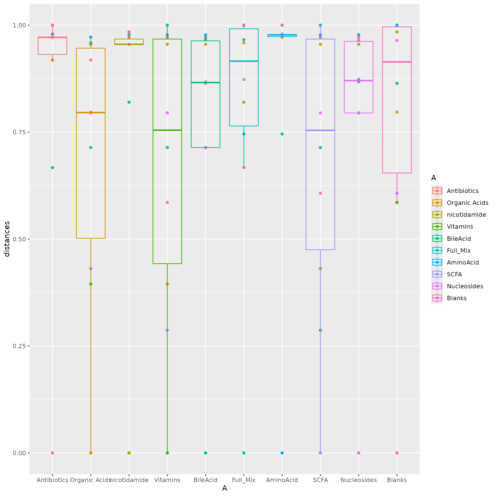

# mums2

The mums2 package is designed to provide researchers with tools to
analyze untargeted metabolomics data generated using tandem mass
spectroscopy from microbial communities. The overall approach taken to
analyze metabolomics data parallels that used to analyze microbial
communities using 16S rRNA gene sequencing data.

``` r
library(mums2)
library(ggplot2)
library(mpactr)
library(networkD3)
library(reshape2)
```

## Preprocess data

Before we even begin the process of analyzing your data, we have to
preprocess it. It is import that we process your data into a readable
`data.frame` or object that we can view and transform. To process your
data we need to run a two functions:
[`import_all_data()`](https://www.mums2.org/mums2/reference/import_all_data.md),
and
[`ms2_ms1_compare()`](https://www.mums2.org/mums2/reference/ms2_ms1_compare.md).
[`import_all_data()`](https://www.mums2.org/mums2/reference/import_all_data.md)
creates an object reflecting the imported data, and
[`ms2_ms1_compare()`](https://www.mums2.org/mums2/reference/ms2_ms1_compare.md)
assigns ms2 spectra to your ms1 data. However, some of your data could
be noise, or may need to be transformed before you can properly analysis
it. To accommodate for those issues, we have two other functions:
[`filter_peak_table()`](https://www.mums2.org/mums2/reference/filter_peak_table.md),
[`change_rt_to_seconds_or_minute()`](https://www.mums2.org/mums2/reference/change_rt_to_seconds_or_minute.md).
[`filter_peak_table()`](https://www.mums2.org/mums2/reference/filter_peak_table.md)
allows your to remove low-quality features and
[`change_rt_to_seconds_or_minute()`](https://www.mums2.org/mums2/reference/change_rt_to_seconds_or_minute.md)
allows you to transform your retention to minutes or seconds. This
allows you to ensure your retention time matches your ms2 data retention
time. Below will explain in more detail what each function does and how
to go through the pipeline.

### Import

The
[`import_all_data()`](https://www.mums2.org/mums2/reference/import_all_data.md)
function takes in a peak_table and meta_data table as input and converts
it into a `mpactr` object (its a wrapper for
[`mpactr::import_data()`](https://www.mums2.org/mpactr/reference/import_data.html)).
The format parameter accepts three different formats: Metaboscape,
Progenesis, and None. If you are using a feature table that was exported
from metaboscape, use the “Metaboscape” format. If its from Progenesis,
use the “Progenesis” format. In order for “Metaboscape” and “Progenesis”
to work, mpactr transforms the data behind the scenes into a universal
peak table. The “None” format is only used when you are using the
“universal peak table” as the “peak table” parameter. You can read up
more about each of the formats
here([`mpactr::import_data()`](https://www.mums2.org/mpactr/reference/import_data.html)).
If you need a deeper understanding of what format the peak table and
meta data file show be in, look at mpactr’s [getting started
page](https://www.mums2.org/mpactr/articles/mpactr.html)

Meta data is a csv that provides information about the samples. In order
for your meta data to be valid, it needs the following columns:
“Injection”, “Sample_Code”, ” Biological_Group.” The “Injection” column
is the name of the samples, it should match the samples inside of the
peak_table. “Sample_Code” is the id for you technical replicates.
Finally, “Biological_Group” is another id, but for your biological
replicate groups (you can learn more here
[`mpactr::import_data()`](https://www.mums2.org/mpactr/reference/import_data.html)).

``` r
data <- import_all_data(
  peak_table = mums2::mums2_example("full_mix_peak_table.csv"), 
  meta_data = mums2::mums2_example("full_mix_meta_data.csv"), 
  format = "None")
#> If peak table has corrupted compound names they will be converted to
#>       utf-8 and if there are any commas, they will be converted to periods(.).
```

#### Peak Table

Below is the expected format for a progenesis peak table. It contains
feature data such as m/z (or pepmass) and retention time. The sample
intenesities are also inside of this table.

``` r
read.csv(mums2::mums2_example("full_mix_peak_table.csv"), check.names = FALSE)
#>               Compound  rt       mz 240927_50MeOH_pos_P2A1_1_9665
#> 1 251.96462 Da 18.25 s 0.3 252.9719                          4150
#>   240927_50MeOH_pos_P2A1_1_9666 240927_50MeOH_pos_P2A1_1_9667
#> 1                          4416                          2754
#>   240927_0.1mgmL_GroupMix3_IsovalericAcid_HSST3_pos_P2E4_1_9668
#> 1                                                          2828
#>   240927_0.1mgmL_GroupMix1_HSST3_pos_P2E2_1_9669
#> 1                                           2986
#>   240927_0.1mgmL_GroupMix4_HSST3_pos_P2E5_1_9670
#> 1                                           2092
#>   240927_0.1mgmL_GroupMix6_HSST3_pos_P2E7_1_9671
#> 1                                           2510
#>   240927_0.1mgmL_GroupMix5_ValericAcid_HSST3_pos_P2E6_1_9672
#> 1                                                       5138
#>   240927_0.1mgmL_GroupMix2_ValericAcid_HSST3_pos_P2E3_1_9673
#> 1                                                       2674
#>   240927_0.1mgmL_FullMix_HSST3_pos_P2F1_1_9674
#> 1                                         3804
#>   240927_0.1mgmL_GroupMix8_IsovalericAcid_HSST3_pos_P2E9_1_9675
#> 1                                                          2098
#>   240927_0.1mgmL_GroupMix7_ValericAcid_HSST3_pos_P2E8_1_9676
#> 1                                                       1800
#>   240927_0.1mgmL_GroupMix3_IsovalericAcid_HSST3_pos_P2E4_1_9725
#> 1                                                           592
#>   240927_0.1mgmL_FullMix_HSST3_pos_P2F1_1_9726
#> 1                                            0
#>   240927_0.1mgmL_GroupMix7_ValericAcid_HSST3_pos_P2E8_1_9727
#> 1                                                        584
#>   240927_0.1mgmL_GroupMix6_HSST3_pos_P2E7_1_9728
#> 1                                            560
#>   240927_0.1mgmL_GroupMix2_ValericAcid_HSST3_pos_P2E3_1_9729
#> 1                                                        642
#>   240927_0.1mgmL_GroupMix4_HSST3_pos_P2E5_1_9730
#> 1                                            556
#>   240927_0.1mgmL_GroupMix8_IsovalericAcid_HSST3_pos_P2E9_1_9731
#> 1                                                           712
#>   240927_0.1mgmL_GroupMix5_ValericAcid_HSST3_pos_P2E6_1_9732
#> 1                                                        482
#>   240927_0.1mgmL_GroupMix1_HSST3_pos_P2E2_1_9733
#> 1                                              0
#>   240927_0.1mgmL_GroupMix5_ValericAcid_HSST3_pos_P2E6_1_9782
#> 1                                                        374
#>   240927_0.1mgmL_GroupMix3_IsovalericAcid_HSST3_pos_P2E4_1_9783
#> 1                                                           558
#>   240927_0.1mgmL_GroupMix7_ValericAcid_HSST3_pos_P2E8_1_9784
#> 1                                                        514
#>   240927_0.1mgmL_GroupMix2_ValericAcid_HSST3_pos_P2E3_1_9785
#> 1                                                        484
#>   240927_0.1mgmL_GroupMix4_HSST3_pos_P2E5_1_9786
#> 1                                            540
#>   240927_0.1mgmL_GroupMix6_HSST3_pos_P2E7_1_9787
#> 1                                            514
#>   240927_0.1mgmL_FullMix_HSST3_pos_P2F1_1_9788
#> 1                                          448
#>   240927_0.1mgmL_GroupMix1_HSST3_pos_P2E2_1_9789
#> 1                                              0
#>   240927_0.1mgmL_GroupMix8_IsovalericAcid_HSST3_pos_P2E9_1_9790
#> 1                                                           742
#>  [ reached 'max' / getOption("max.print") -- omitted 5534 rows ]
```

#### Metadata

The expected format for metadata is below. The metadata file needs to
contain at minimum columns for “Injection”, “Sample_Code”, and ”
Biological_Group.”

``` r
read.csv(mums2::mums2_example("full_mix_meta_data.csv"), check.names = FALSE)
#>                                        Injection File Text Sample_Notes
#> 1                  240927_50MeOH_pos_P2A1_1_9665        NA           NA
#> 2                  240927_50MeOH_pos_P2A1_1_9666        NA           NA
#> 3                  240927_50MeOH_pos_P2A1_1_9667        NA           NA
#> 4 240927_0.1mgmL_GroupMix1_HSST3_pos_P2E2_1_9669        NA           NA
#>   MS method LC method Vial_Position Injection volume Sample_Code
#> 1        NA        NA            NA               NA      Blanks
#> 2        NA        NA            NA               NA      Blanks
#> 3        NA        NA            NA               NA      Blanks
#> 4        NA        NA            NA               NA        SCFA
#>   Biological_Group
#> 1           Blanks
#> 2           Blanks
#> 3           Blanks
#> 4             SCFA
#>  [ reached 'max' / getOption("max.print") -- omitted 26 rows ]
```

### Filter

After you import the data you can use functions from mpactR to filter
the data. There are four different filters included in mpactR:
[`mpactr::filter_mispicked_ions()`](https://www.mums2.org/mpactr/reference/filter_mispicked_ions.html),
[`mpactr::filter_group()`](https://www.mums2.org/mpactr/reference/filter_group.html),
[`mpactr::filter_cv()`](https://www.mums2.org/mpactr/reference/filter_cv.html),
and
[`mpactr::filter_insource_ions()`](https://www.mums2.org/mpactr/reference/filter_insource_ions.html)
(You can find more information on
[mpactR’s](https://www.mums2.org/mpactr/) website). You are not required
to filter your data but filtering your data will help reduce noise and
correct peak selecting errors. Which will also speed up the analysis.

``` r
filtered_data <- data |>
  filter_peak_table(filter_mispicked_ions_params()) |>
  filter_peak_table(filter_cv_params(cv_threshold = 0.2)) |>
  filter_peak_table(filter_group_params(group_threshold = 0.1,
                                            "Blanks")) |>
  filter_peak_table(filter_insource_ions_params())
#> ℹ Checking 5529 peaks for mispicked peaks.
#> ℹ Argument merge_peaks is: TRUE. Merging mispicked peaks with method sum.
#> ✔ 1038 ions failed the mispicked filter, 4491 ions remain.
#> ℹ Parsing 4491 peaks for replicability across technical replicates.
#> ✔ 599 ions failed the cv_filter filter, 3892 ions remain.
#> ℹ Parsing 3892 peaks based on the sample group: Blanks.
#> ℹ Argument remove_ions is: TRUE.Removing peaks from Blanks.
#> ✔ 1331 ions failed the Blanks filter, 2561 ions remain.
#> ℹ Parsing 2561 peaks for insource ions.
#> ✔ 788 ions failed the insource filter, 1773 ions remain.

head(get_peak_table(filtered_data), 3)
#> Key: <Compound, mz, kmd, rt>
#>                  Compound       mz     kmd    rt
#>                    <char>    <num>   <num> <num>
#> 1: 1005.62667 Da 301.61 s 1006.634 0.63395  5.03
#> 2:  101.00570 Da 406.50 s  102.013 0.01297  6.78
#> 3:  1010.28954 Da 42.61 s  506.152 0.15205  0.71
#>    240927_0.1mgmL_FullMix_HSST3_pos_P2F1_1_9674
#>                                           <int>
#> 1:                                         3118
#> 2:                                         3864
#> 3:                                        31060
#>    240927_0.1mgmL_FullMix_HSST3_pos_P2F1_1_9726
#>                                           <int>
#> 1:                                         2826
#> 2:                                         3112
#> 3:                                        26928
#>    240927_0.1mgmL_FullMix_HSST3_pos_P2F1_1_9788
#>                                           <int>
#> 1:                                         3396
#> 2:                                         3602
#> 3:                                        22010
#>    240927_0.1mgmL_GroupMix1_HSST3_pos_P2E2_1_9669
#>                                             <int>
#> 1:                                              0
#> 2:                                           3446
#> 3:                                              0
#>    240927_0.1mgmL_GroupMix1_HSST3_pos_P2E2_1_9733
#>                                             <int>
#> 1:                                              0
#> 2:                                           3098
#> 3:                                              0
#>    240927_0.1mgmL_GroupMix1_HSST3_pos_P2E2_1_9789
#>                                             <int>
#> 1:                                              0
#> 2:                                           3340
#> 3:                                              0
#>    240927_0.1mgmL_GroupMix2_ValericAcid_HSST3_pos_P2E3_1_9673
#>                                                         <int>
#> 1:                                                          0
#> 2:                                                       4052
#> 3:                                                          0
#>    240927_0.1mgmL_GroupMix2_ValericAcid_HSST3_pos_P2E3_1_9729
#>                                                         <int>
#> 1:                                                          0
#> 2:                                                       3478
#> 3:                                                          0
#>    240927_0.1mgmL_GroupMix2_ValericAcid_HSST3_pos_P2E3_1_9785
#>                                                         <int>
#> 1:                                                          0
#> 2:                                                       3108
#> 3:                                                          0
#>    240927_0.1mgmL_GroupMix3_IsovalericAcid_HSST3_pos_P2E4_1_9668
#>                                                            <int>
#> 1:                                                             0
#> 2:                                                             0
#> 3:                                                             0
#>    240927_0.1mgmL_GroupMix3_IsovalericAcid_HSST3_pos_P2E4_1_9725
#>                                                            <int>
#> 1:                                                             0
#> 2:                                                             0
#> 3:                                                             0
#>    240927_0.1mgmL_GroupMix3_IsovalericAcid_HSST3_pos_P2E4_1_9783
#>                                                            <int>
#> 1:                                                             0
#> 2:                                                             0
#> 3:                                                             0
#>    240927_0.1mgmL_GroupMix4_HSST3_pos_P2E5_1_9670
#>                                             <int>
#> 1:                                              0
#> 2:                                              0
#> 3:                                          31182
#>    240927_0.1mgmL_GroupMix4_HSST3_pos_P2E5_1_9730
#>                                             <int>
#> 1:                                              0
#> 2:                                              0
#> 3:                                          35744
#>    240927_0.1mgmL_GroupMix4_HSST3_pos_P2E5_1_9786
#>                                             <int>
#> 1:                                              0
#> 2:                                              0
#> 3:                                          38308
#>    240927_0.1mgmL_GroupMix5_ValericAcid_HSST3_pos_P2E6_1_9672
#>                                                         <int>
#> 1:                                                          0
#> 2:                                                       3920
#> 3:                                                          0
#>    240927_0.1mgmL_GroupMix5_ValericAcid_HSST3_pos_P2E6_1_9732
#>                                                         <int>
#> 1:                                                          0
#> 2:                                                       3012
#> 3:                                                          0
#>    240927_0.1mgmL_GroupMix5_ValericAcid_HSST3_pos_P2E6_1_9782
#>                                                         <int>
#> 1:                                                          0
#> 2:                                                       3098
#> 3:                                                          0
#>    240927_0.1mgmL_GroupMix6_HSST3_pos_P2E7_1_9671
#>                                             <int>
#> 1:                                              0
#> 2:                                           3314
#> 3:                                              0
#>    240927_0.1mgmL_GroupMix6_HSST3_pos_P2E7_1_9728
#>                                             <int>
#> 1:                                              0
#> 2:                                           2928
#> 3:                                              0
#>    240927_0.1mgmL_GroupMix6_HSST3_pos_P2E7_1_9787
#>                                             <int>
#> 1:                                              0
#> 2:                                           3762
#> 3:                                              0
#>    240927_0.1mgmL_GroupMix7_ValericAcid_HSST3_pos_P2E8_1_9676
#>                                                         <int>
#> 1:                                                          0
#> 2:                                                       3568
#> 3:                                                          0
#>    240927_0.1mgmL_GroupMix7_ValericAcid_HSST3_pos_P2E8_1_9727
#>                                                         <int>
#> 1:                                                          0
#> 2:                                                       3622
#> 3:                                                          0
#>    240927_0.1mgmL_GroupMix7_ValericAcid_HSST3_pos_P2E8_1_9784
#>                                                         <int>
#> 1:                                                          0
#> 2:                                                       3008
#> 3:                                                          0
#>    240927_0.1mgmL_GroupMix8_IsovalericAcid_HSST3_pos_P2E9_1_9675
#>                                                            <int>
#> 1:                                                             0
#> 2:                                                             0
#> 3:                                                             0
#>    240927_0.1mgmL_GroupMix8_IsovalericAcid_HSST3_pos_P2E9_1_9731
#>                                                            <int>
#> 1:                                                             0
#> 2:                                                             0
#> 3:                                                             0
#>    240927_0.1mgmL_GroupMix8_IsovalericAcid_HSST3_pos_P2E9_1_9790
#>                                                            <int>
#> 1:                                                             0
#> 2:                                                             0
#> 3:                                                             0
#>    240927_50MeOH_pos_P2A1_1_9665 240927_50MeOH_pos_P2A1_1_9666
#>                            <int>                         <int>
#> 1:                             0                             0
#> 2:                             0                             0
#> 3:                             0                             0
#>    240927_50MeOH_pos_P2A1_1_9667    cor
#>                            <int> <lgcl>
#> 1:                             0   TRUE
#> 2:                             0   TRUE
#> 3:                             0   TRUE
```

### Convert from rt to “RT in minutes” or “rt in seconds”

Sometimes a MS2 file will report the retention time in minutes but the
MS1 file will use seconds. This mismatch will cause the MS1 data to
match incorrect peaks in the MS2 data. The
[`change_rt_to_seconds_or_minute()`](https://www.mums2.org/mums2/reference/change_rt_to_seconds_or_minute.md)
function allows users to synthesize data with different units. Be aware
that this function modifies the mpactr object in place. Therefore, you
will need to call the function again to revert the units. Below will
display a vector of retention time.

``` r
get_peak_table(filtered_data)$rt
#>  [1] 5.03 6.78 0.71 0.82 4.15 1.10 1.54 0.59 4.72 0.63 4.81 0.56 4.38 1.32 1.37
#>  [ reached 'max' / getOption("max.print") -- omitted 1758 entries ]
```

Retention time(rt) is the amount of time a compound spends in a column
and it is an important variable for identifying MS1 compounds. It is
used to match MS1 and MS2 spectra together. However, there are times
when rt is displayed in a incorrect time format. Such as in minutes
instead of seconds. And, if we were to match a MS1 spectra with your rt
time in minutes to a MS2 spectra with rt time in seconds, the data would
match incorrectly. Therefore, using a function to convert from one
format to another is helpful. Keep in mind, that this function cannot
directly detect whether your retention time is in seconds or minutes, so
if you convert your retention to minutes when it is already in minutes
you will generate rt in seconds instead.

``` r

filtered_data <- change_rt_to_seconds_or_minute(mpactr_object = filtered_data, rt_type = "seconds")
#> [1] "Changing rt values to seconds"
head(get_peak_table(filtered_data), 1)
#> Key: <Compound, mz, kmd, RTINSECONDS>
#>                  Compound       mz     kmd RTINSECONDS
#>                    <char>    <num>   <num>       <num>
#> 1: 1005.62667 Da 301.61 s 1006.634 0.63395       301.8
#>    240927_0.1mgmL_FullMix_HSST3_pos_P2F1_1_9674
#>                                           <int>
#> 1:                                         3118
#>    240927_0.1mgmL_FullMix_HSST3_pos_P2F1_1_9726
#>                                           <int>
#> 1:                                         2826
#>    240927_0.1mgmL_FullMix_HSST3_pos_P2F1_1_9788
#>                                           <int>
#> 1:                                         3396
#>    240927_0.1mgmL_GroupMix1_HSST3_pos_P2E2_1_9669
#>                                             <int>
#> 1:                                              0
#>    240927_0.1mgmL_GroupMix1_HSST3_pos_P2E2_1_9733
#>                                             <int>
#> 1:                                              0
#>    240927_0.1mgmL_GroupMix1_HSST3_pos_P2E2_1_9789
#>                                             <int>
#> 1:                                              0
#>    240927_0.1mgmL_GroupMix2_ValericAcid_HSST3_pos_P2E3_1_9673
#>                                                         <int>
#> 1:                                                          0
#>    240927_0.1mgmL_GroupMix2_ValericAcid_HSST3_pos_P2E3_1_9729
#>                                                         <int>
#> 1:                                                          0
#>    240927_0.1mgmL_GroupMix2_ValericAcid_HSST3_pos_P2E3_1_9785
#>                                                         <int>
#> 1:                                                          0
#>    240927_0.1mgmL_GroupMix3_IsovalericAcid_HSST3_pos_P2E4_1_9668
#>                                                            <int>
#> 1:                                                             0
#>    240927_0.1mgmL_GroupMix3_IsovalericAcid_HSST3_pos_P2E4_1_9725
#>                                                            <int>
#> 1:                                                             0
#>    240927_0.1mgmL_GroupMix3_IsovalericAcid_HSST3_pos_P2E4_1_9783
#>                                                            <int>
#> 1:                                                             0
#>    240927_0.1mgmL_GroupMix4_HSST3_pos_P2E5_1_9670
#>                                             <int>
#> 1:                                              0
#>    240927_0.1mgmL_GroupMix4_HSST3_pos_P2E5_1_9730
#>                                             <int>
#> 1:                                              0
#>    240927_0.1mgmL_GroupMix4_HSST3_pos_P2E5_1_9786
#>                                             <int>
#> 1:                                              0
#>    240927_0.1mgmL_GroupMix5_ValericAcid_HSST3_pos_P2E6_1_9672
#>                                                         <int>
#> 1:                                                          0
#>    240927_0.1mgmL_GroupMix5_ValericAcid_HSST3_pos_P2E6_1_9732
#>                                                         <int>
#> 1:                                                          0
#>    240927_0.1mgmL_GroupMix5_ValericAcid_HSST3_pos_P2E6_1_9782
#>                                                         <int>
#> 1:                                                          0
#>    240927_0.1mgmL_GroupMix6_HSST3_pos_P2E7_1_9671
#>                                             <int>
#> 1:                                              0
#>    240927_0.1mgmL_GroupMix6_HSST3_pos_P2E7_1_9728
#>                                             <int>
#> 1:                                              0
#>    240927_0.1mgmL_GroupMix6_HSST3_pos_P2E7_1_9787
#>                                             <int>
#> 1:                                              0
#>    240927_0.1mgmL_GroupMix7_ValericAcid_HSST3_pos_P2E8_1_9676
#>                                                         <int>
#> 1:                                                          0
#>    240927_0.1mgmL_GroupMix7_ValericAcid_HSST3_pos_P2E8_1_9727
#>                                                         <int>
#> 1:                                                          0
#>    240927_0.1mgmL_GroupMix7_ValericAcid_HSST3_pos_P2E8_1_9784
#>                                                         <int>
#> 1:                                                          0
#>    240927_0.1mgmL_GroupMix8_IsovalericAcid_HSST3_pos_P2E9_1_9675
#>                                                            <int>
#> 1:                                                             0
#>    240927_0.1mgmL_GroupMix8_IsovalericAcid_HSST3_pos_P2E9_1_9731
#>                                                            <int>
#> 1:                                                             0
#>    240927_0.1mgmL_GroupMix8_IsovalericAcid_HSST3_pos_P2E9_1_9790
#>                                                            <int>
#> 1:                                                             0
#>    240927_50MeOH_pos_P2A1_1_9665 240927_50MeOH_pos_P2A1_1_9666
#>                            <int>                         <int>
#> 1:                             0                             0
#>    240927_50MeOH_pos_P2A1_1_9667    cor
#>                            <int> <lgcl>
#> 1:                             0   TRUE

filtered_data <- change_rt_to_seconds_or_minute(mpactr_object = filtered_data, rt_type = "minutes")
#> [1] "Changing rt values to minutes"
head(get_peak_table(filtered_data), 1)
#> Key: <Compound, mz, kmd, RTINMINUTES>
#>                  Compound       mz     kmd RTINMINUTES
#>                    <char>    <num>   <num>       <num>
#> 1: 1005.62667 Da 301.61 s 1006.634 0.63395        5.03
#>    240927_0.1mgmL_FullMix_HSST3_pos_P2F1_1_9674
#>                                           <int>
#> 1:                                         3118
#>    240927_0.1mgmL_FullMix_HSST3_pos_P2F1_1_9726
#>                                           <int>
#> 1:                                         2826
#>    240927_0.1mgmL_FullMix_HSST3_pos_P2F1_1_9788
#>                                           <int>
#> 1:                                         3396
#>    240927_0.1mgmL_GroupMix1_HSST3_pos_P2E2_1_9669
#>                                             <int>
#> 1:                                              0
#>    240927_0.1mgmL_GroupMix1_HSST3_pos_P2E2_1_9733
#>                                             <int>
#> 1:                                              0
#>    240927_0.1mgmL_GroupMix1_HSST3_pos_P2E2_1_9789
#>                                             <int>
#> 1:                                              0
#>    240927_0.1mgmL_GroupMix2_ValericAcid_HSST3_pos_P2E3_1_9673
#>                                                         <int>
#> 1:                                                          0
#>    240927_0.1mgmL_GroupMix2_ValericAcid_HSST3_pos_P2E3_1_9729
#>                                                         <int>
#> 1:                                                          0
#>    240927_0.1mgmL_GroupMix2_ValericAcid_HSST3_pos_P2E3_1_9785
#>                                                         <int>
#> 1:                                                          0
#>    240927_0.1mgmL_GroupMix3_IsovalericAcid_HSST3_pos_P2E4_1_9668
#>                                                            <int>
#> 1:                                                             0
#>    240927_0.1mgmL_GroupMix3_IsovalericAcid_HSST3_pos_P2E4_1_9725
#>                                                            <int>
#> 1:                                                             0
#>    240927_0.1mgmL_GroupMix3_IsovalericAcid_HSST3_pos_P2E4_1_9783
#>                                                            <int>
#> 1:                                                             0
#>    240927_0.1mgmL_GroupMix4_HSST3_pos_P2E5_1_9670
#>                                             <int>
#> 1:                                              0
#>    240927_0.1mgmL_GroupMix4_HSST3_pos_P2E5_1_9730
#>                                             <int>
#> 1:                                              0
#>    240927_0.1mgmL_GroupMix4_HSST3_pos_P2E5_1_9786
#>                                             <int>
#> 1:                                              0
#>    240927_0.1mgmL_GroupMix5_ValericAcid_HSST3_pos_P2E6_1_9672
#>                                                         <int>
#> 1:                                                          0
#>    240927_0.1mgmL_GroupMix5_ValericAcid_HSST3_pos_P2E6_1_9732
#>                                                         <int>
#> 1:                                                          0
#>    240927_0.1mgmL_GroupMix5_ValericAcid_HSST3_pos_P2E6_1_9782
#>                                                         <int>
#> 1:                                                          0
#>    240927_0.1mgmL_GroupMix6_HSST3_pos_P2E7_1_9671
#>                                             <int>
#> 1:                                              0
#>    240927_0.1mgmL_GroupMix6_HSST3_pos_P2E7_1_9728
#>                                             <int>
#> 1:                                              0
#>    240927_0.1mgmL_GroupMix6_HSST3_pos_P2E7_1_9787
#>                                             <int>
#> 1:                                              0
#>    240927_0.1mgmL_GroupMix7_ValericAcid_HSST3_pos_P2E8_1_9676
#>                                                         <int>
#> 1:                                                          0
#>    240927_0.1mgmL_GroupMix7_ValericAcid_HSST3_pos_P2E8_1_9727
#>                                                         <int>
#> 1:                                                          0
#>    240927_0.1mgmL_GroupMix7_ValericAcid_HSST3_pos_P2E8_1_9784
#>                                                         <int>
#> 1:                                                          0
#>    240927_0.1mgmL_GroupMix8_IsovalericAcid_HSST3_pos_P2E9_1_9675
#>                                                            <int>
#> 1:                                                             0
#>    240927_0.1mgmL_GroupMix8_IsovalericAcid_HSST3_pos_P2E9_1_9731
#>                                                            <int>
#> 1:                                                             0
#>    240927_0.1mgmL_GroupMix8_IsovalericAcid_HSST3_pos_P2E9_1_9790
#>                                                            <int>
#> 1:                                                             0
#>    240927_50MeOH_pos_P2A1_1_9665 240927_50MeOH_pos_P2A1_1_9666
#>                            <int>                         <int>
#> 1:                             0                             0
#>    240927_50MeOH_pos_P2A1_1_9667    cor
#>                            <int> <lgcl>
#> 1:                             0   TRUE
```

### Preprocess MS2 data

Using the generated mpactr_object from calling the
[`import_all_data()`](https://www.mums2.org/mums2/reference/import_all_data.md)
function we can use a .mgf/.mzxml/.mzml file to match MS1 and MS2 peaks.
The
[`ms2_ms1_compare()`](https://www.mums2.org/mums2/reference/ms2_ms1_compare.md)
function reads a list of mgf files and matches them with a MS1 spectra
based on the mass-charge ratio and retention time tolerance. If there
are multiple peaks, it will select the peak with the highest intensity.
Keep in mind that MS2 spectra files are very memory intensive, they can
be anywhere from 1 MB to 100 GB. Therefore, depending on how big the
file is, it might take a few moments for the function to complete.

[`ms2_ms1_compare()`](https://www.mums2.org/mums2/reference/ms2_ms1_compare.md)
generates a list of data with two data.frames (“ms1_data”, “peak_data”),
a list (“peak_data”), and a character vector (“samples”).

**ms2_matches** - One of the two data.frames, “ms2_matches”, is a
data.frame that contains five columns: “mz”, “rt”, “ms1_compound_id”,
“spectra_index”, and “ms2_spectrum_id.” “mz” and “rt”, represent the ms2
mass to charge ratio and retention time. “ms1_compound_id” represents
your ms1 compound id that was imported from the feature table.
“spectra_index” matches the ms2 data with its ms2 spectrum. Finally,
“ms2_spectrum_id” similar to the “ms1_compound_id”, is the generated
name to represent your ms2 spectra (the name is a combination of your mz
and rt). This is necessary to properly compare compounds. Since the
information supplied from a MS2 file will compute similar results to
compounds that are alike, we can use algorithmic techniques to compute
the similarity between two compounds. This allows us to generate
annotations and cluster similar spectra (MS2 matched information)
together.

**ms1_data** - The other “data.frame”, “ms1_data”, is a data.frame of
the created mpactr object.

**peak_data** - The list that is generate from
[`ms2_ms1_compare()`](https://www.mums2.org/mums2/reference/ms2_ms1_compare.md)
is named “peak_data.” “peak_data” is a collection of ms2 peak list. A
peak list a collection of fragment ions, they all have a value to
represent their intensity and mass-charge ratio.

**samples** - The last slot inside of the list is a character vector
named “samples.” This is just a list of the groups/samples contained
inside of your peak_table file.

``` r
matched_data <- ms2_ms1_compare(
  ms2_files = mums2_example("full_mix_ms2.mgf"),mpactr_object = filtered_data, mz_tolerance = 2, rt_tolerance = 6)
#> [1] "Reading: /home/runner/work/_temp/Library/mums2/extdata/full_mix_ms2.mgf ..."
#> Computing                                                    | 0%  ETA: -...Computing ■                                                  | 2%  ETA: ...Computing ■■                                                 | 4%  ETA: ...Computing ■■■                                                | 6%  ETA: ...Computing ■■■■                                               | 8%  ETA: ...Computing ■■■■■                                              | 10%  ETA: ...Computing ■■■■■■                                             | 12%  ETA: ...Computing ■■■■■■■                                            | 14%  ETA: ...Computing ■■■■■■■■                                           | 16%  ETA: ...Computing ■■■■■■■■■                                          | 18%  ETA: ...Computing ■■■■■■■■■■                                         | 20%  ETA: ...Computing ■■■■■■■■■■■                                        | 22%  ETA: ...Computing ■■■■■■■■■■■■                                       | 24%  ETA: ...Computing ■■■■■■■■■■■■■                                      | 26%  ETA: ...Computing ■■■■■■■■■■■■■■                                     | 28%  ETA: ...Computing ■■■■■■■■■■■■■■■                                    | 30%  ETA: ...Computing ■■■■■■■■■■■■■■■■                                   | 32%  ETA: ...Computing ■■■■■■■■■■■■■■■■■                                  | 34%  ETA: ...Computing ■■■■■■■■■■■■■■■■■■                                 | 36%  ETA: ...Computing ■■■■■■■■■■■■■■■■■■■                                | 38%  ETA: ...Computing ■■■■■■■■■■■■■■■■■■■■                               | 40%  ETA: ...Computing ■■■■■■■■■■■■■■■■■■■■■                              | 42%  ETA: ...Computing ■■■■■■■■■■■■■■■■■■■■■■                             | 44%  ETA: ...Computing ■■■■■■■■■■■■■■■■■■■■■■■                            | 46%  ETA: ...Computing ■■■■■■■■■■■■■■■■■■■■■■■■                           | 48%  ETA: ...Computing ■■■■■■■■■■■■■■■■■■■■■■■■■                          | 50%  ETA: ...Computing ■■■■■■■■■■■■■■■■■■■■■■■■■■                         | 52%  ETA: ...Computing ■■■■■■■■■■■■■■■■■■■■■■■■■■■                        | 54%  ETA: ...Computing ■■■■■■■■■■■■■■■■■■■■■■■■■■■■                       | 56%  ETA: ...Computing ■■■■■■■■■■■■■■■■■■■■■■■■■■■■■                      | 58%  ETA: ...Computing ■■■■■■■■■■■■■■■■■■■■■■■■■■■■■■                     | 60%  ETA: ...Computing ■■■■■■■■■■■■■■■■■■■■■■■■■■■■■■■                    | 62%  ETA: ...Computing ■■■■■■■■■■■■■■■■■■■■■■■■■■■■■■■■                   | 64%  ETA: ...Computing ■■■■■■■■■■■■■■■■■■■■■■■■■■■■■■■■■                  | 66%  ETA: ...Computing ■■■■■■■■■■■■■■■■■■■■■■■■■■■■■■■■■■                 | 68%  ETA: ...Computing ■■■■■■■■■■■■■■■■■■■■■■■■■■■■■■■■■■■                | 70%  ETA: ...Computing ■■■■■■■■■■■■■■■■■■■■■■■■■■■■■■■■■■■■               | 72%  ETA: ...Computing ■■■■■■■■■■■■■■■■■■■■■■■■■■■■■■■■■■■■■              | 74%  ETA: ...Computing ■■■■■■■■■■■■■■■■■■■■■■■■■■■■■■■■■■■■■■             | 76%  ETA: ...Computing ■■■■■■■■■■■■■■■■■■■■■■■■■■■■■■■■■■■■■■■            | 78%  ETA: ...Computing ■■■■■■■■■■■■■■■■■■■■■■■■■■■■■■■■■■■■■■■■           | 80%  ETA: ...Computing ■■■■■■■■■■■■■■■■■■■■■■■■■■■■■■■■■■■■■■■■■          | 82%  ETA: ...Computing ■■■■■■■■■■■■■■■■■■■■■■■■■■■■■■■■■■■■■■■■■■         | 84%  ETA: ...Computing ■■■■■■■■■■■■■■■■■■■■■■■■■■■■■■■■■■■■■■■■■■■        | 86%  ETA: ...Computing ■■■■■■■■■■■■■■■■■■■■■■■■■■■■■■■■■■■■■■■■■■■■       | 88%  ETA: ...Computing ■■■■■■■■■■■■■■■■■■■■■■■■■■■■■■■■■■■■■■■■■■■■■      | 90%  ETA: ...Computing ■■■■■■■■■■■■■■■■■■■■■■■■■■■■■■■■■■■■■■■■■■■■■■     | 92%  ETA: ...Computing ■■■■■■■■■■■■■■■■■■■■■■■■■■■■■■■■■■■■■■■■■■■■■■■    | 94%  ETA: ...Computing ■■■■■■■■■■■■■■■■■■■■■■■■■■■■■■■■■■■■■■■■■■■■■■■■   | 96%  ETA: ...Computing ■■■■■■■■■■■■■■■■■■■■■■■■■■■■■■■■■■■■■■■■■■■■■■■■■  | 98%  ETA: ...Computing ■■■■■■■■■■■■■■■■■■■■■■■■■■■■■■■■■■■■■■■■■■■■■■■■■■ | 100%  ETA: ...
#> [1] "1237/1773 peaks have an MS2 spectra."

head(matched_data$ms2_matches)
#>         mz   rt       ms1_compound_id spectra_index   ms2_spectrum_id
#> 1 102.0130 6.78 101.00570 Da 406.50 s             1 mz102.01297rt6.78
#> 2 506.1520 0.71 1010.28954 Da 42.61 s             2 mz506.15205rt0.71
#> 3 508.1192 0.82 1014.22384 Da 49.06 s             3 mz508.11919rt0.82
#> 4 103.0397 1.10  102.03241 Da 66.00 s             4  mz103.03969rt1.1
#> 5 103.1231 1.54  102.11581 Da 92.14 s             5 mz103.12309rt1.54
#> 6 103.1235 0.59  102.11623 Da 35.13 s             6 mz103.12351rt0.59

head(matched_data$ms1_data, 1)
#> Key: <Compound, mz, kmd, RTINMINUTES>
#>                  Compound       mz     kmd RTINMINUTES
#>                    <char>    <num>   <num>       <num>
#> 1: 1005.62667 Da 301.61 s 1006.634 0.63395        5.03
#>    240927_0.1mgmL_FullMix_HSST3_pos_P2F1_1_9674
#>                                           <int>
#> 1:                                         3118
#>    240927_0.1mgmL_FullMix_HSST3_pos_P2F1_1_9726
#>                                           <int>
#> 1:                                         2826
#>    240927_0.1mgmL_FullMix_HSST3_pos_P2F1_1_9788
#>                                           <int>
#> 1:                                         3396
#>    240927_0.1mgmL_GroupMix1_HSST3_pos_P2E2_1_9669
#>                                             <int>
#> 1:                                              0
#>    240927_0.1mgmL_GroupMix1_HSST3_pos_P2E2_1_9733
#>                                             <int>
#> 1:                                              0
#>    240927_0.1mgmL_GroupMix1_HSST3_pos_P2E2_1_9789
#>                                             <int>
#> 1:                                              0
#>    240927_0.1mgmL_GroupMix2_ValericAcid_HSST3_pos_P2E3_1_9673
#>                                                         <int>
#> 1:                                                          0
#>    240927_0.1mgmL_GroupMix2_ValericAcid_HSST3_pos_P2E3_1_9729
#>                                                         <int>
#> 1:                                                          0
#>    240927_0.1mgmL_GroupMix2_ValericAcid_HSST3_pos_P2E3_1_9785
#>                                                         <int>
#> 1:                                                          0
#>    240927_0.1mgmL_GroupMix3_IsovalericAcid_HSST3_pos_P2E4_1_9668
#>                                                            <int>
#> 1:                                                             0
#>    240927_0.1mgmL_GroupMix3_IsovalericAcid_HSST3_pos_P2E4_1_9725
#>                                                            <int>
#> 1:                                                             0
#>    240927_0.1mgmL_GroupMix3_IsovalericAcid_HSST3_pos_P2E4_1_9783
#>                                                            <int>
#> 1:                                                             0
#>    240927_0.1mgmL_GroupMix4_HSST3_pos_P2E5_1_9670
#>                                             <int>
#> 1:                                              0
#>    240927_0.1mgmL_GroupMix4_HSST3_pos_P2E5_1_9730
#>                                             <int>
#> 1:                                              0
#>    240927_0.1mgmL_GroupMix4_HSST3_pos_P2E5_1_9786
#>                                             <int>
#> 1:                                              0
#>    240927_0.1mgmL_GroupMix5_ValericAcid_HSST3_pos_P2E6_1_9672
#>                                                         <int>
#> 1:                                                          0
#>    240927_0.1mgmL_GroupMix5_ValericAcid_HSST3_pos_P2E6_1_9732
#>                                                         <int>
#> 1:                                                          0
#>    240927_0.1mgmL_GroupMix5_ValericAcid_HSST3_pos_P2E6_1_9782
#>                                                         <int>
#> 1:                                                          0
#>    240927_0.1mgmL_GroupMix6_HSST3_pos_P2E7_1_9671
#>                                             <int>
#> 1:                                              0
#>    240927_0.1mgmL_GroupMix6_HSST3_pos_P2E7_1_9728
#>                                             <int>
#> 1:                                              0
#>    240927_0.1mgmL_GroupMix6_HSST3_pos_P2E7_1_9787
#>                                             <int>
#> 1:                                              0
#>    240927_0.1mgmL_GroupMix7_ValericAcid_HSST3_pos_P2E8_1_9676
#>                                                         <int>
#> 1:                                                          0
#>    240927_0.1mgmL_GroupMix7_ValericAcid_HSST3_pos_P2E8_1_9727
#>                                                         <int>
#> 1:                                                          0
#>    240927_0.1mgmL_GroupMix7_ValericAcid_HSST3_pos_P2E8_1_9784
#>                                                         <int>
#> 1:                                                          0
#>    240927_0.1mgmL_GroupMix8_IsovalericAcid_HSST3_pos_P2E9_1_9675
#>                                                            <int>
#> 1:                                                             0
#>    240927_0.1mgmL_GroupMix8_IsovalericAcid_HSST3_pos_P2E9_1_9731
#>                                                            <int>
#> 1:                                                             0
#>    240927_0.1mgmL_GroupMix8_IsovalericAcid_HSST3_pos_P2E9_1_9790
#>                                                            <int>
#> 1:                                                             0
#>    240927_50MeOH_pos_P2A1_1_9665 240927_50MeOH_pos_P2A1_1_9666
#>                            <int>                         <int>
#> 1:                             0                             0
#>    240927_50MeOH_pos_P2A1_1_9667    cor
#>                            <int> <lgcl>
#> 1:                             0   TRUE

matched_data$peak_data[[1]]
#> $mz
#>   [1]   20.75976   21.68269   22.10765   22.38143   22.94004   23.19636
#>   [7]   26.89654   28.29918   29.47849   31.02587   31.06692   31.72100
#>  [13]   31.96936   33.18614   33.72053   36.17439   36.82771   37.51869
#>  [19]   39.02983   39.46880   39.96730   40.03359   40.50032   40.50610
#>  [25]   40.97603   41.04442   41.84005   42.03108   42.03411   42.03928
#>  [31]   42.06185   42.06305   42.68930   42.99501   43.02339   43.05919
#>  [37]   43.50392   43.58220   43.98984   44.05459   45.03831   46.04253
#>  [43]   46.07032   48.20792   51.60362   55.02140   55.03606   55.05816
#>  [49]   55.35853   55.93842   55.94200   56.54307   56.92918   56.96851
#>  [55]   57.41903   57.44979   57.81476   57.85512   58.06762   58.96215
#>  [61]   59.05324   59.92906   59.94532   60.70560   60.93332   61.42771
#>  [67]   61.88733   61.93062   62.93414   63.01081   65.64248   66.04879
#>  [73]   67.19445   69.23524   70.87618   74.09342   74.09868   74.68850
#>  [79]   74.97736   76.12532   76.51589   76.51755   85.52230   86.32549
#>  [85]   87.03675   88.02520   89.83402   89.91689   90.02053   90.98282
#>  [91]   94.52631   94.95490   97.01313   97.02974   97.53224   99.17291
#>  [97]  101.75293  106.77674  107.51543  108.01105  112.09179  112.42092
#> [103]  112.75219  112.91967  114.06882  114.90730  117.70186  118.03391
#> [109]  118.63177  120.96894  121.75676  125.73326  129.81279  130.85178
#> [115]  131.78736  137.49283  137.96701  138.80656  142.74792  147.00177
#> [121]  148.32014  148.37528  149.95879  153.21547  157.83118  159.59921
#> [127]  159.66430  162.68461  164.08537  168.74726  170.03742  173.38194
#> [133]  174.91257  176.57229  186.28379  194.81020  202.12454  202.37096
#> [139]  205.12177  210.86155  211.18130  217.80223  220.64521  225.80435
#> [145]  229.62530  234.46211  246.22322  246.60551  250.41008  264.26750
#> [151]  266.13605  272.89414  283.89069  296.16469  302.15076  305.42675
#> [157]  306.40971  308.76154  310.64894  326.25111  329.90721  330.17948
#> [163]  332.81429  333.16468  333.35562  338.56617  341.72459  351.05964
#> [169]  354.08471  367.60365  369.80687  380.12693  385.07365  391.81791
#> [175]  409.04204  412.76980  435.80426  440.00535  447.70464  451.07688
#> [181]  460.57238  460.83039  467.28044  486.71013  488.77184  491.67871
#> [187]  520.40203  523.81215  526.90009  528.07611  528.88358  535.09111
#> [193]  536.32683  536.82587  540.86277  543.10152  548.75519  552.46228
#> [199]  556.57218  563.53614  569.05283  571.64768  573.42571  579.87356
#> [205]  582.05220  593.86612  596.20045  601.98928  602.50648  604.62737
#> [211]  605.41071  611.24783  611.43311  625.19007  629.35797  634.34155
#> [217]  635.37997  637.81415  643.45259  667.41147  689.28535  702.67001
#> [223]  734.40420  753.32944  757.27654  766.38106  771.12927  777.44967
#> [229]  779.63630  784.36850  785.55816  796.87848  796.91374  801.86598
#> [235]  803.52013  803.69715  808.66151  825.94627  828.01583  830.30839
#> [241]  838.35276  848.13086  854.57612  860.92209  874.06288  907.90995
#> [247]  908.30512  914.10129  921.01944  936.20410  938.72304  943.93412
#> [253]  947.93841  960.46652  975.50350  980.60043  987.75061  989.56677
#> [259]  991.75819  991.85651  996.96144 1011.13331 1015.07805 1019.38450
#> [265] 1028.82229 1036.00514 1048.22582 1059.17647 1073.72601 1092.32336
#> [271] 1105.48841 1113.49613 1117.19774 1117.43255 1124.61937 1137.48207
#> [277] 1148.94112 1150.26966 1160.25551 1163.63988 1164.99287 1168.37346
#> [283] 1180.44251 1181.70327 1199.27319 1204.68214 1214.73553 1220.35698
#> [289] 1224.59797 1230.48857 1239.66699 1267.72922 1272.58622 1294.12238
#> [295] 1294.78513
#> 
#> $intensity
#>   [1]   16   16   16   16   16   16   16   16   16  104   16   16   16   16   16
#>  [16]   16   46   16  270   24  100   70  126   68   46  204   16   16   16 1720
#>  [31]   22   22   22   84   58   56   16   16  136   64   38   96   56   16   16
#>  [46]   60  110  132   16   52   62   18   46 1626   18   16   16   16   72   50
#>  [61]   62   30  128   16   42   16   16   96   30   44   16   94   16   16   16
#>  [76]   16   66   16   86   16   96   96  564   16   20  196   16   16   16   16
#>  [91]  146   62   46  526   40   16   16   16   76   16   16   16   16   16   16
#> [106]   16   16   42   16   38   16   16   16   16   16   18   52   16   16   16
#> [121]   16   16   20   16   16   16   16   16   16   16   16   16   16   16   16
#> [136]   16   16   16   16   16   16   16   16   16   16   16   18   16   16   16
#> [151]   16   16   18   16   16   16   16   16   16   16   16   16   16   16   16
#> [166]   16   16   16   16   16   16   16   16   16   16   16   16   16   16   16
#> [181]   16   16   16   16   16   16   16   16   16   16   16   16   16   16   16
#> [196]   16   16   16   16   16   16   16   16   16   16   16   16   16   16   16
#> [211]   16   16   16   16   16   16   16   16   16   16   16   16   16   16   16
#> [226]   16   16   16   16   16   16   16   16   16   16   16   16   16   16   16
#> [241]   16   16   16   16   16   16   16   16   16   16   16   16   16   16   18
#> [256]   16   16   16   16   16   16   16   68  128   16   16   16   16   16   32
#> [271]   16   16   16   16   16   16   16   16   16   16   16   16   18   16   16
#> [286]   20   16   16   16   16   16   16   16   16   16

matched_data$samples
#>  [1] "240927_50MeOH_pos_P2A1_1_9665"                                
#>  [2] "240927_50MeOH_pos_P2A1_1_9666"                                
#>  [3] "240927_50MeOH_pos_P2A1_1_9667"                                
#>  [4] "240927_0.1mgmL_GroupMix1_HSST3_pos_P2E2_1_9669"               
#>  [5] "240927_0.1mgmL_GroupMix1_HSST3_pos_P2E2_1_9733"               
#>  [6] "240927_0.1mgmL_GroupMix1_HSST3_pos_P2E2_1_9789"               
#>  [7] "240927_0.1mgmL_GroupMix2_ValericAcid_HSST3_pos_P2E3_1_9673"   
#>  [8] "240927_0.1mgmL_GroupMix2_ValericAcid_HSST3_pos_P2E3_1_9729"   
#>  [9] "240927_0.1mgmL_GroupMix2_ValericAcid_HSST3_pos_P2E3_1_9785"   
#> [10] "240927_0.1mgmL_GroupMix3_IsovalericAcid_HSST3_pos_P2E4_1_9668"
#> [11] "240927_0.1mgmL_GroupMix3_IsovalericAcid_HSST3_pos_P2E4_1_9725"
#> [12] "240927_0.1mgmL_GroupMix3_IsovalericAcid_HSST3_pos_P2E4_1_9783"
#> [13] "240927_0.1mgmL_GroupMix4_HSST3_pos_P2E5_1_9670"               
#> [14] "240927_0.1mgmL_GroupMix4_HSST3_pos_P2E5_1_9730"               
#> [15] "240927_0.1mgmL_GroupMix4_HSST3_pos_P2E5_1_9786"               
#> [16] "240927_0.1mgmL_GroupMix5_ValericAcid_HSST3_pos_P2E6_1_9672"   
#> [17] "240927_0.1mgmL_GroupMix5_ValericAcid_HSST3_pos_P2E6_1_9732"   
#> [18] "240927_0.1mgmL_GroupMix5_ValericAcid_HSST3_pos_P2E6_1_9782"   
#> [19] "240927_0.1mgmL_GroupMix6_HSST3_pos_P2E7_1_9671"               
#> [20] "240927_0.1mgmL_GroupMix6_HSST3_pos_P2E7_1_9728"               
#> [21] "240927_0.1mgmL_GroupMix6_HSST3_pos_P2E7_1_9787"               
#> [22] "240927_0.1mgmL_GroupMix7_ValericAcid_HSST3_pos_P2E8_1_9676"   
#> [23] "240927_0.1mgmL_GroupMix7_ValericAcid_HSST3_pos_P2E8_1_9727"   
#> [24] "240927_0.1mgmL_GroupMix7_ValericAcid_HSST3_pos_P2E8_1_9784"   
#> [25] "240927_0.1mgmL_GroupMix8_IsovalericAcid_HSST3_pos_P2E9_1_9675"
#> [26] "240927_0.1mgmL_GroupMix8_IsovalericAcid_HSST3_pos_P2E9_1_9731"
#> [27] "240927_0.1mgmL_GroupMix8_IsovalericAcid_HSST3_pos_P2E9_1_9790"
#> [28] "240927_0.1mgmL_FullMix_HSST3_pos_P2F1_1_9674"                 
#> [29] "240927_0.1mgmL_FullMix_HSST3_pos_P2F1_1_9726"                 
#> [30] "240927_0.1mgmL_FullMix_HSST3_pos_P2F1_1_9788"
```

## Generate Metadata

Once you preprocess your data, we can start to generate additional
metadata like molecular formulas and annotations. Using the
[`compute_molecular_formulas()`](https://www.mums2.org/mums2/reference/compute_molecular_formulas.md)
function, we can generate molecular formulas and
[`annotate_ms2()`](https://www.mums2.org/mums2/reference/annotate_ms2.md)
allows us to annotate our data based on a reference database. This
allows us to annotate additional data to unknown features or confirm
known features. Below will explain in further detail how these functions
are used.

### Chemical formula prediction

To add annotation information to the data, mums2 will generate *de novo*
chemical formula predictions using fragmentation trees. The
[`compute_molecular_formulas()`](https://www.mums2.org/mums2/reference/compute_molecular_formulas.md)
function uses MS2 data to generate the most explained chemical formula
and return it as a result (for more information: [Fragmentation
Trees](https://doi.org/10.1093/bioinformatics/btn270)). The most
explained chemical formula simply means the chemical formula that is
explained by the most peaks in the compound. In order to create a
fragmentation tree we have to generate every possible chemical formula
the parent mass can create (using only CHNOPS). We call these formulas
the candidate formulas, formulas that have the potential to be the
predicted formulas. We then look at every mass and intensity pair inside
of the compound and compute every molecular formula. We then create a
one directional graph based on all the molecular formulas using. A
molecular formula will point to another if it is a subformula of another
formula (meaning it contains at most as many atoms as the parent
formula). Finally, we can compute a score for each one of the nodes uses
methods like Ring Double Bond equivalents, compute molecular formula
score, etc. You can learn how other open-sourced software such as
[MZMine](https://mzio.io/mzmine-news/) and
[Sirirus](https://github.com/sirius-ms/sirius) generate chemical
formula. Due to the time this function will take to run, we are going to
use a small testset.

It is possible for a formula to be unable to be generated. In this case
we return a NA to represent an unknown molecular formula.

Warning messages will be printed if no molecular formula is generated or
there is only one possible molecular formula.

``` r

data_small <- import_all_data(
  peak_table = mums2::mums2_example("full_mix_peak_table_small.csv"), 
  meta_data = mums2::mums2_example("full_mix_meta_data_small.csv"), 
  format = "Metaboscape") |> 
    filter_peak_table(filter_mispicked_ions_params()) |>
    filter_peak_table(filter_cv_params(cv_threshold = 0.05)) |>
    filter_peak_table(filter_group_params(group_threshold = 0.1,
                                              "Blanks")) |>
    filter_peak_table(filter_insource_ions_params())
#> If peak table has corrupted compound names they will be converted to
#>       utf-8 and if there are any commas, they will be converted to periods(.).
#> ℹ Checking 1294 peaks for mispicked peaks.
#> ℹ Argument merge_peaks is: TRUE. Merging mispicked peaks with method sum.
#> ✔ 8 ions failed the mispicked filter, 1286 ions remain.
#> ℹ Parsing 1286 peaks for replicability across technical replicates.
#> ✔ 993 ions failed the cv_filter filter, 293 ions remain.
#> ℹ Parsing 293 peaks based on the sample group: Blanks.
#> ℹ Argument remove_ions is: TRUE.Removing peaks from Blanks.
#> ✔ 113 ions failed the Blanks filter, 180 ions remain.
#> ℹ Parsing 180 peaks for insource ions.
#> ✔ 12 ions failed the insource filter, 168 ions remain.

matched_data_small <- ms2_ms1_compare(
  ms2_files = mums2_example("full_mix_ms2_small.mgf"),mpactr_object = data_small, mz_tolerance = 2, rt_tolerance = 170)
#> [1] "Reading: /home/runner/work/_temp/Library/mums2/extdata/full_mix_ms2_small.mgf ..."
#> Computing                                                    | 0%  ETA: -...Computing ■                                                  | 2%  ETA: ...Computing ■■                                                 | 4%  ETA: ...Computing ■■■                                                | 6%  ETA: ...Computing ■■■■                                               | 8%  ETA: ...Computing ■■■■■                                              | 10%  ETA: ...Computing ■■■■■■                                             | 12%  ETA: ...Computing ■■■■■■■                                            | 14%  ETA: ...Computing ■■■■■■■■                                           | 16%  ETA: ...Computing ■■■■■■■■■                                          | 18%  ETA: ...Computing ■■■■■■■■■■                                         | 20%  ETA: ...Computing ■■■■■■■■■■■                                        | 22%  ETA: ...Computing ■■■■■■■■■■■■                                       | 24%  ETA: ...Computing ■■■■■■■■■■■■■                                      | 26%  ETA: ...Computing ■■■■■■■■■■■■■■                                     | 28%  ETA: ...Computing ■■■■■■■■■■■■■■■                                    | 30%  ETA: ...Computing ■■■■■■■■■■■■■■■■                                   | 32%  ETA: ...Computing ■■■■■■■■■■■■■■■■■                                  | 34%  ETA: ...Computing ■■■■■■■■■■■■■■■■■■                                 | 36%  ETA: ...Computing ■■■■■■■■■■■■■■■■■■■                                | 38%  ETA: ...Computing ■■■■■■■■■■■■■■■■■■■■                               | 40%  ETA: ...Computing ■■■■■■■■■■■■■■■■■■■■■                              | 42%  ETA: ...Computing ■■■■■■■■■■■■■■■■■■■■■■                             | 44%  ETA: ...Computing ■■■■■■■■■■■■■■■■■■■■■■■                            | 46%  ETA: ...Computing ■■■■■■■■■■■■■■■■■■■■■■■■                           | 48%  ETA: ...Computing ■■■■■■■■■■■■■■■■■■■■■■■■■                          | 50%  ETA: ...Computing ■■■■■■■■■■■■■■■■■■■■■■■■■■                         | 52%  ETA: ...Computing ■■■■■■■■■■■■■■■■■■■■■■■■■■■                        | 54%  ETA: ...Computing ■■■■■■■■■■■■■■■■■■■■■■■■■■■■                       | 56%  ETA: ...Computing ■■■■■■■■■■■■■■■■■■■■■■■■■■■■■                      | 58%  ETA: ...Computing ■■■■■■■■■■■■■■■■■■■■■■■■■■■■■■                     | 60%  ETA: ...Computing ■■■■■■■■■■■■■■■■■■■■■■■■■■■■■■■                    | 62%  ETA: ...Computing ■■■■■■■■■■■■■■■■■■■■■■■■■■■■■■■■                   | 64%  ETA: ...Computing ■■■■■■■■■■■■■■■■■■■■■■■■■■■■■■■■■                  | 66%  ETA: ...Computing ■■■■■■■■■■■■■■■■■■■■■■■■■■■■■■■■■■                 | 68%  ETA: ...Computing ■■■■■■■■■■■■■■■■■■■■■■■■■■■■■■■■■■■                | 70%  ETA: ...Computing ■■■■■■■■■■■■■■■■■■■■■■■■■■■■■■■■■■■■               | 72%  ETA: ...Computing ■■■■■■■■■■■■■■■■■■■■■■■■■■■■■■■■■■■■■              | 74%  ETA: ...Computing ■■■■■■■■■■■■■■■■■■■■■■■■■■■■■■■■■■■■■■             | 76%  ETA: ...Computing ■■■■■■■■■■■■■■■■■■■■■■■■■■■■■■■■■■■■■■■            | 78%  ETA: ...Computing ■■■■■■■■■■■■■■■■■■■■■■■■■■■■■■■■■■■■■■■■           | 80%  ETA: ...Computing ■■■■■■■■■■■■■■■■■■■■■■■■■■■■■■■■■■■■■■■■■          | 82%  ETA: ...Computing ■■■■■■■■■■■■■■■■■■■■■■■■■■■■■■■■■■■■■■■■■■         | 84%  ETA: ...Computing ■■■■■■■■■■■■■■■■■■■■■■■■■■■■■■■■■■■■■■■■■■■        | 86%  ETA: ...Computing ■■■■■■■■■■■■■■■■■■■■■■■■■■■■■■■■■■■■■■■■■■■■       | 88%  ETA: ...Computing ■■■■■■■■■■■■■■■■■■■■■■■■■■■■■■■■■■■■■■■■■■■■■      | 90%  ETA: ...Computing ■■■■■■■■■■■■■■■■■■■■■■■■■■■■■■■■■■■■■■■■■■■■■■     | 92%  ETA: ...Computing ■■■■■■■■■■■■■■■■■■■■■■■■■■■■■■■■■■■■■■■■■■■■■■■    | 94%  ETA: ...Computing ■■■■■■■■■■■■■■■■■■■■■■■■■■■■■■■■■■■■■■■■■■■■■■■■   | 96%  ETA: ...Computing ■■■■■■■■■■■■■■■■■■■■■■■■■■■■■■■■■■■■■■■■■■■■■■■■■  | 98%  ETA: ...Computing ■■■■■■■■■■■■■■■■■■■■■■■■■■■■■■■■■■■■■■■■■■■■■■■■■■ | 100%  ETA: ...
#> [1] "17/168 peaks have an MS2 spectra."


matched_data_small <- compute_molecular_formulas(mass_data = matched_data_small, parent_ppm = 3)
#> Computing                                                    | 5%  ETA: -...Computing ■■                                                 | 5%  ETA: ...Computing ■■■■■                                              | 11%  ETA: ...Computing ■■■■■■■■                                           | 17%  ETA: ...Computing ■■■■■■■■■■■                                        | 23%  ETA: 3s ...Computing ■■■■■■■■■■■■■■                                     | 29%  ETA: 2s ...Computing ■■■■■■■■■■■■■■■■■                                  | 35%  ETA: 1s ...Computing ■■■■■■■■■■■■■■■■■■■■                               | 41%  ETA: 1s ...Computing ■■■■■■■■■■■■■■■■■■■■■■■                            | 47%  ETA: 1s ...Computing ■■■■■■■■■■■■■■■■■■■■■■■■■■                         | 52%  ETA: ...Computing ■■■■■■■■■■■■■■■■■■■■■■■■■■■■■                      | 58%  ETA: 1s ...Computing ■■■■■■■■■■■■■■■■■■■■■■■■■■■■■■■■                   | 64%  ETA: 1s ...Computing ■■■■■■■■■■■■■■■■■■■■■■■■■■■■■■■■■■■                | 70%  ETA: 2s ...Computing ■■■■■■■■■■■■■■■■■■■■■■■■■■■■■■■■■■■■■■             | 76%  ETA: 1s ...Computing ■■■■■■■■■■■■■■■■■■■■■■■■■■■■■■■■■■■■■■■■■          | 82%  ETA: 1s ...Computing ■■■■■■■■■■■■■■■■■■■■■■■■■■■■■■■■■■■■■■■■■■■■       | 88%  ETA: ...Computing ■■■■■■■■■■■■■■■■■■■■■■■■■■■■■■■■■■■■■■■■■■■■■■■    | 94%  ETA: ...Computing ■■■■■■■■■■■■■■■■■■■■■■■■■■■■■■■■■■■■■■■■■■■■■■■■■■ | 100%  ETA: ...
#> 15/17 chemical formulas were predicted
matched_data$predicted_molecular_formulas
#> NULL
```

### Annotations

Beyond predicting the molecular formula, it is possible to use the
[`annotate_ms2()`](https://www.mums2.org/mums2/reference/annotate_ms2.md)
function to annotate the data in the matched_ms2_ms1 object. By
supplying a reference database and a scoring method, we can generate
numerous annotations. A reference database is a collection of ms2
spectra, generally curated in a specific format. This package is able to
read msp files using the
[`read_msp()`](https://www.mums2.org/mums2/reference/read_msp.md)
function. It returns a reference database that can be used as an input
for the
[`annotate_ms2()`](https://www.mums2.org/mums2/reference/annotate_ms2.md)
function. To determine how similar ms2 spectra are from each other, we
have to incorporate special algorithms. The algorithms we have decided
to use are spectral entropy (for more information: [Spectral
Entropy](https://doi.org/10.1038/s41592-021-01331-z))and the gnps
algorithm (for more information:
[GNPS](https://doi.org/10.1038/nbt.3597)). While gnps uses an modified
cosine score to compute similarity between spectra, spectral entropy
takes advantage of the total intensities of the spectra. We determine
which method we use by supplying either, `gnps_param()` or
[`spec_entropy_params()`](https://www.mums2.org/mums2/reference/spec_entropy_params.md).
Using these two methods we are able to effectively generate a collection
of annotations based on the supplied data.

It is recommended to use the
[`read_msp()`](https://www.mums2.org/mums2/reference/read_msp.md)
function with your reference database path for the reference parameter.
If you store the returned data of
[`read_msp()`](https://www.mums2.org/mums2/reference/read_msp.md) in a
variable it may cause lag if it is too big (over ~100mbs). But we show
both ways below.

``` r
psu_msmls <- read_msp(msp_file = mums2_example("PSU-MSMLS.msp"))
#> [1] "Reading: /home/runner/work/_temp/Library/mums2/extdata/PSU-MSMLS.msp ..."
#> Computing                                                    | 0%  ETA: -...Computing ■                                                  | 2%  ETA: ...Computing ■■                                                 | 4%  ETA: ...Computing ■■■                                                | 6%  ETA: ...Computing ■■■■                                               | 8%  ETA: ...Computing ■■■■■                                              | 10%  ETA: ...Computing ■■■■■■                                             | 12%  ETA: ...Computing ■■■■■■■                                            | 14%  ETA: ...Computing ■■■■■■■■                                           | 16%  ETA: ...Computing ■■■■■■■■■                                          | 18%  ETA: ...Computing ■■■■■■■■■■                                         | 20%  ETA: ...Computing ■■■■■■■■■■■                                        | 22%  ETA: ...Computing ■■■■■■■■■■■■                                       | 24%  ETA: ...Computing ■■■■■■■■■■■■■                                      | 26%  ETA: ...Computing ■■■■■■■■■■■■■■                                     | 28%  ETA: ...Computing ■■■■■■■■■■■■■■■                                    | 30%  ETA: ...Computing ■■■■■■■■■■■■■■■■                                   | 32%  ETA: ...Computing ■■■■■■■■■■■■■■■■■                                  | 34%  ETA: ...Computing ■■■■■■■■■■■■■■■■■■                                 | 36%  ETA: ...Computing ■■■■■■■■■■■■■■■■■■■                                | 38%  ETA: ...Computing ■■■■■■■■■■■■■■■■■■■■                               | 40%  ETA: ...Computing ■■■■■■■■■■■■■■■■■■■■■                              | 42%  ETA: ...Computing ■■■■■■■■■■■■■■■■■■■■■■                             | 44%  ETA: ...Computing ■■■■■■■■■■■■■■■■■■■■■■■                            | 46%  ETA: ...Computing ■■■■■■■■■■■■■■■■■■■■■■■■                           | 48%  ETA: ...Computing ■■■■■■■■■■■■■■■■■■■■■■■■■                          | 50%  ETA: ...Computing ■■■■■■■■■■■■■■■■■■■■■■■■■■                         | 52%  ETA: ...Computing ■■■■■■■■■■■■■■■■■■■■■■■■■■■                        | 54%  ETA: ...Computing ■■■■■■■■■■■■■■■■■■■■■■■■■■■■                       | 56%  ETA: ...Computing ■■■■■■■■■■■■■■■■■■■■■■■■■■■■■                      | 58%  ETA: ...Computing ■■■■■■■■■■■■■■■■■■■■■■■■■■■■■■                     | 60%  ETA: ...Computing ■■■■■■■■■■■■■■■■■■■■■■■■■■■■■■■                    | 62%  ETA: ...Computing ■■■■■■■■■■■■■■■■■■■■■■■■■■■■■■■■                   | 64%  ETA: ...Computing ■■■■■■■■■■■■■■■■■■■■■■■■■■■■■■■■■                  | 66%  ETA: ...Computing ■■■■■■■■■■■■■■■■■■■■■■■■■■■■■■■■■■                 | 68%  ETA: ...Computing ■■■■■■■■■■■■■■■■■■■■■■■■■■■■■■■■■■■                | 70%  ETA: ...Computing ■■■■■■■■■■■■■■■■■■■■■■■■■■■■■■■■■■■■               | 72%  ETA: ...Computing ■■■■■■■■■■■■■■■■■■■■■■■■■■■■■■■■■■■■■              | 74%  ETA: ...Computing ■■■■■■■■■■■■■■■■■■■■■■■■■■■■■■■■■■■■■■             | 76%  ETA: ...Computing ■■■■■■■■■■■■■■■■■■■■■■■■■■■■■■■■■■■■■■■            | 78%  ETA: ...Computing ■■■■■■■■■■■■■■■■■■■■■■■■■■■■■■■■■■■■■■■■           | 80%  ETA: ...Computing ■■■■■■■■■■■■■■■■■■■■■■■■■■■■■■■■■■■■■■■■■          | 82%  ETA: ...Computing ■■■■■■■■■■■■■■■■■■■■■■■■■■■■■■■■■■■■■■■■■■         | 84%  ETA: ...Computing ■■■■■■■■■■■■■■■■■■■■■■■■■■■■■■■■■■■■■■■■■■■        | 86%  ETA: ...Computing ■■■■■■■■■■■■■■■■■■■■■■■■■■■■■■■■■■■■■■■■■■■■       | 88%  ETA: ...Computing ■■■■■■■■■■■■■■■■■■■■■■■■■■■■■■■■■■■■■■■■■■■■■      | 90%  ETA: ...Computing ■■■■■■■■■■■■■■■■■■■■■■■■■■■■■■■■■■■■■■■■■■■■■■     | 92%  ETA: ...Computing ■■■■■■■■■■■■■■■■■■■■■■■■■■■■■■■■■■■■■■■■■■■■■■■    | 94%  ETA: ...Computing ■■■■■■■■■■■■■■■■■■■■■■■■■■■■■■■■■■■■■■■■■■■■■■■■   | 96%  ETA: ...Computing ■■■■■■■■■■■■■■■■■■■■■■■■■■■■■■■■■■■■■■■■■■■■■■■■■  | 98%  ETA: ...Computing ■■■■■■■■■■■■■■■■■■■■■■■■■■■■■■■■■■■■■■■■■■■■■■■■■■ | 100%  ETA: ...
annotations <- annotate_ms2(
  mass_data = matched_data, reference = read_msp(mums2_example("PSU-MSMLS.msp")),
  scoring_params = modified_cosine_params(0.5), ppm = 1000,
  min_score =  0.1, chemical_min_score = 0)
#> [1] "Reading: /home/runner/work/_temp/Library/mums2/extdata/PSU-MSMLS.msp ..."
#> Computing                                                    | 0%  ETA: -...Computing ■                                                  | 2%  ETA: ...Computing ■■                                                 | 4%  ETA: ...Computing ■■■                                                | 6%  ETA: ...Computing ■■■■                                               | 8%  ETA: ...Computing ■■■■■                                              | 10%  ETA: ...Computing ■■■■■■                                             | 12%  ETA: ...Computing ■■■■■■■                                            | 14%  ETA: ...Computing ■■■■■■■■                                           | 16%  ETA: ...Computing ■■■■■■■■■                                          | 18%  ETA: ...Computing ■■■■■■■■■■                                         | 20%  ETA: ...Computing ■■■■■■■■■■■                                        | 22%  ETA: ...Computing ■■■■■■■■■■■■                                       | 24%  ETA: ...Computing ■■■■■■■■■■■■■                                      | 26%  ETA: ...Computing ■■■■■■■■■■■■■■                                     | 28%  ETA: ...Computing ■■■■■■■■■■■■■■■                                    | 30%  ETA: ...Computing ■■■■■■■■■■■■■■■■                                   | 32%  ETA: ...Computing ■■■■■■■■■■■■■■■■■                                  | 34%  ETA: ...Computing ■■■■■■■■■■■■■■■■■■                                 | 36%  ETA: ...Computing ■■■■■■■■■■■■■■■■■■■                                | 38%  ETA: ...Computing ■■■■■■■■■■■■■■■■■■■■                               | 40%  ETA: ...Computing ■■■■■■■■■■■■■■■■■■■■■                              | 42%  ETA: ...Computing ■■■■■■■■■■■■■■■■■■■■■■                             | 44%  ETA: ...Computing ■■■■■■■■■■■■■■■■■■■■■■■                            | 46%  ETA: ...Computing ■■■■■■■■■■■■■■■■■■■■■■■■                           | 48%  ETA: ...Computing ■■■■■■■■■■■■■■■■■■■■■■■■■                          | 50%  ETA: ...Computing ■■■■■■■■■■■■■■■■■■■■■■■■■■                         | 52%  ETA: ...Computing ■■■■■■■■■■■■■■■■■■■■■■■■■■■                        | 54%  ETA: ...Computing ■■■■■■■■■■■■■■■■■■■■■■■■■■■■                       | 56%  ETA: ...Computing ■■■■■■■■■■■■■■■■■■■■■■■■■■■■■                      | 58%  ETA: ...Computing ■■■■■■■■■■■■■■■■■■■■■■■■■■■■■■                     | 60%  ETA: ...Computing ■■■■■■■■■■■■■■■■■■■■■■■■■■■■■■■                    | 62%  ETA: ...Computing ■■■■■■■■■■■■■■■■■■■■■■■■■■■■■■■■                   | 64%  ETA: ...Computing ■■■■■■■■■■■■■■■■■■■■■■■■■■■■■■■■■                  | 66%  ETA: ...Computing ■■■■■■■■■■■■■■■■■■■■■■■■■■■■■■■■■■                 | 68%  ETA: ...Computing ■■■■■■■■■■■■■■■■■■■■■■■■■■■■■■■■■■■                | 70%  ETA: ...Computing ■■■■■■■■■■■■■■■■■■■■■■■■■■■■■■■■■■■■               | 72%  ETA: ...Computing ■■■■■■■■■■■■■■■■■■■■■■■■■■■■■■■■■■■■■              | 74%  ETA: ...Computing ■■■■■■■■■■■■■■■■■■■■■■■■■■■■■■■■■■■■■■             | 76%  ETA: ...Computing ■■■■■■■■■■■■■■■■■■■■■■■■■■■■■■■■■■■■■■■            | 78%  ETA: ...Computing ■■■■■■■■■■■■■■■■■■■■■■■■■■■■■■■■■■■■■■■■           | 80%  ETA: ...Computing ■■■■■■■■■■■■■■■■■■■■■■■■■■■■■■■■■■■■■■■■■          | 82%  ETA: ...Computing ■■■■■■■■■■■■■■■■■■■■■■■■■■■■■■■■■■■■■■■■■■         | 84%  ETA: ...Computing ■■■■■■■■■■■■■■■■■■■■■■■■■■■■■■■■■■■■■■■■■■■        | 86%  ETA: ...Computing ■■■■■■■■■■■■■■■■■■■■■■■■■■■■■■■■■■■■■■■■■■■■       | 88%  ETA: ...Computing ■■■■■■■■■■■■■■■■■■■■■■■■■■■■■■■■■■■■■■■■■■■■■      | 90%  ETA: ...Computing ■■■■■■■■■■■■■■■■■■■■■■■■■■■■■■■■■■■■■■■■■■■■■■     | 92%  ETA: ...Computing ■■■■■■■■■■■■■■■■■■■■■■■■■■■■■■■■■■■■■■■■■■■■■■■    | 94%  ETA: ...Computing ■■■■■■■■■■■■■■■■■■■■■■■■■■■■■■■■■■■■■■■■■■■■■■■■   | 96%  ETA: ...Computing ■■■■■■■■■■■■■■■■■■■■■■■■■■■■■■■■■■■■■■■■■■■■■■■■■  | 98%  ETA: ...Computing ■■■■■■■■■■■■■■■■■■■■■■■■■■■■■■■■■■■■■■■■■■■■■■■■■■ | 100%  ETA: ...
#> Computing                                                    | 0%  ETA: -...Computing ■                                                  | 2%  ETA: ...Computing ■■                                                 | 4%  ETA: ...Computing ■■■                                                | 6%  ETA: ...Computing ■■■■                                               | 8%  ETA: ...Computing ■■■■■                                              | 10%  ETA: ...Computing ■■■■■■                                             | 12%  ETA: ...Computing ■■■■■■■                                            | 14%  ETA: ...Computing ■■■■■■■■                                           | 16%  ETA: ...Computing ■■■■■■■■■                                          | 18%  ETA: ...Computing ■■■■■■■■■■                                         | 20%  ETA: ...Computing ■■■■■■■■■■■                                        | 22%  ETA: ...Computing ■■■■■■■■■■■■                                       | 24%  ETA: ...Computing ■■■■■■■■■■■■■                                      | 26%  ETA: ...Computing ■■■■■■■■■■■■■■                                     | 28%  ETA: ...Computing ■■■■■■■■■■■■■■■                                    | 30%  ETA: ...Computing ■■■■■■■■■■■■■■■■                                   | 32%  ETA: ...Computing ■■■■■■■■■■■■■■■■■                                  | 34%  ETA: ...Computing ■■■■■■■■■■■■■■■■■■                                 | 36%  ETA: ...Computing ■■■■■■■■■■■■■■■■■■■                                | 38%  ETA: ...Computing ■■■■■■■■■■■■■■■■■■■■                               | 40%  ETA: ...Computing ■■■■■■■■■■■■■■■■■■■■■                              | 42%  ETA: ...Computing ■■■■■■■■■■■■■■■■■■■■■■                             | 44%  ETA: ...Computing ■■■■■■■■■■■■■■■■■■■■■■■                            | 46%  ETA: ...Computing ■■■■■■■■■■■■■■■■■■■■■■■■                           | 48%  ETA: ...Computing ■■■■■■■■■■■■■■■■■■■■■■■■■                          | 50%  ETA: ...Computing ■■■■■■■■■■■■■■■■■■■■■■■■■■                         | 52%  ETA: ...Computing ■■■■■■■■■■■■■■■■■■■■■■■■■■■                        | 54%  ETA: ...Computing ■■■■■■■■■■■■■■■■■■■■■■■■■■■■                       | 56%  ETA: ...Computing ■■■■■■■■■■■■■■■■■■■■■■■■■■■■■                      | 58%  ETA: ...Computing ■■■■■■■■■■■■■■■■■■■■■■■■■■■■■■                     | 60%  ETA: ...Computing ■■■■■■■■■■■■■■■■■■■■■■■■■■■■■■■                    | 62%  ETA: ...Computing ■■■■■■■■■■■■■■■■■■■■■■■■■■■■■■■■                   | 64%  ETA: ...Computing ■■■■■■■■■■■■■■■■■■■■■■■■■■■■■■■■■                  | 66%  ETA: ...Computing ■■■■■■■■■■■■■■■■■■■■■■■■■■■■■■■■■■                 | 68%  ETA: ...Computing ■■■■■■■■■■■■■■■■■■■■■■■■■■■■■■■■■■■                | 70%  ETA: ...Computing ■■■■■■■■■■■■■■■■■■■■■■■■■■■■■■■■■■■■               | 72%  ETA: ...Computing ■■■■■■■■■■■■■■■■■■■■■■■■■■■■■■■■■■■■■              | 74%  ETA: ...Computing ■■■■■■■■■■■■■■■■■■■■■■■■■■■■■■■■■■■■■■             | 76%  ETA: ...Computing ■■■■■■■■■■■■■■■■■■■■■■■■■■■■■■■■■■■■■■■            | 78%  ETA: ...Computing ■■■■■■■■■■■■■■■■■■■■■■■■■■■■■■■■■■■■■■■■           | 80%  ETA: ...Computing ■■■■■■■■■■■■■■■■■■■■■■■■■■■■■■■■■■■■■■■■■          | 82%  ETA: ...Computing ■■■■■■■■■■■■■■■■■■■■■■■■■■■■■■■■■■■■■■■■■■         | 84%  ETA: ...Computing ■■■■■■■■■■■■■■■■■■■■■■■■■■■■■■■■■■■■■■■■■■■        | 86%  ETA: ...Computing ■■■■■■■■■■■■■■■■■■■■■■■■■■■■■■■■■■■■■■■■■■■■       | 88%  ETA: ...Computing ■■■■■■■■■■■■■■■■■■■■■■■■■■■■■■■■■■■■■■■■■■■■■      | 90%  ETA: ...Computing ■■■■■■■■■■■■■■■■■■■■■■■■■■■■■■■■■■■■■■■■■■■■■■     | 92%  ETA: ...Computing ■■■■■■■■■■■■■■■■■■■■■■■■■■■■■■■■■■■■■■■■■■■■■■■    | 94%  ETA: ...Computing ■■■■■■■■■■■■■■■■■■■■■■■■■■■■■■■■■■■■■■■■■■■■■■■■   | 96%  ETA: ...Computing ■■■■■■■■■■■■■■■■■■■■■■■■■■■■■■■■■■■■■■■■■■■■■■■■■  | 98%  ETA: ...Computing ■■■■■■■■■■■■■■■■■■■■■■■■■■■■■■■■■■■■■■■■■■■■■■■■■■ | 100%  ETA: ...

annotations[1:5,]
#>           query_ms1_id      query_ms2_id  query_mz query_rt ref_idx
#> 1 102.03241 Da 66.00 s  mz103.03969rt1.1 103.03969      1.1     387
#> 2 102.03241 Da 66.00 s  mz103.03969rt1.1 103.03969      1.1     441
#> 3 102.03241 Da 66.00 s  mz103.03969rt1.1 103.03969      1.1     459
#> 4 102.11581 Da 92.14 s mz103.12309rt1.54 103.12309     1.54     387
#> 5 102.11581 Da 92.14 s mz103.12309rt1.54 103.12309     1.54     441
#>   query_formula chemical_similarity             score
#> 1                                 0 0.223330924180471
#> 2                                 0 0.192038470402378
#> 3                                 0 0.196853851546717
#> 4                                 0 0.239728653940602
#> 5                                 0 0.154736233895662
#>                               comment                   name precursormz
#> 1 DB#=CCMSLIB00005720710; origin=GNPS HYDROXYISOBUTYRIC ACID      103.04
#> 2 DB#=CCMSLIB00005720764; origin=GNPS 3-HYDROXYBUTANOIC ACID      103.04
#> 3 DB#=CCMSLIB00005720782; origin=GNPS  2-HYDROXYBUTYRIC ACID      103.04
#> 4 DB#=CCMSLIB00005720710; origin=GNPS HYDROXYISOBUTYRIC ACID      103.04
#> 5 DB#=CCMSLIB00005720764; origin=GNPS 3-HYDROXYBUTANOIC ACID      103.04
#>   ontology formula instrument collisionenergy                    inchikey
#> 1           C4H8O3       qTof                 BWLBGMIXKSTLSX-UHFFFAOYSA-N
#> 2           C4H8O3       qTof                 WHBMMWSBFZVSSR-GSVOUGTGSA-N
#> 3           C4H8O3       qTof                 AFENDNXGAFYKQO-UHFFFAOYSA-N
#> 4           C4H8O3       qTof                 BWLBGMIXKSTLSX-UHFFFAOYSA-N
#> 5           C4H8O3       qTof                 WHBMMWSBFZVSSR-GSVOUGTGSA-N
#>   precursortype
#> 1        [M-H]-
#> 2        [M-H]-
#> 3        [M-H]-
#> 4        [M-H]-
#> 5        [M-H]-
#>                                                              inchi
#> 1               "InChI=1S/C4H8O3/c1-4(2,7)3(5)6/h7H,1-2H3,(H,5,6)"
#> 2 "InChI=1S/C4H8O3/c1-3(5)2-4(6)7/h3,5H,2H2,1H3,(H,6,7)/t3-/m1/s1"
#> 3           "InChI=1S/C4H8O3/c1-2-3(5)4(6)7/h3,5H,2H2,1H3,(H,6,7)"
#> 4               "InChI=1S/C4H8O3/c1-4(2,7)3(5)6/h7H,1-2H3,(H,5,6)"
#> 5 "InChI=1S/C4H8O3/c1-3(5)2-4(6)7/h3,5H,2H2,1H3,(H,6,7)/t3-/m1/s1"
#>             smiles retentiontime num.peaks  ionmode instrumenttype
#> 1   CC(C)(C(=O)O)O          CCS:        24 Negative       ESI-qTof
#> 2 C[C@H](CC(=O)O)O          CCS:        36 Negative       ESI-qTof
#> 3     CCC(C(=O)O)O          CCS:        20 Negative       ESI-qTof
#> 4   CC(C)(C(=O)O)O          CCS:        24 Negative       ESI-qTof
#> 5 C[C@H](CC(=O)O)O          CCS:        36 Negative       ESI-qTof
```

## Create OMUs

Lets look into generating OMUs. OMUs are cluster of metabolites and can
be used for numerous analysis. To properly cluster your data together,
you need to generate some similarity or distance between your data. This
is where our
[`dist_ms2()`](https://www.mums2.org/mums2/reference/dist_ms2.md)
function comes in. After you generate a distance `data.frame` we can use
the
[`cluster_data()`](https://www.mums2.org/mums2/reference/cluster_data.md)
function to create your OMUs. Below will show you the process how this
works.

### Scoring/Distance

We have implemented two different distance calculations to generate
distances between compounds. To generate the distances you can use the
gnps algorithm
([`modified_cosine_params()`](https://www.mums2.org/mums2/reference/modified_cosine_params.md))
or an algorithm called spectral entropy
([`spec_entropy_params()`](https://www.mums2.org/mums2/reference/spec_entropy_params.md)).
Just like above, being able to compute the similarity between ms2
spectra is what allows us to cluster and annotate the data but we can
also use the similarity distances to generate a simple distance
data.frame for later use.

``` r
dist <- dist_ms2(
  data = matched_data, cutoff = 0.3, precursor_threshold = 2,
  score_params = modified_cosine_params(0.5), min_peaks = 0)
#> Computing                                                    | 0%  ETA: -...Computing ■                                                  | 2%  ETA: ...Computing ■■                                                 | 4%  ETA: ...Computing ■■■                                                | 6%  ETA: ...Computing ■■■■                                               | 8%  ETA: ...Computing ■■■■■                                              | 10%  ETA: ...Computing ■■■■■■                                             | 12%  ETA: ...Computing ■■■■■■■                                            | 14%  ETA: ...Computing ■■■■■■■■                                           | 16%  ETA: ...Computing ■■■■■■■■■                                          | 18%  ETA: ...Computing ■■■■■■■■■■                                         | 20%  ETA: ...Computing ■■■■■■■■■■■                                        | 22%  ETA: ...Computing ■■■■■■■■■■■■                                       | 24%  ETA: ...Computing ■■■■■■■■■■■■■                                      | 26%  ETA: ...Computing ■■■■■■■■■■■■■■                                     | 28%  ETA: 2s ...Computing ■■■■■■■■■■■■■■■                                    | 30%  ETA: 2s ...Computing ■■■■■■■■■■■■■■■■                                   | 32%  ETA: 2s ...Computing ■■■■■■■■■■■■■■■■■                                  | 34%  ETA: 1s ...Computing ■■■■■■■■■■■■■■■■■■                                 | 36%  ETA: 1s ...Computing ■■■■■■■■■■■■■■■■■■■                                | 38%  ETA: 1s ...Computing ■■■■■■■■■■■■■■■■■■■■                               | 40%  ETA: 1s ...Computing ■■■■■■■■■■■■■■■■■■■■■                              | 42%  ETA: 1s ...Computing ■■■■■■■■■■■■■■■■■■■■■■                             | 44%  ETA: 1s ...Computing ■■■■■■■■■■■■■■■■■■■■■■■                            | 46%  ETA: 1s ...Computing ■■■■■■■■■■■■■■■■■■■■■■■■                           | 48%  ETA: 1s ...Computing ■■■■■■■■■■■■■■■■■■■■■■■■■                          | 50%  ETA: ...Computing ■■■■■■■■■■■■■■■■■■■■■■■■■■                         | 52%  ETA: ...Computing ■■■■■■■■■■■■■■■■■■■■■■■■■■■                        | 54%  ETA: ...Computing ■■■■■■■■■■■■■■■■■■■■■■■■■■■■                       | 56%  ETA: ...Computing ■■■■■■■■■■■■■■■■■■■■■■■■■■■■■                      | 58%  ETA: ...Computing ■■■■■■■■■■■■■■■■■■■■■■■■■■■■■■                     | 60%  ETA: ...Computing ■■■■■■■■■■■■■■■■■■■■■■■■■■■■■■■                    | 62%  ETA: ...Computing ■■■■■■■■■■■■■■■■■■■■■■■■■■■■■■■■                   | 64%  ETA: ...Computing ■■■■■■■■■■■■■■■■■■■■■■■■■■■■■■■■■                  | 66%  ETA: ...Computing ■■■■■■■■■■■■■■■■■■■■■■■■■■■■■■■■■■                 | 68%  ETA: ...Computing ■■■■■■■■■■■■■■■■■■■■■■■■■■■■■■■■■■■                | 70%  ETA: ...Computing ■■■■■■■■■■■■■■■■■■■■■■■■■■■■■■■■■■■■               | 72%  ETA: ...Computing ■■■■■■■■■■■■■■■■■■■■■■■■■■■■■■■■■■■■■              | 74%  ETA: ...Computing ■■■■■■■■■■■■■■■■■■■■■■■■■■■■■■■■■■■■■■             | 76%  ETA: ...Computing ■■■■■■■■■■■■■■■■■■■■■■■■■■■■■■■■■■■■■■■            | 78%  ETA: ...Computing ■■■■■■■■■■■■■■■■■■■■■■■■■■■■■■■■■■■■■■■■           | 80%  ETA: ...Computing ■■■■■■■■■■■■■■■■■■■■■■■■■■■■■■■■■■■■■■■■■          | 82%  ETA: ...Computing ■■■■■■■■■■■■■■■■■■■■■■■■■■■■■■■■■■■■■■■■■■         | 84%  ETA: ...Computing ■■■■■■■■■■■■■■■■■■■■■■■■■■■■■■■■■■■■■■■■■■■        | 86%  ETA: ...Computing ■■■■■■■■■■■■■■■■■■■■■■■■■■■■■■■■■■■■■■■■■■■■       | 88%  ETA: ...Computing ■■■■■■■■■■■■■■■■■■■■■■■■■■■■■■■■■■■■■■■■■■■■■      | 90%  ETA: ...Computing ■■■■■■■■■■■■■■■■■■■■■■■■■■■■■■■■■■■■■■■■■■■■■■     | 92%  ETA: ...Computing ■■■■■■■■■■■■■■■■■■■■■■■■■■■■■■■■■■■■■■■■■■■■■■■    | 94%  ETA: ...Computing ■■■■■■■■■■■■■■■■■■■■■■■■■■■■■■■■■■■■■■■■■■■■■■■■   | 96%  ETA: ...Computing ■■■■■■■■■■■■■■■■■■■■■■■■■■■■■■■■■■■■■■■■■■■■■■■■■  | 98%  ETA: ...Computing ■■■■■■■■■■■■■■■■■■■■■■■■■■■■■■■■■■■■■■■■■■■■■■■■■■ | 100%  ETA: ...
dist
#>    i   j       dist
#> 1  2 795 0.21422864
#> 2  5   6 0.10755131
#> 3 19  20 0.04153481
#> 4 21  24 0.04445618
#> 5 21  25 0.03858952
#>  [ reached 'max' / getOption("max.print") -- omitted 1276 rows ]
```

### Operational Metabolomic Units (OMUs)

OMUs or Operational Metabolomic Units are clusters of metabolites. We
cluster metabolites based on how similar their ms2s are to each other.
In our case, we are have a function that is able to do just this, the
[`dist_ms2()`](https://www.mums2.org/mums2/reference/dist_ms2.md)
function. This function generates a distance `data.frame`, or a
`data.frame` of closeness between metabolites. Using the generate object
along with the matched_ms2_ms1 object, we are able to cluster are data
together to generate OMUs using the
[`cluster_data()`](https://www.mums2.org/mums2/reference/cluster_data.md)
function. This function returns a list with five slots; label,
abundance, cluster, cluster_metrics, and iteration metrics.

**label** - Represents the cutoff distance used for the cluster.
**abundance** - A
[`data.frame()`](https://rdrr.io/r/base/data.frame.html) that shows the
absolute abundance of the clusters by sample. **cluster** - A
[`data.frame()`](https://rdrr.io/r/base/data.frame.html) that shows
which features clustered together **cluster_metrics** - A
[`data.frame()`](https://rdrr.io/r/base/data.frame.html) representing
metrics for how the clusters were formed. **iteration_metrics** - A
[`data.frame()`](https://rdrr.io/r/base/data.frame.html) that shows how
the data was clustered at each iteration.

``` r
cluster_results <- cluster_data(
  distance_df = dist, ms2_match_data = matched_data, cutoff = 0.3,
  cluster_method = "opticlust")

cluster_results
#> $label
#> [1] 0.3
#> 
#> $abundance
#>                                                         samples  omu abundance
#> 1 240927_0.1mgmL_GroupMix3_IsovalericAcid_HSST3_pos_P2E4_1_9725 omu1         0
#> 2 240927_0.1mgmL_GroupMix3_IsovalericAcid_HSST3_pos_P2E4_1_9668 omu1         0
#> 3                240927_0.1mgmL_GroupMix1_HSST3_pos_P2E2_1_9789 omu1      3340
#> 4                240927_0.1mgmL_GroupMix6_HSST3_pos_P2E7_1_9728 omu1      2928
#> 5                240927_0.1mgmL_GroupMix1_HSST3_pos_P2E2_1_9733 omu1      3098
#>  [ reached 'max' / getOption("max.print") -- omitted 26305 rows ]
#> 
#> $cluster
#>                 feature  omu
#> 1 101.00570 Da 406.50 s omu1
#> 2 1014.22384 Da 49.06 s omu2
#> 3  102.03241 Da 66.00 s omu3
#> 4  105.07892 Da 37.82 s omu4
#> 5  105.98515 Da 33.64 s omu5
#> 6  107.03732 Da 79.01 s omu6
#> 7  107.05036 Da 82.10 s omu7
#>  [ reached 'max' / getOption("max.print") -- omitted 870 rows ]
#> 
#> $cluster_metrics
#>      label   cutoff specificity      ppv         ttp  f1score            tn
#> 1 0.300000 0.300000    0.999946 0.966828 1195.000000 0.949543 763144.000000
#>        mcc        fn        fp sensitivity      npv      fdr accuracy
#> 1 0.949612 86.000000 41.000000    0.932865 0.999887 0.966828 0.999834
#> 
#> $iteration_metrics
#>      iter time label num_otus cutoff tp tn fp fn sensitivity specificity ppv
#>      npv fdr accuracy
#>  [ reached 'max' / getOption("max.print") -- omitted 2 columns ]
#>  [ reached 'max' / getOption("max.print") -- omitted 5 rows ]
```

### Display OMUs when you annotate

After your data has been clustered, if you wish to see which OMUs the
annotated features are in, you can supply that to the annotation
function using the “cluster_data” parameter. Doing so will add a column
named OMU. This column will display the OMU the feature is represented
in.

``` r
annotations <- annotate_ms2(mass_data = matched_data, reference = psu_msmls, scoring_params = modified_cosine_params(0.5), 
                            ppm = 1000, min_score = 0.1, chemical_min_score = 0, cluster_data = cluster_results)
#> Computing                                                    | 0%  ETA: -...Computing ■                                                  | 2%  ETA: ...Computing ■■                                                 | 4%  ETA: ...Computing ■■■                                                | 6%  ETA: ...Computing ■■■■                                               | 8%  ETA: ...Computing ■■■■■                                              | 10%  ETA: ...Computing ■■■■■■                                             | 12%  ETA: ...Computing ■■■■■■■                                            | 14%  ETA: ...Computing ■■■■■■■■                                           | 16%  ETA: ...Computing ■■■■■■■■■                                          | 18%  ETA: ...Computing ■■■■■■■■■■                                         | 20%  ETA: ...Computing ■■■■■■■■■■■                                        | 22%  ETA: ...Computing ■■■■■■■■■■■■                                       | 24%  ETA: ...Computing ■■■■■■■■■■■■■                                      | 26%  ETA: ...Computing ■■■■■■■■■■■■■■                                     | 28%  ETA: ...Computing ■■■■■■■■■■■■■■■                                    | 30%  ETA: ...Computing ■■■■■■■■■■■■■■■■                                   | 32%  ETA: ...Computing ■■■■■■■■■■■■■■■■■                                  | 34%  ETA: ...Computing ■■■■■■■■■■■■■■■■■■                                 | 36%  ETA: ...Computing ■■■■■■■■■■■■■■■■■■■                                | 38%  ETA: ...Computing ■■■■■■■■■■■■■■■■■■■■                               | 40%  ETA: ...Computing ■■■■■■■■■■■■■■■■■■■■■                              | 42%  ETA: ...Computing ■■■■■■■■■■■■■■■■■■■■■■                             | 44%  ETA: ...Computing ■■■■■■■■■■■■■■■■■■■■■■■                            | 46%  ETA: ...Computing ■■■■■■■■■■■■■■■■■■■■■■■■                           | 48%  ETA: ...Computing ■■■■■■■■■■■■■■■■■■■■■■■■■                          | 50%  ETA: ...Computing ■■■■■■■■■■■■■■■■■■■■■■■■■■                         | 52%  ETA: ...Computing ■■■■■■■■■■■■■■■■■■■■■■■■■■■                        | 54%  ETA: ...Computing ■■■■■■■■■■■■■■■■■■■■■■■■■■■■                       | 56%  ETA: ...Computing ■■■■■■■■■■■■■■■■■■■■■■■■■■■■■                      | 58%  ETA: ...Computing ■■■■■■■■■■■■■■■■■■■■■■■■■■■■■■                     | 60%  ETA: ...Computing ■■■■■■■■■■■■■■■■■■■■■■■■■■■■■■■                    | 62%  ETA: ...Computing ■■■■■■■■■■■■■■■■■■■■■■■■■■■■■■■■                   | 64%  ETA: ...Computing ■■■■■■■■■■■■■■■■■■■■■■■■■■■■■■■■■                  | 66%  ETA: ...Computing ■■■■■■■■■■■■■■■■■■■■■■■■■■■■■■■■■■                 | 68%  ETA: ...Computing ■■■■■■■■■■■■■■■■■■■■■■■■■■■■■■■■■■■                | 70%  ETA: ...Computing ■■■■■■■■■■■■■■■■■■■■■■■■■■■■■■■■■■■■               | 72%  ETA: ...Computing ■■■■■■■■■■■■■■■■■■■■■■■■■■■■■■■■■■■■■              | 74%  ETA: ...Computing ■■■■■■■■■■■■■■■■■■■■■■■■■■■■■■■■■■■■■■             | 76%  ETA: ...Computing ■■■■■■■■■■■■■■■■■■■■■■■■■■■■■■■■■■■■■■■            | 78%  ETA: ...Computing ■■■■■■■■■■■■■■■■■■■■■■■■■■■■■■■■■■■■■■■■           | 80%  ETA: ...Computing ■■■■■■■■■■■■■■■■■■■■■■■■■■■■■■■■■■■■■■■■■          | 82%  ETA: ...Computing ■■■■■■■■■■■■■■■■■■■■■■■■■■■■■■■■■■■■■■■■■■         | 84%  ETA: ...Computing ■■■■■■■■■■■■■■■■■■■■■■■■■■■■■■■■■■■■■■■■■■■        | 86%  ETA: ...Computing ■■■■■■■■■■■■■■■■■■■■■■■■■■■■■■■■■■■■■■■■■■■■       | 88%  ETA: ...Computing ■■■■■■■■■■■■■■■■■■■■■■■■■■■■■■■■■■■■■■■■■■■■■      | 90%  ETA: ...Computing ■■■■■■■■■■■■■■■■■■■■■■■■■■■■■■■■■■■■■■■■■■■■■■     | 92%  ETA: ...Computing ■■■■■■■■■■■■■■■■■■■■■■■■■■■■■■■■■■■■■■■■■■■■■■■    | 94%  ETA: ...Computing ■■■■■■■■■■■■■■■■■■■■■■■■■■■■■■■■■■■■■■■■■■■■■■■■   | 96%  ETA: ...Computing ■■■■■■■■■■■■■■■■■■■■■■■■■■■■■■■■■■■■■■■■■■■■■■■■■  | 98%  ETA: ...Computing ■■■■■■■■■■■■■■■■■■■■■■■■■■■■■■■■■■■■■■■■■■■■■■■■■■ | 100%  ETA: ...

annotations[1:5,]
#>           query_ms1_id      query_ms2_id  query_mz query_rt ref_idx
#> 1 102.03241 Da 66.00 s  mz103.03969rt1.1 103.03969      1.1     387
#> 2 102.03241 Da 66.00 s  mz103.03969rt1.1 103.03969      1.1     441
#> 3 102.03241 Da 66.00 s  mz103.03969rt1.1 103.03969      1.1     459
#> 4 102.11581 Da 92.14 s mz103.12309rt1.54 103.12309     1.54     387
#> 5 102.11581 Da 92.14 s mz103.12309rt1.54 103.12309     1.54     441
#>   query_formula chemical_similarity             score
#> 1                                 0 0.223330924180471
#> 2                                 0 0.192038470402378
#> 3                                 0 0.196853851546717
#> 4                                 0 0.239728653940602
#> 5                                 0 0.154736233895662
#>                               comment                   name precursormz
#> 1 DB#=CCMSLIB00005720710; origin=GNPS HYDROXYISOBUTYRIC ACID      103.04
#> 2 DB#=CCMSLIB00005720764; origin=GNPS 3-HYDROXYBUTANOIC ACID      103.04
#> 3 DB#=CCMSLIB00005720782; origin=GNPS  2-HYDROXYBUTYRIC ACID      103.04
#> 4 DB#=CCMSLIB00005720710; origin=GNPS HYDROXYISOBUTYRIC ACID      103.04
#> 5 DB#=CCMSLIB00005720764; origin=GNPS 3-HYDROXYBUTANOIC ACID      103.04
#>   ontology formula instrument collisionenergy                    inchikey
#> 1           C4H8O3       qTof                 BWLBGMIXKSTLSX-UHFFFAOYSA-N
#> 2           C4H8O3       qTof                 WHBMMWSBFZVSSR-GSVOUGTGSA-N
#> 3           C4H8O3       qTof                 AFENDNXGAFYKQO-UHFFFAOYSA-N
#> 4           C4H8O3       qTof                 BWLBGMIXKSTLSX-UHFFFAOYSA-N
#> 5           C4H8O3       qTof                 WHBMMWSBFZVSSR-GSVOUGTGSA-N
#>   precursortype
#> 1        [M-H]-
#> 2        [M-H]-
#> 3        [M-H]-
#> 4        [M-H]-
#> 5        [M-H]-
#>                                                              inchi
#> 1               "InChI=1S/C4H8O3/c1-4(2,7)3(5)6/h7H,1-2H3,(H,5,6)"
#> 2 "InChI=1S/C4H8O3/c1-3(5)2-4(6)7/h3,5H,2H2,1H3,(H,6,7)/t3-/m1/s1"
#> 3           "InChI=1S/C4H8O3/c1-2-3(5)4(6)7/h3,5H,2H2,1H3,(H,6,7)"
#> 4               "InChI=1S/C4H8O3/c1-4(2,7)3(5)6/h7H,1-2H3,(H,5,6)"
#> 5 "InChI=1S/C4H8O3/c1-3(5)2-4(6)7/h3,5H,2H2,1H3,(H,6,7)/t3-/m1/s1"
#>             smiles retentiontime num.peaks  ionmode instrumenttype    omu
#> 1   CC(C)(C(=O)O)O          CCS:        24 Negative       ESI-qTof   omu3
#> 2 C[C@H](CC(=O)O)O          CCS:        36 Negative       ESI-qTof   omu3
#> 3     CCC(C(=O)O)O          CCS:        20 Negative       ESI-qTof   omu3
#> 4   CC(C)(C(=O)O)O          CCS:        24 Negative       ESI-qTof omu700
#> 5 C[C@H](CC(=O)O)O          CCS:        36 Negative       ESI-qTof omu700
```

## Ecological Analysis

After all of your data is processed, we can finally start analysis your
data. To begin, you have to create a “community_object”. A community
object is a Rcpp Object used for all ecological analysis. You can
generate a “community_object” by running the
[`create_community_matrix_object()`](https://www.mums2.org/mums2/reference/create_community_matrix_object.md).
Once your object is created, we can start computing the diversity inside
of the samples. We can compute beta
([`dist_shared()`](https://www.mums2.org/mums2/reference/dist_shared.md))
and alpha diversity
([`alpha_summary()`](https://www.mums2.org/mums2/reference/alpha_summary.md)).
For more information and how to analysis beta and alpha diversity, or
how to further analysis your data, continue reading below.

### Create the community object/matrix

Now that the data have been clustered into OMUs, it is possible to use
the abundance of each OMU across samples to perform ecological analyses.
First, it is necessary to transform it using the
[`create_community_matrix_object()`](https://www.mums2.org/mums2/reference/create_community_matrix_object.md)
function. This will create a Rcpp object that contains all of your
generated ecological data. If you wish to see what your data looks like,
you can call the
[`get_community_matrix()`](https://www.mums2.org/mums2/reference/get_community_matrix.md)
function.

Packages like vegan opt for using a `matrix` object as input for
ecological analyses (see more `vegan::rarefy()`). However, if we were to
use the same methodology, the computation would take far too long. In
particular, the rarefaction algorithm. Rarefaction is the process of
randomly selecting n number of samples without replacement. With n being
the user defined sum threshold. However, in mass spectrometry, in order
to account for machine limits and background noise, we have to define a
sample threshold. So, rarefaction is the process of randomly selecting n
number of samples without replacement, with n being the user defined sum
threshold. **After selecting n number of samples, we only add the
samples that are above the size threshold. If the total is below the sum
threshold, we continue until we are equal to or above the sum
threshold.** Therefore, adding the size threshold adds another layer
complexity to the algorithm. In order to retain efficiency, we create a
custom object that contains all of the necessary data for the
calculation.

``` r
community_w_omus <- create_community_matrix_object(data = cluster_results)
community_w_omus
#>                                                               omu1  omu2 omu3
#> 240927_0.1mgmL_GroupMix3_IsovalericAcid_HSST3_pos_P2E4_1_9725    0     0    0
#>                                                               omu4 omu5  omu6
#> 240927_0.1mgmL_GroupMix3_IsovalericAcid_HSST3_pos_P2E4_1_9725 2936    0     0
#>                                                               omu7 omu8   omu9
#> 240927_0.1mgmL_GroupMix3_IsovalericAcid_HSST3_pos_P2E4_1_9725    0    0    116
#>                                                               omu10 omu11 omu12
#> 240927_0.1mgmL_GroupMix3_IsovalericAcid_HSST3_pos_P2E4_1_9725     0     0     0
#>                                                               omu13 omu14 omu15
#> 240927_0.1mgmL_GroupMix3_IsovalericAcid_HSST3_pos_P2E4_1_9725     0     0     0
#>  [ reached 'max' / getOption("max.print") -- omitted 29 rows and 862 columns ]
```

You have the option of not clustering your data to generate a community
object as well. However, by not creating OMUs, it may be difficult to
determine unknown metabolites. When creating OMUs, all alike data is
clustered together to create an OMU, which means similar species stay
together.

``` r
community_wo_omus <- create_community_matrix_object(data = matched_data)
community_wo_omus
#>                                                               101.00570 Da 406.50 s
#> 240927_50MeOH_pos_P2A1_1_9665                                                     0
#>                                                               1010.28954 Da 42.61 s
#> 240927_50MeOH_pos_P2A1_1_9665                                                     0
#>                                                               1014.22384 Da 49.06 s
#> 240927_50MeOH_pos_P2A1_1_9665                                                     0
#>                                                               102.03241 Da 66.00 s
#> 240927_50MeOH_pos_P2A1_1_9665                                                    0
#>                                                               102.11581 Da 92.14 s
#> 240927_50MeOH_pos_P2A1_1_9665                                                    0
#>                                                               102.11623 Da 35.13 s
#> 240927_50MeOH_pos_P2A1_1_9665                                                    0
#>                                                               105.07892 Da 37.82 s
#> 240927_50MeOH_pos_P2A1_1_9665                                                    0
#>                                                               105.98515 Da 33.64 s
#> 240927_50MeOH_pos_P2A1_1_9665                                                    0
#>                                                               107.03732 Da 79.01 s
#> 240927_50MeOH_pos_P2A1_1_9665                                                    0
#>                                                               107.05036 Da 82.10 s
#> 240927_50MeOH_pos_P2A1_1_9665                                                    0
#>                                                               108.50843 Da 155.24 s
#> 240927_50MeOH_pos_P2A1_1_9665                                                     0
#>                                                               111.04331 Da 58.51 s
#> 240927_50MeOH_pos_P2A1_1_9665                                                    0
#>                                                               112.05397 Da 181.60 s
#> 240927_50MeOH_pos_P2A1_1_9665                                                     0
#>                                                               1134.69422 Da 280.39 s
#> 240927_50MeOH_pos_P2A1_1_9665                                                      0
#>                                                               114.03178 Da 128.93 s
#> 240927_50MeOH_pos_P2A1_1_9665                                                     0
#>                                                               114.06797 Da 198.24 s
#> 240927_50MeOH_pos_P2A1_1_9665                                                     0
#>                                                               114.99691 Da 402.85 s
#> 240927_50MeOH_pos_P2A1_1_9665                                                     0
#>                                                               1144.80206 Da 356.25 s
#> 240927_50MeOH_pos_P2A1_1_9665                                                      0
#>                                                               115.06328 Da 43.46 s
#> 240927_50MeOH_pos_P2A1_1_9665                                                    0
#>                                                               115.96888 Da 148.22 s
#> 240927_50MeOH_pos_P2A1_1_9665                                                     0
#>                                                               115.96893 Da 63.16 s
#> 240927_50MeOH_pos_P2A1_1_9665                                                    0
#>                                                               116.08826 Da 447.16 s
#> 240927_50MeOH_pos_P2A1_1_9665                                                     0
#>                                                               116.09476 Da 122.94 s
#> 240927_50MeOH_pos_P2A1_1_9665                                                     0
#>                                                               117.07855 Da 319.95 s
#> 240927_50MeOH_pos_P2A1_1_9665                                                     0
#>                                                               117.07875 Da 225.37 s
#> 240927_50MeOH_pos_P2A1_1_9665                                                     0
#>                                                               117.07878 Da 20.61 s
#> 240927_50MeOH_pos_P2A1_1_9665                                                    0
#>                                                               117.07880 Da 73.18 s
#> 240927_50MeOH_pos_P2A1_1_9665                                                    0
#>                                                               117.07881 Da 191.30 s
#> 240927_50MeOH_pos_P2A1_1_9665                                                     0
#>                                                               117.07883 Da 418.54 s
#> 240927_50MeOH_pos_P2A1_1_9665                                                     0
#>                                                               117.07885 Da 308.09 s
#> 240927_50MeOH_pos_P2A1_1_9665                                                     0
#>  [ reached 'max' / getOption("max.print") -- omitted 29 rows and 1207 columns ]
```

### Community Matrix

The vegan package uses an object called a “community matrix.” A
community matrix is a `matrix` that represents samples as rows, and
species as columns. Vegan does not account for machine limits and
background noise, so there is no threshold needed when vegan rarefies
data. In are effort to make a fast and efficient tool, we have opted to
create a `community object`. It is the same as a community matrix, but
it is created and held in a Rcpp class for speedy access. However, if
you wish to use vegan for other analysis, we have created a
[`get_community_matrix()`](https://www.mums2.org/mums2/reference/get_community_matrix.md)
function. This function will convert your community object into a
community matrix for ease of use.

``` r
  get_community_matrix(community_object = community_w_omus)
#>                                                               omu1  omu2 omu3
#> 240927_0.1mgmL_GroupMix3_IsovalericAcid_HSST3_pos_P2E4_1_9725    0     0    0
#>                                                               omu4 omu5  omu6
#> 240927_0.1mgmL_GroupMix3_IsovalericAcid_HSST3_pos_P2E4_1_9725 2936    0     0
#>                                                               omu7 omu8   omu9
#> 240927_0.1mgmL_GroupMix3_IsovalericAcid_HSST3_pos_P2E4_1_9725    0    0    116
#>                                                               omu10 omu11 omu12
#> 240927_0.1mgmL_GroupMix3_IsovalericAcid_HSST3_pos_P2E4_1_9725     0     0     0
#>                                                               omu13 omu14 omu15
#> 240927_0.1mgmL_GroupMix3_IsovalericAcid_HSST3_pos_P2E4_1_9725     0     0     0
#>                                                               omu16 omu17 omu18
#> 240927_0.1mgmL_GroupMix3_IsovalericAcid_HSST3_pos_P2E4_1_9725     0     0     0
#>                                                               omu19 omu20 omu21
#> 240927_0.1mgmL_GroupMix3_IsovalericAcid_HSST3_pos_P2E4_1_9725     0     0     0
#>                                                               omu22 omu23 omu24
#> 240927_0.1mgmL_GroupMix3_IsovalericAcid_HSST3_pos_P2E4_1_9725     0     0     0
#>                                                               omu25 omu26 omu27
#> 240927_0.1mgmL_GroupMix3_IsovalericAcid_HSST3_pos_P2E4_1_9725     0     0     0
#>                                                               omu28 omu29 omu30
#> 240927_0.1mgmL_GroupMix3_IsovalericAcid_HSST3_pos_P2E4_1_9725     0     0     0
#>  [ reached 'max' / getOption("max.print") -- omitted 29 rows and 847 columns ]
```

### Alpha Diversity

Using your created community matrix object, you are able to compute
alpha diversity. Alpha diversity represents diversity (or richness) on a
local scale. In our case, it represents the diversity inside of a single
sample. You can determine alpha diversity in this package using two
different methods: Simpson’s and Shannon’s diversity. Simpson’s
diversity represents the diversity on a scale of zero to one, zero
meaning no diversity and one meaning maximum diversity. Shannon’s
diversity is not bound by zero, essentially, the higher the value, the
more diversity there is.

``` r
alpha_summary(community_object = community_w_omus, size = 4000, threshold = 100,
              diversity_index = "simpson", subsample = TRUE)
#> Computing                                                    | 0%  ETA: -...Computing ■                                                  | 1%  ETA: 49s ...Computing ■■                                                 | 3%  ETA: 24s ...Computing ■■■                                                | 5%  ETA: 15s ...Computing ■■■■                                               | 7%  ETA: 11s ...Computing ■■■■■                                              | 10%  ETA: 17s ...Computing ■■■■■■                                             | 11%  ETA: 14s ...Computing ■■■■■■■                                            | 14%  ETA: 12s ...Computing ■■■■■■■■                                           | 15%  ETA: 15s ...Computing ■■■■■■■■■                                          | 18%  ETA: 13s ...Computing ■■■■■■■■■■                                         | 20%  ETA: 11s ...Computing ■■■■■■■■■■■                                        | 21%  ETA: 10s ...Computing ■■■■■■■■■■■■                                       | 23%  ETA: 12s ...Computing ■■■■■■■■■■■■■                                      | 25%  ETA: 11s ...Computing ■■■■■■■■■■■■■■                                     | 28%  ETA: 10s ...Computing ■■■■■■■■■■■■■■■                                    | 30%  ETA: 9s ...Computing ■■■■■■■■■■■■■■■■                                   | 31%  ETA: 10s ...Computing ■■■■■■■■■■■■■■■■■                                  | 34%  ETA: 9s ...Computing ■■■■■■■■■■■■■■■■■■                                 | 36%  ETA: 8s ...Computing ■■■■■■■■■■■■■■■■■■■                                | 37%  ETA: 9s ...Computing ■■■■■■■■■■■■■■■■■■■■                               | 40%  ETA: 8s ...Computing ■■■■■■■■■■■■■■■■■■■■■                              | 41%  ETA: 8s ...Computing ■■■■■■■■■■■■■■■■■■■■■■                             | 43%  ETA: 7s ...Computing ■■■■■■■■■■■■■■■■■■■■■■■                            | 46%  ETA: 8s ...Computing ■■■■■■■■■■■■■■■■■■■■■■■■                           | 47%  ETA: 7s ...Computing ■■■■■■■■■■■■■■■■■■■■■■■■■                          | 50%  ETA: 7s ...Computing ■■■■■■■■■■■■■■■■■■■■■■■■■■                         | 51%  ETA: 6s ...Computing ■■■■■■■■■■■■■■■■■■■■■■■■■■■                        | 54%  ETA: 6s ...Computing ■■■■■■■■■■■■■■■■■■■■■■■■■■■■                       | 56%  ETA: 6s ...Computing ■■■■■■■■■■■■■■■■■■■■■■■■■■■■■                      | 57%  ETA: 5s ...Computing ■■■■■■■■■■■■■■■■■■■■■■■■■■■■■■                     | 60%  ETA: 5s ...Computing ■■■■■■■■■■■■■■■■■■■■■■■■■■■■■■■                    | 62%  ETA: 5s ...Computing ■■■■■■■■■■■■■■■■■■■■■■■■■■■■■■■■                   | 63%  ETA: 5s ...Computing ■■■■■■■■■■■■■■■■■■■■■■■■■■■■■■■■■                  | 66%  ETA: 4s ...Computing ■■■■■■■■■■■■■■■■■■■■■■■■■■■■■■■■■■                 | 68%  ETA: 4s ...Computing ■■■■■■■■■■■■■■■■■■■■■■■■■■■■■■■■■■■                | 69%  ETA: 4s ...Computing ■■■■■■■■■■■■■■■■■■■■■■■■■■■■■■■■■■■■               | 72%  ETA: 3s ...Computing ■■■■■■■■■■■■■■■■■■■■■■■■■■■■■■■■■■■■■              | 74%  ETA: 3s ...Computing ■■■■■■■■■■■■■■■■■■■■■■■■■■■■■■■■■■■■■■             | 75%  ETA: 3s ...Computing ■■■■■■■■■■■■■■■■■■■■■■■■■■■■■■■■■■■■■■■            | 77%  ETA: 3s ...Computing ■■■■■■■■■■■■■■■■■■■■■■■■■■■■■■■■■■■■■■■■           | 80%  ETA: 2s ...Computing ■■■■■■■■■■■■■■■■■■■■■■■■■■■■■■■■■■■■■■■■■          | 81%  ETA: 2s ...Computing ■■■■■■■■■■■■■■■■■■■■■■■■■■■■■■■■■■■■■■■■■■         | 83%  ETA: 2s ...Computing ■■■■■■■■■■■■■■■■■■■■■■■■■■■■■■■■■■■■■■■■■■■        | 86%  ETA: 1s ...Computing ■■■■■■■■■■■■■■■■■■■■■■■■■■■■■■■■■■■■■■■■■■■■       | 87%  ETA: 1s ...Computing ■■■■■■■■■■■■■■■■■■■■■■■■■■■■■■■■■■■■■■■■■■■■■      | 89%  ETA: 1s ...Computing ■■■■■■■■■■■■■■■■■■■■■■■■■■■■■■■■■■■■■■■■■■■■■■     | 92%  ETA: 1s ...Computing ■■■■■■■■■■■■■■■■■■■■■■■■■■■■■■■■■■■■■■■■■■■■■■■    | 93%  ETA: ...Computing ■■■■■■■■■■■■■■■■■■■■■■■■■■■■■■■■■■■■■■■■■■■■■■■■   | 95%  ETA: ...Computing ■■■■■■■■■■■■■■■■■■■■■■■■■■■■■■■■■■■■■■■■■■■■■■■■■  | 98%  ETA: ...Computing ■■■■■■■■■■■■■■■■■■■■■■■■■■■■■■■■■■■■■■■■■■■■■■■■■■ | 100%  ETA: ...
#>      240927_0.1mgmL_GroupMix3_IsovalericAcid_HSST3_pos_P2E4_1_9725
#> [1,]                                                     0.8467867
#>      240927_0.1mgmL_GroupMix3_IsovalericAcid_HSST3_pos_P2E4_1_9668
#> [1,]                                                     0.8403942
#>      240927_0.1mgmL_GroupMix1_HSST3_pos_P2E2_1_9789
#> [1,]                                      0.7944701
#>      240927_0.1mgmL_GroupMix6_HSST3_pos_P2E7_1_9728
#> [1,]                                      0.8701338
#>      240927_0.1mgmL_GroupMix1_HSST3_pos_P2E2_1_9733
#> [1,]                                      0.7954494
#>      240927_0.1mgmL_GroupMix7_ValericAcid_HSST3_pos_P2E8_1_9727
#> [1,]                                                  0.8551975
#>      240927_0.1mgmL_GroupMix1_HSST3_pos_P2E2_1_9669
#> [1,]                                      0.7835755
#>      240927_0.1mgmL_GroupMix5_ValericAcid_HSST3_pos_P2E6_1_9732
#> [1,]                                                  0.7948735
#>      240927_0.1mgmL_GroupMix8_IsovalericAcid_HSST3_pos_P2E9_1_9790
#> [1,]                                                     0.9102612
#>      240927_0.1mgmL_GroupMix4_HSST3_pos_P2E5_1_9670
#> [1,]                                       0.851845
#>      240927_0.1mgmL_GroupMix7_ValericAcid_HSST3_pos_P2E8_1_9676
#> [1,]                                                  0.8606137
#>      240927_0.1mgmL_GroupMix2_ValericAcid_HSST3_pos_P2E3_1_9785
#> [1,]                                                  0.8805835
#>      240927_50MeOH_pos_P2A1_1_9666
#> [1,]                     0.8772014
#>      240927_0.1mgmL_GroupMix6_HSST3_pos_P2E7_1_9787
#> [1,]                                      0.8763459
#>      240927_0.1mgmL_GroupMix2_ValericAcid_HSST3_pos_P2E3_1_9729
#> [1,]                                                  0.8828465
#>  [ reached 'max' / getOption("max.print") -- omitted 15 columns ]
```

### Beta Diversity

Beta diversity values can be calculated using the Bray-Curtis, Theta-YC,
Jaccard, Hamming, Moristia-Horn, and Sorenson distance calculators.
Users are strongly encouraged to use rarefaction to control for uneven
sampling effort when calculating any diversity metric. By default, the
[`dist_shared()`](https://www.mums2.org/mums2/reference/dist_shared.md)
function uses subsample = TRUE, which automatically rarefies the
samples.

Beta diversity represents the dissimilarity of two different samples.
With this calculation the user can generate distances between the
community that can be used for visualizations. And, with all of the
annotations, and clusters that were computed earlier, you can see just
how dissimilar/similar the resultant samples are.

Below are examples of using rarefaction to calculate Bray-Curtis
distances using OMU or individual metabolites.

``` r
bray_w_omus <- dist_shared(community_object = community_w_omus, size = 4000,
                          threshold = 100, diversity_index = "bray", subsample = TRUE)
#> Computing                                                    | 0%  ETA: -...Computing ■                                                  | 1%  ETA: ...Computing ■■                                                 | 3%  ETA: ...Computing ■■■                                                | 5%  ETA: ...Computing ■■■■                                               | 7%  ETA: ...Computing ■■■■■                                              | 10%  ETA: ...Computing ■■■■■■                                             | 11%  ETA: ...Computing ■■■■■■■                                            | 14%  ETA: ...Computing ■■■■■■■■                                           | 15%  ETA: ...Computing ■■■■■■■■■                                          | 18%  ETA: ...Computing ■■■■■■■■■■                                         | 20%  ETA: ...Computing ■■■■■■■■■■■                                        | 21%  ETA: 3s ...Computing ■■■■■■■■■■■■                                       | 23%  ETA: 3s ...Computing ■■■■■■■■■■■■■                                      | 25%  ETA: 2s ...Computing ■■■■■■■■■■■■■■                                     | 28%  ETA: 2s ...Computing ■■■■■■■■■■■■■■■                                    | 30%  ETA: 2s ...Computing ■■■■■■■■■■■■■■■■                                   | 31%  ETA: 2s ...Computing ■■■■■■■■■■■■■■■■■                                  | 34%  ETA: 1s ...Computing ■■■■■■■■■■■■■■■■■■                                 | 36%  ETA: 1s ...Computing ■■■■■■■■■■■■■■■■■■■                                | 37%  ETA: 1s ...Computing ■■■■■■■■■■■■■■■■■■■■                               | 40%  ETA: 1s ...Computing ■■■■■■■■■■■■■■■■■■■■■                              | 41%  ETA: 1s ...Computing ■■■■■■■■■■■■■■■■■■■■■■                             | 43%  ETA: 1s ...Computing ■■■■■■■■■■■■■■■■■■■■■■■                            | 46%  ETA: 1s ...Computing ■■■■■■■■■■■■■■■■■■■■■■■■                           | 47%  ETA: 1s ...Computing ■■■■■■■■■■■■■■■■■■■■■■■■■                          | 50%  ETA: 1s ...Computing ■■■■■■■■■■■■■■■■■■■■■■■■■■                         | 51%  ETA: ...Computing ■■■■■■■■■■■■■■■■■■■■■■■■■■■                        | 54%  ETA: ...Computing ■■■■■■■■■■■■■■■■■■■■■■■■■■■■                       | 56%  ETA: ...Computing ■■■■■■■■■■■■■■■■■■■■■■■■■■■■■                      | 57%  ETA: ...Computing ■■■■■■■■■■■■■■■■■■■■■■■■■■■■■■                     | 60%  ETA: ...Computing ■■■■■■■■■■■■■■■■■■■■■■■■■■■■■■■                    | 62%  ETA: ...Computing ■■■■■■■■■■■■■■■■■■■■■■■■■■■■■■■■                   | 63%  ETA: ...Computing ■■■■■■■■■■■■■■■■■■■■■■■■■■■■■■■■■                  | 66%  ETA: ...Computing ■■■■■■■■■■■■■■■■■■■■■■■■■■■■■■■■■■                 | 68%  ETA: ...Computing ■■■■■■■■■■■■■■■■■■■■■■■■■■■■■■■■■■■                | 69%  ETA: ...Computing ■■■■■■■■■■■■■■■■■■■■■■■■■■■■■■■■■■■■               | 72%  ETA: ...Computing ■■■■■■■■■■■■■■■■■■■■■■■■■■■■■■■■■■■■■              | 74%  ETA: ...Computing ■■■■■■■■■■■■■■■■■■■■■■■■■■■■■■■■■■■■■■             | 75%  ETA: ...Computing ■■■■■■■■■■■■■■■■■■■■■■■■■■■■■■■■■■■■■■■            | 77%  ETA: ...Computing ■■■■■■■■■■■■■■■■■■■■■■■■■■■■■■■■■■■■■■■■           | 80%  ETA: ...Computing ■■■■■■■■■■■■■■■■■■■■■■■■■■■■■■■■■■■■■■■■■          | 81%  ETA: ...Computing ■■■■■■■■■■■■■■■■■■■■■■■■■■■■■■■■■■■■■■■■■■         | 83%  ETA: ...Computing ■■■■■■■■■■■■■■■■■■■■■■■■■■■■■■■■■■■■■■■■■■■        | 86%  ETA: ...Computing ■■■■■■■■■■■■■■■■■■■■■■■■■■■■■■■■■■■■■■■■■■■■       | 87%  ETA: ...Computing ■■■■■■■■■■■■■■■■■■■■■■■■■■■■■■■■■■■■■■■■■■■■■      | 89%  ETA: ...Computing ■■■■■■■■■■■■■■■■■■■■■■■■■■■■■■■■■■■■■■■■■■■■■■     | 92%  ETA: ...Computing ■■■■■■■■■■■■■■■■■■■■■■■■■■■■■■■■■■■■■■■■■■■■■■■    | 93%  ETA: ...Computing ■■■■■■■■■■■■■■■■■■■■■■■■■■■■■■■■■■■■■■■■■■■■■■■■   | 95%  ETA: ...Computing ■■■■■■■■■■■■■■■■■■■■■■■■■■■■■■■■■■■■■■■■■■■■■■■■■  | 98%  ETA: ...Computing ■■■■■■■■■■■■■■■■■■■■■■■■■■■■■■■■■■■■■■■■■■■■■■■■■■ | 100%  ETA: ...
bray_w_omus
#>                                                               240927_0.1mgmL_GroupMix3_IsovalericAcid_HSST3_pos_P2E4_1_9725
#> 240927_0.1mgmL_GroupMix3_IsovalericAcid_HSST3_pos_P2E4_1_9668                                                    0.04367615
#>                                                               240927_0.1mgmL_GroupMix3_IsovalericAcid_HSST3_pos_P2E4_1_9668
#> 240927_0.1mgmL_GroupMix3_IsovalericAcid_HSST3_pos_P2E4_1_9668                                                              
#>                                                               240927_0.1mgmL_GroupMix1_HSST3_pos_P2E2_1_9789
#> 240927_0.1mgmL_GroupMix3_IsovalericAcid_HSST3_pos_P2E4_1_9668                                               
#>                                                               240927_0.1mgmL_GroupMix6_HSST3_pos_P2E7_1_9728
#> 240927_0.1mgmL_GroupMix3_IsovalericAcid_HSST3_pos_P2E4_1_9668                                               
#>                                                               240927_0.1mgmL_GroupMix1_HSST3_pos_P2E2_1_9733
#> 240927_0.1mgmL_GroupMix3_IsovalericAcid_HSST3_pos_P2E4_1_9668                                               
#>                                                               240927_0.1mgmL_GroupMix7_ValericAcid_HSST3_pos_P2E8_1_9727
#> 240927_0.1mgmL_GroupMix3_IsovalericAcid_HSST3_pos_P2E4_1_9668                                                           
#>                                                               240927_0.1mgmL_GroupMix1_HSST3_pos_P2E2_1_9669
#> 240927_0.1mgmL_GroupMix3_IsovalericAcid_HSST3_pos_P2E4_1_9668                                               
#>                                                               240927_0.1mgmL_GroupMix5_ValericAcid_HSST3_pos_P2E6_1_9732
#> 240927_0.1mgmL_GroupMix3_IsovalericAcid_HSST3_pos_P2E4_1_9668                                                           
#>                                                               240927_0.1mgmL_GroupMix8_IsovalericAcid_HSST3_pos_P2E9_1_9790
#> 240927_0.1mgmL_GroupMix3_IsovalericAcid_HSST3_pos_P2E4_1_9668                                                              
#>                                                               240927_0.1mgmL_GroupMix4_HSST3_pos_P2E5_1_9670
#> 240927_0.1mgmL_GroupMix3_IsovalericAcid_HSST3_pos_P2E4_1_9668                                               
#>                                                               240927_0.1mgmL_GroupMix7_ValericAcid_HSST3_pos_P2E8_1_9676
#> 240927_0.1mgmL_GroupMix3_IsovalericAcid_HSST3_pos_P2E4_1_9668                                                           
#>                                                               240927_0.1mgmL_GroupMix2_ValericAcid_HSST3_pos_P2E3_1_9785
#> 240927_0.1mgmL_GroupMix3_IsovalericAcid_HSST3_pos_P2E4_1_9668                                                           
#>                                                               240927_50MeOH_pos_P2A1_1_9666
#> 240927_0.1mgmL_GroupMix3_IsovalericAcid_HSST3_pos_P2E4_1_9668                              
#>                                                               240927_0.1mgmL_GroupMix6_HSST3_pos_P2E7_1_9787
#> 240927_0.1mgmL_GroupMix3_IsovalericAcid_HSST3_pos_P2E4_1_9668                                               
#>                                                               240927_0.1mgmL_GroupMix2_ValericAcid_HSST3_pos_P2E3_1_9729
#> 240927_0.1mgmL_GroupMix3_IsovalericAcid_HSST3_pos_P2E4_1_9668                                                           
#>  [ reached 'max' / getOption("max.print") -- omitted 28 rows and 14 columns ]

bray_no_omus <- dist_shared(community_object = community_wo_omus, size = 4000,
                           threshold = 100, diversity_index = "bray", subsample = TRUE)
#> Computing                                                    | 0%  ETA: -...Computing ■                                                  | 1%  ETA: ...Computing ■■                                                 | 3%  ETA: ...Computing ■■■                                                | 5%  ETA: ...Computing ■■■■                                               | 7%  ETA: ...Computing ■■■■■                                              | 10%  ETA: ...Computing ■■■■■■                                             | 11%  ETA: ...Computing ■■■■■■■                                            | 14%  ETA: ...Computing ■■■■■■■■                                           | 15%  ETA: ...Computing ■■■■■■■■■                                          | 18%  ETA: ...Computing ■■■■■■■■■■                                         | 20%  ETA: ...Computing ■■■■■■■■■■■                                        | 21%  ETA: ...Computing ■■■■■■■■■■■■                                       | 23%  ETA: ...Computing ■■■■■■■■■■■■■                                      | 25%  ETA: ...Computing ■■■■■■■■■■■■■■                                     | 28%  ETA: ...Computing ■■■■■■■■■■■■■■■                                    | 30%  ETA: ...Computing ■■■■■■■■■■■■■■■■                                   | 31%  ETA: ...Computing ■■■■■■■■■■■■■■■■■                                  | 34%  ETA: ...Computing ■■■■■■■■■■■■■■■■■■                                 | 36%  ETA: ...Computing ■■■■■■■■■■■■■■■■■■■                                | 37%  ETA: ...Computing ■■■■■■■■■■■■■■■■■■■■                               | 40%  ETA: ...Computing ■■■■■■■■■■■■■■■■■■■■■                              | 41%  ETA: ...Computing ■■■■■■■■■■■■■■■■■■■■■■                             | 43%  ETA: ...Computing ■■■■■■■■■■■■■■■■■■■■■■■                            | 46%  ETA: ...Computing ■■■■■■■■■■■■■■■■■■■■■■■■                           | 47%  ETA: 1s ...Computing ■■■■■■■■■■■■■■■■■■■■■■■■■                          | 50%  ETA: 1s ...Computing ■■■■■■■■■■■■■■■■■■■■■■■■■■                         | 51%  ETA: ...Computing ■■■■■■■■■■■■■■■■■■■■■■■■■■■                        | 54%  ETA: ...Computing ■■■■■■■■■■■■■■■■■■■■■■■■■■■■                       | 56%  ETA: ...Computing ■■■■■■■■■■■■■■■■■■■■■■■■■■■■■                      | 57%  ETA: ...Computing ■■■■■■■■■■■■■■■■■■■■■■■■■■■■■■                     | 60%  ETA: ...Computing ■■■■■■■■■■■■■■■■■■■■■■■■■■■■■■■                    | 62%  ETA: ...Computing ■■■■■■■■■■■■■■■■■■■■■■■■■■■■■■■■                   | 63%  ETA: ...Computing ■■■■■■■■■■■■■■■■■■■■■■■■■■■■■■■■■                  | 66%  ETA: ...Computing ■■■■■■■■■■■■■■■■■■■■■■■■■■■■■■■■■■                 | 68%  ETA: ...Computing ■■■■■■■■■■■■■■■■■■■■■■■■■■■■■■■■■■■                | 69%  ETA: ...Computing ■■■■■■■■■■■■■■■■■■■■■■■■■■■■■■■■■■■■               | 72%  ETA: ...Computing ■■■■■■■■■■■■■■■■■■■■■■■■■■■■■■■■■■■■■              | 74%  ETA: ...Computing ■■■■■■■■■■■■■■■■■■■■■■■■■■■■■■■■■■■■■■             | 75%  ETA: ...Computing ■■■■■■■■■■■■■■■■■■■■■■■■■■■■■■■■■■■■■■■            | 77%  ETA: ...Computing ■■■■■■■■■■■■■■■■■■■■■■■■■■■■■■■■■■■■■■■■           | 80%  ETA: ...Computing ■■■■■■■■■■■■■■■■■■■■■■■■■■■■■■■■■■■■■■■■■          | 81%  ETA: ...Computing ■■■■■■■■■■■■■■■■■■■■■■■■■■■■■■■■■■■■■■■■■■         | 83%  ETA: ...Computing ■■■■■■■■■■■■■■■■■■■■■■■■■■■■■■■■■■■■■■■■■■■        | 86%  ETA: ...Computing ■■■■■■■■■■■■■■■■■■■■■■■■■■■■■■■■■■■■■■■■■■■■       | 87%  ETA: ...Computing ■■■■■■■■■■■■■■■■■■■■■■■■■■■■■■■■■■■■■■■■■■■■■      | 89%  ETA: ...Computing ■■■■■■■■■■■■■■■■■■■■■■■■■■■■■■■■■■■■■■■■■■■■■■     | 92%  ETA: ...Computing ■■■■■■■■■■■■■■■■■■■■■■■■■■■■■■■■■■■■■■■■■■■■■■■    | 93%  ETA: ...Computing ■■■■■■■■■■■■■■■■■■■■■■■■■■■■■■■■■■■■■■■■■■■■■■■■   | 95%  ETA: ...Computing ■■■■■■■■■■■■■■■■■■■■■■■■■■■■■■■■■■■■■■■■■■■■■■■■■  | 98%  ETA: ...Computing ■■■■■■■■■■■■■■■■■■■■■■■■■■■■■■■■■■■■■■■■■■■■■■■■■■ | 100%  ETA: ...
bray_no_omus
#>                                                               240927_50MeOH_pos_P2A1_1_9665
#> 240927_50MeOH_pos_P2A1_1_9666                                                    0.05894818
#>                                                               240927_50MeOH_pos_P2A1_1_9666
#> 240927_50MeOH_pos_P2A1_1_9666                                                              
#>                                                               240927_50MeOH_pos_P2A1_1_9667
#> 240927_50MeOH_pos_P2A1_1_9666                                                              
#>                                                               240927_0.1mgmL_GroupMix1_HSST3_pos_P2E2_1_9669
#> 240927_50MeOH_pos_P2A1_1_9666                                                                               
#>                                                               240927_0.1mgmL_GroupMix1_HSST3_pos_P2E2_1_9733
#> 240927_50MeOH_pos_P2A1_1_9666                                                                               
#>                                                               240927_0.1mgmL_GroupMix1_HSST3_pos_P2E2_1_9789
#> 240927_50MeOH_pos_P2A1_1_9666                                                                               
#>                                                               240927_0.1mgmL_GroupMix2_ValericAcid_HSST3_pos_P2E3_1_9673
#> 240927_50MeOH_pos_P2A1_1_9666                                                                                           
#>                                                               240927_0.1mgmL_GroupMix2_ValericAcid_HSST3_pos_P2E3_1_9729
#> 240927_50MeOH_pos_P2A1_1_9666                                                                                           
#>                                                               240927_0.1mgmL_GroupMix2_ValericAcid_HSST3_pos_P2E3_1_9785
#> 240927_50MeOH_pos_P2A1_1_9666                                                                                           
#>                                                               240927_0.1mgmL_GroupMix3_IsovalericAcid_HSST3_pos_P2E4_1_9668
#> 240927_50MeOH_pos_P2A1_1_9666                                                                                              
#>                                                               240927_0.1mgmL_GroupMix3_IsovalericAcid_HSST3_pos_P2E4_1_9725
#> 240927_50MeOH_pos_P2A1_1_9666                                                                                              
#>                                                               240927_0.1mgmL_GroupMix3_IsovalericAcid_HSST3_pos_P2E4_1_9783
#> 240927_50MeOH_pos_P2A1_1_9666                                                                                              
#>                                                               240927_0.1mgmL_GroupMix4_HSST3_pos_P2E5_1_9670
#> 240927_50MeOH_pos_P2A1_1_9666                                                                               
#>                                                               240927_0.1mgmL_GroupMix4_HSST3_pos_P2E5_1_9730
#> 240927_50MeOH_pos_P2A1_1_9666                                                                               
#>                                                               240927_0.1mgmL_GroupMix4_HSST3_pos_P2E5_1_9786
#> 240927_50MeOH_pos_P2A1_1_9666                                                                               
#>  [ reached 'max' / getOption("max.print") -- omitted 28 rows and 14 columns ]
```

## Visualizations

There are a few different ways to visualize the data generated from this
package. Below we have examples of a PCOA plot, Hierarchical Clustering
graph, and a Network graph.

### PCOA

Principal Coordinate Analysis (PCOA) is a statistical technique used to
show similarities between data. PCOA allows us, in particular, to use
the distances generated from our ecological analysis. And, unlike
Principle Component Analysis (PCA), it is not limited to only euclidean
distances. So, we can use the distances generated from
[`dist_shared()`](https://www.mums2.org/mums2/reference/dist_shared.md)
as input for this calculation. To start, we need to convert the
[`dist_shared()`](https://www.mums2.org/mums2/reference/dist_shared.md)
result into cartisan coordinates. To do this, we can use the
[`stats::cmdscale()`](https://rdrr.io/r/stats/cmdscale.html) function.
Following, we can extract the points from the
[`stats::cmdscale()`](https://rdrr.io/r/stats/cmdscale.html) function
and rename them to be more readable. Finally, we plot the values. PCOA
is a great way to look at your beta diversity results visually and shows
us how similar samples are to each other.

``` r
dist_obj <- bray_no_omus

pcoa <- cmdscale(dist_obj, k = 2, eig = T, add = T)
pcoa_points <- as.data.frame(pcoa$points)
variance <- round(pcoa$eig*100/sum(pcoa$eig), 1)
names(pcoa_points) <- paste0("PCOA", seq(1:2))
pcoa_points$Samples <- rownames(pcoa_points)

meta_data <- get_meta_data(filtered_data)
for(i in 1:nrow(pcoa_points)) {
  idx <- which(pcoa_points$Samples[[i]] == meta_data$Injection)
  pcoa_points$Samples[[i]] <- meta_data$Biological_Group[[i]]
  
}

pcoa_points |>
  ggplot(aes(x=PCOA1, y = PCOA2, color = Samples)) +
    geom_point(size = 5.5) +
    theme(
      legend.text = element_text(size = 10), 
      legend.title = element_text(size = 15)
    )
```


### Hierarchical Clustering

Another visualization approach is to perform hierarchical clustering
using the [`stats::hclust()`](https://rdrr.io/r/stats/hclust.html)
function. Hierarchical clustering generates a tree of samples based on
their beta diversity values to show the similarities of the samples. The
results are similar to that of PCoA but it uses a tree like structure to
showcase relationships. It tends to be easier to look at relationships
or clusters using this type of graph.

``` r
hclust_result <- hclust(dist_obj, "complete")
par(cex=0.6, mar=c(5, 8, 4, 1))
plot(hclust_result)
```


### Network Plot

Sometimes, it is useful to see a visual map of your annotations. We can
accomplish this using a network plot. By creating a network of data, we
can see which compounds matched certain features. Its very useful for
looking at relationships between compounds and features. And using
[`networkD3::simpleNetwork()`](https://rdrr.io/pkg/networkD3/man/simpleNetwork.html)
we can generate a very simple network plot.

``` r
distance_df_annotations <- annotations[, c("query_ms2_id", "name", "score")]
simpleNetwork(distance_df_annotations, height="100px", width="100px", zoom = TRUE)
```

### Using Group Averages

Another feature included inside of mums2, is the ability to run your
analysis using group averages. Some researchers conduct mass
spectrometry experiments by running samples in triplicates. Meaning,
they run the experiment using three of the same samples to account for
noise. Since we know all three samples are the same, we can average out
all of the samples into one group and work with one group. We are able
to generate group averages by using the metadata file that was supplied
when you imported your data. We can accomplish this by using the
[`convert_to_group_averages()`](https://www.mums2.org/mums2/reference/convert_to_group_averages.md)
function.

Below, you can see a copy of the functions we ran above. But this time,
we are using group averages.

``` r
  matched_avg <- convert_to_group_averages(matched_data = matched_data, mpactr_object = filtered_data)
  dist_avg <- dist <- dist_ms2(
    data = matched_avg, cutoff = 0.3, precursor_thresh = 2,
    score_params = modified_cosine_params(0.5), min_peaks = 0)
#> Computing                                                    | 0%  ETA: -...Computing ■                                                  | 2%  ETA: ...Computing ■■                                                 | 4%  ETA: ...Computing ■■■                                                | 6%  ETA: ...Computing ■■■■                                               | 8%  ETA: ...Computing ■■■■■                                              | 10%  ETA: ...Computing ■■■■■■                                             | 12%  ETA: ...Computing ■■■■■■■                                            | 14%  ETA: ...Computing ■■■■■■■■                                           | 16%  ETA: ...Computing ■■■■■■■■■                                          | 18%  ETA: ...Computing ■■■■■■■■■■                                         | 20%  ETA: ...Computing ■■■■■■■■■■■                                        | 22%  ETA: ...Computing ■■■■■■■■■■■■                                       | 24%  ETA: ...Computing ■■■■■■■■■■■■■                                      | 26%  ETA: ...Computing ■■■■■■■■■■■■■■                                     | 28%  ETA: ...Computing ■■■■■■■■■■■■■■■                                    | 30%  ETA: ...Computing ■■■■■■■■■■■■■■■■                                   | 32%  ETA: ...Computing ■■■■■■■■■■■■■■■■■                                  | 34%  ETA: ...Computing ■■■■■■■■■■■■■■■■■■                                 | 36%  ETA: ...Computing ■■■■■■■■■■■■■■■■■■■                                | 38%  ETA: ...Computing ■■■■■■■■■■■■■■■■■■■■                               | 40%  ETA: ...Computing ■■■■■■■■■■■■■■■■■■■■■                              | 42%  ETA: ...Computing ■■■■■■■■■■■■■■■■■■■■■■                             | 44%  ETA: ...Computing ■■■■■■■■■■■■■■■■■■■■■■■                            | 46%  ETA: ...Computing ■■■■■■■■■■■■■■■■■■■■■■■■                           | 48%  ETA: ...Computing ■■■■■■■■■■■■■■■■■■■■■■■■■                          | 50%  ETA: ...Computing ■■■■■■■■■■■■■■■■■■■■■■■■■■                         | 52%  ETA: ...Computing ■■■■■■■■■■■■■■■■■■■■■■■■■■■                        | 54%  ETA: ...Computing ■■■■■■■■■■■■■■■■■■■■■■■■■■■■                       | 56%  ETA: ...Computing ■■■■■■■■■■■■■■■■■■■■■■■■■■■■■                      | 58%  ETA: ...Computing ■■■■■■■■■■■■■■■■■■■■■■■■■■■■■■                     | 60%  ETA: ...Computing ■■■■■■■■■■■■■■■■■■■■■■■■■■■■■■■                    | 62%  ETA: ...Computing ■■■■■■■■■■■■■■■■■■■■■■■■■■■■■■■■                   | 64%  ETA: ...Computing ■■■■■■■■■■■■■■■■■■■■■■■■■■■■■■■■■                  | 66%  ETA: ...Computing ■■■■■■■■■■■■■■■■■■■■■■■■■■■■■■■■■■                 | 68%  ETA: ...Computing ■■■■■■■■■■■■■■■■■■■■■■■■■■■■■■■■■■■                | 70%  ETA: ...Computing ■■■■■■■■■■■■■■■■■■■■■■■■■■■■■■■■■■■■               | 72%  ETA: ...Computing ■■■■■■■■■■■■■■■■■■■■■■■■■■■■■■■■■■■■■              | 74%  ETA: ...Computing ■■■■■■■■■■■■■■■■■■■■■■■■■■■■■■■■■■■■■■             | 76%  ETA: ...Computing ■■■■■■■■■■■■■■■■■■■■■■■■■■■■■■■■■■■■■■■            | 78%  ETA: ...Computing ■■■■■■■■■■■■■■■■■■■■■■■■■■■■■■■■■■■■■■■■           | 80%  ETA: ...Computing ■■■■■■■■■■■■■■■■■■■■■■■■■■■■■■■■■■■■■■■■■          | 82%  ETA: ...Computing ■■■■■■■■■■■■■■■■■■■■■■■■■■■■■■■■■■■■■■■■■■         | 84%  ETA: ...Computing ■■■■■■■■■■■■■■■■■■■■■■■■■■■■■■■■■■■■■■■■■■■        | 86%  ETA: ...Computing ■■■■■■■■■■■■■■■■■■■■■■■■■■■■■■■■■■■■■■■■■■■■       | 88%  ETA: ...Computing ■■■■■■■■■■■■■■■■■■■■■■■■■■■■■■■■■■■■■■■■■■■■■      | 90%  ETA: ...Computing ■■■■■■■■■■■■■■■■■■■■■■■■■■■■■■■■■■■■■■■■■■■■■■     | 92%  ETA: ...Computing ■■■■■■■■■■■■■■■■■■■■■■■■■■■■■■■■■■■■■■■■■■■■■■■    | 94%  ETA: ...Computing ■■■■■■■■■■■■■■■■■■■■■■■■■■■■■■■■■■■■■■■■■■■■■■■■   | 96%  ETA: ...Computing ■■■■■■■■■■■■■■■■■■■■■■■■■■■■■■■■■■■■■■■■■■■■■■■■■  | 98%  ETA: ...Computing ■■■■■■■■■■■■■■■■■■■■■■■■■■■■■■■■■■■■■■■■■■■■■■■■■■ | 100%  ETA: ...

  cluster_results_avg <- cluster_data(
    distance_df = dist, ms2_match_data = matched_avg, cutoff = 0.3,
    cluster_method = "opticlust")

  annotations_avg <- annotate_ms2(mass_data = matched_avg, reference = psu_msmls, scoring_params = modified_cosine_params(0.5), 
                            ppm = 1000, min_score = 0.1, chemical_min_score = 0, cluster_data = cluster_results_avg)
#> Computing                                                    | 0%  ETA: -...Computing ■                                                  | 2%  ETA: ...Computing ■■                                                 | 4%  ETA: ...Computing ■■■                                                | 6%  ETA: ...Computing ■■■■                                               | 8%  ETA: ...Computing ■■■■■                                              | 10%  ETA: ...Computing ■■■■■■                                             | 12%  ETA: ...Computing ■■■■■■■                                            | 14%  ETA: ...Computing ■■■■■■■■                                           | 16%  ETA: ...Computing ■■■■■■■■■                                          | 18%  ETA: ...Computing ■■■■■■■■■■                                         | 20%  ETA: ...Computing ■■■■■■■■■■■                                        | 22%  ETA: ...Computing ■■■■■■■■■■■■                                       | 24%  ETA: ...Computing ■■■■■■■■■■■■■                                      | 26%  ETA: ...Computing ■■■■■■■■■■■■■■                                     | 28%  ETA: ...Computing ■■■■■■■■■■■■■■■                                    | 30%  ETA: ...Computing ■■■■■■■■■■■■■■■■                                   | 32%  ETA: ...Computing ■■■■■■■■■■■■■■■■■                                  | 34%  ETA: ...Computing ■■■■■■■■■■■■■■■■■■                                 | 36%  ETA: ...Computing ■■■■■■■■■■■■■■■■■■■                                | 38%  ETA: ...Computing ■■■■■■■■■■■■■■■■■■■■                               | 40%  ETA: ...Computing ■■■■■■■■■■■■■■■■■■■■■                              | 42%  ETA: ...Computing ■■■■■■■■■■■■■■■■■■■■■■                             | 44%  ETA: ...Computing ■■■■■■■■■■■■■■■■■■■■■■■                            | 46%  ETA: ...Computing ■■■■■■■■■■■■■■■■■■■■■■■■                           | 48%  ETA: ...Computing ■■■■■■■■■■■■■■■■■■■■■■■■■                          | 50%  ETA: ...Computing ■■■■■■■■■■■■■■■■■■■■■■■■■■                         | 52%  ETA: ...Computing ■■■■■■■■■■■■■■■■■■■■■■■■■■■                        | 54%  ETA: ...Computing ■■■■■■■■■■■■■■■■■■■■■■■■■■■■                       | 56%  ETA: ...Computing ■■■■■■■■■■■■■■■■■■■■■■■■■■■■■                      | 58%  ETA: ...Computing ■■■■■■■■■■■■■■■■■■■■■■■■■■■■■■                     | 60%  ETA: ...Computing ■■■■■■■■■■■■■■■■■■■■■■■■■■■■■■■                    | 62%  ETA: ...Computing ■■■■■■■■■■■■■■■■■■■■■■■■■■■■■■■■                   | 64%  ETA: ...Computing ■■■■■■■■■■■■■■■■■■■■■■■■■■■■■■■■■                  | 66%  ETA: ...Computing ■■■■■■■■■■■■■■■■■■■■■■■■■■■■■■■■■■                 | 68%  ETA: ...Computing ■■■■■■■■■■■■■■■■■■■■■■■■■■■■■■■■■■■                | 70%  ETA: ...Computing ■■■■■■■■■■■■■■■■■■■■■■■■■■■■■■■■■■■■               | 72%  ETA: ...Computing ■■■■■■■■■■■■■■■■■■■■■■■■■■■■■■■■■■■■■              | 74%  ETA: ...Computing ■■■■■■■■■■■■■■■■■■■■■■■■■■■■■■■■■■■■■■             | 76%  ETA: ...Computing ■■■■■■■■■■■■■■■■■■■■■■■■■■■■■■■■■■■■■■■            | 78%  ETA: ...Computing ■■■■■■■■■■■■■■■■■■■■■■■■■■■■■■■■■■■■■■■■           | 80%  ETA: ...Computing ■■■■■■■■■■■■■■■■■■■■■■■■■■■■■■■■■■■■■■■■■          | 82%  ETA: ...Computing ■■■■■■■■■■■■■■■■■■■■■■■■■■■■■■■■■■■■■■■■■■         | 84%  ETA: ...Computing ■■■■■■■■■■■■■■■■■■■■■■■■■■■■■■■■■■■■■■■■■■■        | 86%  ETA: ...Computing ■■■■■■■■■■■■■■■■■■■■■■■■■■■■■■■■■■■■■■■■■■■■       | 88%  ETA: ...Computing ■■■■■■■■■■■■■■■■■■■■■■■■■■■■■■■■■■■■■■■■■■■■■      | 90%  ETA: ...Computing ■■■■■■■■■■■■■■■■■■■■■■■■■■■■■■■■■■■■■■■■■■■■■■     | 92%  ETA: ...Computing ■■■■■■■■■■■■■■■■■■■■■■■■■■■■■■■■■■■■■■■■■■■■■■■    | 94%  ETA: ...Computing ■■■■■■■■■■■■■■■■■■■■■■■■■■■■■■■■■■■■■■■■■■■■■■■■   | 96%  ETA: ...Computing ■■■■■■■■■■■■■■■■■■■■■■■■■■■■■■■■■■■■■■■■■■■■■■■■■  | 98%  ETA: ...Computing ■■■■■■■■■■■■■■■■■■■■■■■■■■■■■■■■■■■■■■■■■■■■■■■■■■ | 100%  ETA: ...

  community_object_avg <- create_community_matrix_object(data = cluster_results_avg)
  head(get_community_matrix(community_object = community_object_avg), 3)
#>                   omu1 omu2 omu3     omu4     omu5  omu6 omu7     omu8 omu9
#> Antibiotics      0.000    0 1620 5549.333 1758.667     0    0 2629.333    0
#> Organic Acids 3334.667    0 1226 1810.000 4612.667     0    0    0.000    0
#> nicotidamide  3343.333    0    0 1203.333    0.000 10784 5334    0.000    0
#>                  omu10 omu11 omu12    omu13    omu14 omu15    omu16 omu17 omu18
#> Antibiotics      0.000     0     0 3685.333     0.00     0 5870.667     0     0
#> Organic Acids    0.000     0     0    0.000     0.00     0    0.000     0     0
#> nicotidamide  2246.667     0     0    0.000 79481.33     0    0.000     0     0
#>               omu19 omu20 omu21 omu22 omu23 omu24 omu25 omu26 omu27 omu28 omu29
#> Antibiotics       0     0     0     0     0  2550     0     0     0     0     0
#> Organic Acids     0     0     0     0     0     0     0     0     0     0     0
#> nicotidamide      0     0  7846     0     0     0     0     0     0     0     0
#>               omu30    omu31 omu32    omu33    omu34 omu35     omu36 omu37
#> Antibiotics       0    0.000     0    0.000 1798.000     0  6218.000     0
#> Organic Acids     0 1271.333     0    0.000 1587.333     0 10327.333     0
#> nicotidamide      0 1168.000     0 2608.667 1629.333     0  2446.667     0
#>                  omu38    omu39 omu40 omu41 omu42    omu43 omu44    omu45
#> Antibiotics      0.000    0.000     0     0     0      0.0  8910     0.00
#> Organic Acids 1610.667 1527.333     0     0  4602      0.0     0 14129.33
#> nicotidamide  1671.333    0.000     0     0     0 219592.7     0     0.00
#>                  omu46 omu47 omu48    omu49    omu50    omu51    omu52    omu53
#> Antibiotics   7714.667     0     0 13107.33 1918.667   0.0000    0.000    0.000
#> Organic Acids 6236.667     0     0     0.00    0.000   0.0000 1486.667 2151.333
#> nicotidamide  7470.000     0     0     0.00    0.000 179.3333    0.000    0.000
#>               omu54    omu55 omu56    omu57 omu58 omu59 omu60 omu61    omu62
#> Antibiotics       0 12514.67     0 480.6667     0     0     0 78760 24588.67
#> Organic Acids     0     0.00  3082   0.0000     0     0     0     0 25056.00
#> nicotidamide      0     0.00     0   0.0000     0     0     0     0 23540.00
#>               omu63 omu64 omu65    omu66 omu67    omu68    omu69    omu70
#> Antibiotics       0  2058     0 1546.667     0   0.0000 2906.667 5980.667
#> Organic Acids     0     0     0 1639.333     0 846.6667 2870.667    0.000
#> nicotidamide      0     0     0 1610.000     0 642.6667 2768.000    0.000
#>                  omu71     omu72    omu73    omu74 omu75 omu76    omu77
#> Antibiotics   342.6667 10544.000 2721.333 8291.333     0     0    0.000
#> Organic Acids   0.0000 29413.333    0.000    0.000     0     0 4888.667
#> nicotidamide  428.6667  7567.333    0.000    0.000     0     0    0.000
#>                  omu78 omu79 omu80 omu81    omu82 omu83 omu84    omu85    omu86
#> Antibiotics   2158.667     0     0  1602      0.0     0     0   0.0000    0.000
#> Organic Acids 1935.333     0     0     0      0.0     0     0 782.6667 1278.667
#> nicotidamide  2182.667     0     0     0 126020.7     0     0   0.0000 1265.333
#>               omu87    omu88 omu89    omu90 omu91 omu92 omu93    omu94 omu95
#> Antibiotics       0    0.000     0    0.000     0     0     0 3270.667     0
#> Organic Acids     0 4468.667     0    0.000     0     0     0    0.000     0
#> nicotidamide    388    0.000  6932 1755.333     0     0     0    0.000     0
#>               omu96 omu97    omu98 omu99 omu100 omu101   omu102   omu103
#> Antibiotics       0     0 9860.667     0      0      0 1638.000    0.000
#> Organic Acids     0  2188    0.000     0      0      0 1093.333    0.000
#> nicotidamide      0     0    0.000     0      0      0    0.000 1315.333
#>                 omu104 omu105 omu106   omu107 omu108 omu109 omu110 omu111
#> Antibiotics       0.00      0      0 1632.000      0      0 160208      0
#> Organic Acids 12302.67      0   1624 1648.667      0      0      0      0
#> nicotidamide      0.00      0   1642    0.000      0   9330      0   3420
#>               omu112 omu113 omu114 omu115   omu116 omu117 omu118   omu119
#> Antibiotics        0      0      0      0    0.000      0      0 17153.33
#> Organic Acids      0    884    398    696 4495.333      0   3256 88117.33
#> nicotidamide       0      0      0      0    0.000      0      0 18002.00
#>               omu120   omu121   omu122   omu123   omu124   omu125   omu126
#> Antibiotics        0   0.0000    0.000 2179.333   0.0000 1507.333    0.000
#> Organic Acids      0 783.3333 3125.333    0.000 565.3333 1495.333    0.000
#> nicotidamide       0   0.0000    0.000    0.000   0.0000 1336.667 2130.667
#>                  omu127   omu128   omu129   omu130   omu131   omu132 omu133
#> Antibiotics    2017.333    0.000    0.000 18873.33 5259.333 1883.333      0
#> Organic Acids 23613.333 2063.333    0.000     0.00    0.000 3094.000      0
#> nicotidamide      0.000    0.000 3389.333     0.00    0.000 2522.667      0
#>               omu134 omu135   omu136 omu137    omu138   omu139 omu140   omu141
#> Antibiotics        0      0    0.000      0  880.6667    0.000      0    0.000
#> Organic Acids      0      0    0.000      0 1311.3333    0.000      0    0.000
#> nicotidamide       0      0 3327.333      0  840.6667 6649.333   7228 3589.333
#>               omu142 omu143 omu144 omu145 omu146   omu147 omu148 omu149
#> Antibiotics        0      0      0      0      0 1262.667      0      0
#> Organic Acids      0      0      0      0      0 2663.333      0      0
#> nicotidamide       0  10268      0      0      0 2584.000      0      0
#>                 omu150 omu151   omu152   omu153   omu154 omu155   omu156
#> Antibiotics   5892.000      0    0.000 2796.667 28764.67    948 1244.667
#> Organic Acids 4559.333      0    0.000 2623.333     0.00      0 2020.000
#> nicotidamide     0.000      0 5179.333 2790.667     0.00      0  652.000
#>                 omu157   omu158 omu159   omu160 omu161 omu162   omu163 omu164
#> Antibiotics   1734.667    0.000      0   0.0000      0      0 1676.667      0
#> Organic Acids    0.000 4314.667      0   0.0000   5752      0 2026.000      0
#> nicotidamide     0.000    0.000      0 347.3333      0   1920 2046.000      0
#>                 omu165   omu166 omu167    omu168   omu169   omu170   omu171
#> Antibiotics       0.00 5524.667      0  9869.333 4617.333 2521.333     0.00
#> Organic Acids 11791.33    0.000      0 26473.333    0.000    0.000 14885.33
#> nicotidamide      0.00 6945.333      0     0.000    0.000    0.000     0.00
#>                 omu172 omu173 omu174 omu175   omu176 omu177 omu178 omu179
#> Antibiotics   5963.333  11500      0      0   0.0000      0      0      0
#> Organic Acids    0.000      0   1610      0 529.3333      0      0      0
#> nicotidamide     0.000      0      0      0   0.0000    750      0      0
#>               omu180 omu181 omu182   omu183   omu184 omu185 omu186   omu187
#> Antibiotics        0   2546      0 7660.667    0.000      0   2618 1949.333
#> Organic Acids      0      0      0    0.000    0.000      0      0    0.000
#> nicotidamide       0   3006      0    0.000 3680.667      0      0    0.000
#>               omu188   omu189 omu190 omu191   omu192 omu193   omu194   omu195
#> Antibiotics        0 1679.333      0      0 5149.333      0 14339.33    0.000
#> Organic Acids      0    0.000      0      0    0.000      0     0.00    0.000
#> nicotidamide       0    0.000      0      0    0.000      0     0.00 7634.667
#>               omu196 omu197 omu198 omu199   omu200 omu201   omu202   omu203
#> Antibiotics        0      0      0      0 1835.333      0    0.000    0.000
#> Organic Acids      0      0      0      0    0.000      0    0.000    0.000
#> nicotidamide       0      0      0      0    0.000      0 1565.333 1937.333
#>                 omu204 omu205 omu206   omu207   omu208   omu209 omu210   omu211
#> Antibiotics   3853.333   2714      0    0.000    0.000   0.0000   1008 648.6667
#> Organic Acids    0.000      0   2916    0.000    0.000 509.3333      0 330.6667
#> nicotidamide     0.000      0      0 3376.667 5646.667   0.0000      0 354.0000
#>                 omu212   omu213   omu214   omu215   omu216   omu217 omu218
#> Antibiotics      0.000    0.000 2742.667 1705.333    0.000 1900.000      0
#> Organic Acids    0.000 2475.333    0.000 1644.667 9870.667 3338.667      0
#> nicotidamide  8712.667    0.000    0.000    0.000    0.000 1973.333      0
#>               omu219 omu220 omu221   omu222   omu223   omu224 omu225 omu226
#> Antibiotics        0      0      0 22345.33 1557.333   0.0000      0      0
#> Organic Acids      0      0      0     0.00 1772.667 422.6667      0      0
#> nicotidamide       0      0      0     0.00 1558.667   0.0000      0      0
#>                 omu227 omu228   omu229   omu230   omu231   omu232   omu233
#> Antibiotics     0.0000      0   0.0000    0.000 662.6667 1009.333 4200.000
#> Organic Acids   0.0000      0 604.6667 2936.667   0.0000 8558.000 9193.333
#> nicotidamide  618.6667      0   0.0000    0.000   0.0000 8594.667 5013.333
#>               omu234 omu235   omu236   omu237   omu238   omu239 omu240 omu241
#> Antibiotics        0      0     0.00 1511.333    0.000     0.00      0      0
#> Organic Acids      0      0 11247.33    0.000 1303.333 11466.67      0      0
#> nicotidamide       0      0     0.00    0.000    0.000     0.00      0      0
#>               omu242   omu243   omu244 omu245 omu246 omu247   omu248 omu249
#> Antibiotics        0 1065.333    0.000      0      0    136 2699.333      0
#> Organic Acids      0 4562.667 8587.333      0      0      0    0.000      0
#> nicotidamide       0 1046.667    0.000      0      0      0    0.000      0
#>                 omu250 omu251   omu252 omu253   omu254 omu255 omu256 omu257
#> Antibiotics   4142.667      0    0.000      0    0.000      0      0      0
#> Organic Acids 4472.000      0    0.000      0  974.000      0      0      0
#> nicotidamide     0.000      0 1476.667      0 2650.667      0      0      0
#>               omu258 omu259   omu260 omu261 omu262 omu263 omu264 omu265 omu266
#> Antibiotics        0    474    0.000      0      0      0   2016      0      0
#> Organic Acids      0      0 3178.667      0      0      0      0  13538  21274
#> nicotidamide       0      0    0.000      0      0      0      0      0      0
#>               omu267 omu268   omu269 omu270   omu271 omu272   omu273   omu274
#> Antibiotics        0      0     0.00      0 720.6667      0    0.000 1994.000
#> Organic Acids      0      0 13161.33      0   0.0000      0 3584.667    0.000
#> nicotidamide       0      0     0.00      0   0.0000      0    0.000 1222.667
#>               omu275 omu276 omu277 omu278   omu279 omu280 omu281   omu282
#> Antibiotics        0      0      0      0 4775.333      0      0   0.0000
#> Organic Acids      0   3116      0      0    0.000      0   2990 536.0000
#> nicotidamide       0      0      0      0    0.000      0      0 513.3333
#>               omu283   omu284 omu285 omu286 omu287 omu288   omu289   omu290
#> Antibiotics        0 1302.667      0      0      0      0    0.000 1340.667
#> Organic Acids      0    0.000      0      0      0      0 6163.333    0.000
#> nicotidamide       0    0.000   2474      0   4960      0    0.000 1498.000
#>               omu291 omu292 omu293 omu294   omu295   omu296 omu297    omu298
#> Antibiotics        0      0      0      0     0.00     0.00      0  4712.667
#> Organic Acids      0  12054      0      0     0.00     0.00      0 20903.333
#> nicotidamide       0      0      0  70276 18213.33 10285.33      0  3577.333
#>               omu299   omu300 omu301 omu302   omu303    omu304 omu305 omu306
#> Antibiotics        0    0.000      0      0    0.000  916.6667      0      0
#> Organic Acids      0 4927.333      0      0    0.000 1258.0000      0      0
#> nicotidamide       0    0.000      0    958 4203.333  921.3333      0      0
#>                 omu307 omu308   omu309 omu310    omu311   omu312   omu313
#> Antibiotics   54951.33      0 3096.667      0 11228.667    0.000    0.000
#> Organic Acids     0.00      0 3392.000      0  2676.667 6461.333    0.000
#> nicotidamide      0.00      0    0.000      0     0.000    0.000 5345.333
#>                  omu314 omu315 omu316   omu317 omu318   omu319 omu320    omu321
#> Antibiotics       0.000      0   1890 3096.667      0 30452.67  13538 116251.33
#> Organic Acids 22178.000      0      0    0.000      0     0.00      0  82822.67
#> nicotidamide   5412.667      0      0    0.000   1344     0.00      0  80930.00
#>               omu322 omu323   omu324 omu325 omu326   omu327 omu328   omu329
#> Antibiotics        0      0   0.0000      0      0 2769.333      0 941034.7
#> Organic Acids      0      0   0.0000      0      0    0.000      0      0.0
#> nicotidamide       0      0 130.6667      0      0    0.000      0      0.0
#>                 omu330   omu331   omu332 omu333 omu334   omu335   omu336
#> Antibiotics   8067.333 6909.333 334.6667      0      0    0.000 1091.333
#> Organic Acids    0.000    0.000   0.0000      0      0    0.000    0.000
#> nicotidamide  4844.667    0.000   0.0000      0      0 3115.333    0.000
#>                 omu337    omu338 omu339 omu340   omu341 omu342 omu343 omu344
#> Antibiotics   8907.333 1386.0000      0      0     0.00      0  16420      0
#> Organic Acids 6393.333  917.3333      0      0 40472.67      0      0      0
#> nicotidamide  5996.000 1042.6667      0      0     0.00      0  15594      0
#>                 omu345   omu346 omu347 omu348   omu349 omu350   omu351 omu352
#> Antibiotics   22173.33     0.00      0      0     0.00      0     0.00      0
#> Organic Acids     0.00 19248.00      0      0     0.00      0 23621.33      0
#> nicotidamide      0.00 16222.67      0      0 50328.67      0 24018.67      0
#>               omu353 omu354   omu355 omu356 omu357 omu358 omu359   omu360
#> Antibiotics        0      0 1729.333   3976      0  18054      0 1717.333
#> Organic Acids      0      0    0.000      0      0      0    698    0.000
#> nicotidamide       0      0 1577.333      0      0      0      0    0.000
#>                  omu361   omu362   omu363 omu364    omu365   omu366 omu367
#> Antibiotics   1660.0000   0.0000 2994.667      0  1223.333    0.000      0
#> Organic Acids  850.6667   0.0000    0.000      0 25229.333    0.000      0
#> nicotidamide  1109.3333 804.6667    0.000      0  1312.667 3544.667  23074
#>               omu368   omu369   omu370   omu371 omu372   omu373 omu374 omu375
#> Antibiotics     3826 5129.333 23735.33 1418.667      0  808.000      0   2612
#> Organic Acids      0    0.000     0.00 2701.333      0    0.000      0      0
#> nicotidamide       0    0.000     0.00    0.000      0 1073.333      0      0
#>               omu376   omu377   omu378   omu379 omu380 omu381 omu382   omu383
#> Antibiotics        0 5007.333     0.00 2104.667      0      0      0     0.00
#> Organic Acids      0    0.000 23913.33    0.000      0      0      0     0.00
#> nicotidamide       0    0.000  3426.00    0.000      0      0      0 34984.67
#>               omu384   omu385 omu386 omu387 omu388 omu389 omu390   omu391
#> Antibiotics        0 13899.33      0      0      0      0      0 6303.333
#> Organic Acids      0     0.00      0      0      0      0      0    0.000
#> nicotidamide       0     0.00      0      0    356      0      0    0.000
#>                 omu392   omu393 omu394 omu395 omu396 omu397   omu398   omu399
#> Antibiotics   3187.333     0.00      0      0      0      0 2382.667    0.000
#> Organic Acids    0.000 24211.33      0      0      0    472 1793.333    0.000
#> nicotidamide     0.000     0.00      0      0      0      0 1859.333 1139.333
#>               omu400 omu401   omu402 omu403 omu404 omu405   omu406   omu407
#> Antibiotics        0      0 11923.33      0      0      0     0.00     0.00
#> Organic Acids      0      0 16729.33      0      0      0 89664.67     0.00
#> nicotidamide       0      0 15951.33      0      0      0     0.00 16385.33
#>                 omu408 omu409   omu410   omu411 omu412 omu413 omu414 omu415
#> Antibiotics   16862.67      0     0.00 10382.67      0      0      0      0
#> Organic Acids     0.00      0 25316.67 12830.67      0      0      0      0
#> nicotidamide      0.00      0     0.00 12942.67      0      0      0      0
#>               omu416   omu417 omu418 omu419 omu420 omu421 omu422   omu423
#> Antibiotics        0 700.0000      0      0      0      0      0   0.0000
#> Organic Acids      0 501.3333      0      0      0      0      0 623.3333
#> nicotidamide       0 795.3333      0      0      0      0      0   0.0000
#>               omu424 omu425 omu426 omu427   omu428   omu429 omu430 omu431
#> Antibiotics        0      0      0      0 4127.333 944.6667      0      0
#> Organic Acids      0      0      0      0    0.000   0.0000      0      0
#> nicotidamide       0      0      0      0    0.000 476.6667      0      0
#>               omu432 omu433 omu434   omu435 omu436 omu437 omu438   omu439
#> Antibiotics        0      0      0 4242.000      0      0      0 5403.333
#> Organic Acids      0      0      0 2596.000      0      0      0    0.000
#> nicotidamide    9254      0      0 3273.333      0      0      0    0.000
#>               omu440 omu441   omu442 omu443 omu444   omu445   omu446   omu447
#> Antibiotics        0      0    0.000      0      0   0.0000    0.000 2088.667
#> Organic Acids      0      0    0.000      0      0 725.3333    0.000    0.000
#> nicotidamide       0      0 3739.333      0      0   0.0000 6732.667    0.000
#>                  omu448 omu449 omu450   omu451 omu452 omu453 omu454   omu455
#> Antibiotics    2611.333      0      0    0.000      0      0      0 5288.667
#> Organic Acids 11978.000      0      0    0.000      0      0      0    0.000
#> nicotidamide   1831.333   5136      0 3782.667      0      0      0    0.000
#>               omu456 omu457 omu458   omu459   omu460   omu461 omu462 omu463
#> Antibiotics        0      0      0    0.000 9946.667 1035.333      0      0
#> Organic Acids      0      0      0    0.000    0.000    0.000      0      0
#> nicotidamide       0      0      0 4301.333 9022.667    0.000      0      0
#>               omu464 omu465 omu466 omu467 omu468 omu469 omu470 omu471 omu472
#> Antibiotics        0      0      0      0      0      0      0      0      0
#> Organic Acids      0      0      0      0      0      0      0      0      0
#> nicotidamide       0      0      0      0      0      0      0      0      0
#>               omu473 omu474 omu475 omu476 omu477 omu478 omu479 omu480 omu481
#> Antibiotics        0      0      0      0      0      0      0      0      0
#> Organic Acids      0      0      0      0      0      0      0      0      0
#> nicotidamide       0      0      0      0      0      0      0      0      0
#>               omu482 omu483   omu484 omu485 omu486   omu487 omu488 omu489
#> Antibiotics        0      0 2840.667      0  10472 23824.67      0      0
#> Organic Acids      0      0    0.000      0      0     0.00      0      0
#> nicotidamide       0      0 2078.000      0      0     0.00      0      0
#>               omu490 omu491 omu492 omu493 omu494   omu495   omu496 omu497
#> Antibiotics        0      0   2056      0      0 1800.667    0.000      0
#> Organic Acids      0      0      0   9348   3088    0.000    0.000      0
#> nicotidamide       0      0      0      0      0    0.000 5271.333      0
#>                 omu498   omu499 omu500 omu501 omu502 omu503 omu504   omu505
#> Antibiotics   10470.67      0.0      0      0      0      0      0 8660.000
#> Organic Acids     0.00      0.0      0      0    916      0   7578 7651.333
#> nicotidamide      0.00 134062.7      0      0      0      0   7606    0.000
#>               omu506   omu507   omu508 omu509   omu510 omu511 omu512 omu513
#> Antibiotics        0 9224.000 8388.000   7540    0.000      0      0      0
#> Organic Acids   7886 8956.000    0.000   7446    0.000      0      0      0
#> nicotidamide       0 9039.333 8386.667   7044 8312.667      0      0      0
#>               omu514 omu515 omu516 omu517 omu518 omu519 omu520 omu521 omu522
#> Antibiotics        0      0      0  14328      0      0      0   6710      0
#> Organic Acids      0      0      0      0      0      0      0      0  14036
#> nicotidamide       0      0      0      0      0      0      0      0      0
#>               omu523 omu524 omu525    omu526 omu527   omu528 omu529 omu530
#> Antibiotics        0      0  51724 17203.333   2790    0.000    830      0
#> Organic Acids      0      0      0  1397.333   2062 2122.667      0      0
#> nicotidamide       0      0      0     0.000   2288    0.000      0      0
#>                 omu531   omu532 omu533 omu534 omu535 omu536 omu537 omu538
#> Antibiotics   9494.667 2486.667      0      0   7212      0    370      0
#> Organic Acids    0.000    0.000      0      0      0      0    512      0
#> nicotidamide     0.000    0.000      0      0      0      0      0      0
#>               omu539 omu540   omu541 omu542 omu543 omu544   omu545   omu546
#> Antibiotics        0  14664 2313.333      0      0      0 2388.667    0.000
#> Organic Acids      0      0    0.000      0      0      0    0.000 2253.333
#> nicotidamide       0      0    0.000      0      0      0 2166.667    0.000
#>               omu547 omu548 omu549 omu550 omu551 omu552   omu553   omu554
#> Antibiotics        0      0      0   3356   2638      0 6868.667    0.000
#> Organic Acids      0      0      0      0      0      0    0.000    0.000
#> nicotidamide       0      0      0      0      0      0    0.000 1740.667
#>                 omu555 omu556 omu557 omu558 omu559 omu560   omu561   omu562
#> Antibiotics      0.000      0      0      0      0      0 3527.333    0.000
#> Organic Acids 3160.667      0   5192      0      0      0    0.000 3706.667
#> nicotidamide     0.000      0      0      0      0      0    0.000    0.000
#>               omu563   omu564   omu565 omu566 omu567 omu568 omu569 omu570
#> Antibiotics        0 825.3333  1640.00      0      0      0      0      0
#> Organic Acids      0 854.6667 11264.67      0      0      0      0      0
#> nicotidamide       0 834.6667  1130.00      0      0      0   9668      0
#>               omu571   omu572 omu573 omu574 omu575 omu576 omu577   omu578
#> Antibiotics        0 758.0000    354      0  24194      0      0 2461.333
#> Organic Acids      0 816.0000      0      0      0      0      0    0.000
#> nicotidamide       0 794.6667      0  25618      0      0      0    0.000
#>               omu579 omu580 omu581 omu582 omu583   omu584   omu585 omu586
#> Antibiotics     7660      0      0      0   3364 2730.667 42026.67  33704
#> Organic Acids      0   4656      0      0      0    0.000     0.00      0
#> nicotidamide       0      0      0    310      0    0.000     0.00      0
#>                 omu587   omu588   omu589 omu590   omu591   omu592   omu593
#> Antibiotics       0.00 278769.3 4066.667      0 1644.667 2219.333 5325.333
#> Organic Acids 14448.67      0.0    0.000      0    0.000    0.000    0.000
#> nicotidamide   1276.00      0.0    0.000  12194    0.000    0.000    0.000
#>               omu594 omu595   omu596   omu597    omu598   omu599   omu600
#> Antibiotics        0      0 2642.667 818539.3  7835.333 1773.333 609.3333
#> Organic Acids      0      0    0.000      0.0 16656.000    0.000 740.0000
#> nicotidamide       0      0    0.000      0.0     0.000    0.000 679.3333
#>                 omu601 omu602 omu603 omu604 omu605   omu606   omu607   omu608
#> Antibiotics   1000.667      0  11276      0   5394 282224.7 1336.667 6056.667
#> Organic Acids    0.000      0      0      0      0      0.0    0.000    0.000
#> nicotidamide     0.000      0      0      0      0      0.0    0.000    0.000
#>                 omu609 omu610 omu611   omu612   omu613   omu614   omu615 omu616
#> Antibiotics   27977.33      0      0 5399.333 7593.333    0.000 10719.33   8382
#> Organic Acids     0.00      0      0    0.000    0.000    0.000     0.00      0
#> nicotidamide      0.00      0      0    0.000    0.000 8453.333     0.00      0
#>                 omu617 omu618   omu619 omu620   omu621 omu622 omu623   omu624
#> Antibiotics   2587.333   7088    0.000   1294 2853.333   4384      0 15581.33
#> Organic Acids    0.000      0 8616.667      0    0.000      0      0     0.00
#> nicotidamide     0.000      0    0.000      0  570.000      0      0     0.00
#>                 omu625   omu626 omu627   omu628 omu629 omu630 omu631 omu632
#> Antibiotics   1699.333 3335.333      0 5285.333      0 106856      0      0
#> Organic Acids    0.000    0.000      0    0.000      0      0      0      0
#> nicotidamide     0.000    0.000      0    0.000      0      0      0      0
#>                 omu633 omu634   omu635 omu636   omu637 omu638   omu639   omu640
#> Antibiotics       0.00  40152 1539.333   2612 7568.667      0 3710.667    0.000
#> Organic Acids     0.00      0    0.000      0    0.000      0    0.000    0.000
#> nicotidamide  10098.67      0    0.000      0    0.000      0    0.000 4677.333
#>               omu641 omu642 omu643 omu644 omu645   omu646 omu647   omu648
#> Antibiotics     4676      0  18668  49946      0 4919.333      0 18609.33
#> Organic Acids      0      0      0      0      0    0.000      0     0.00
#> nicotidamide       0      0      0      0      0    0.000      0     0.00
#>                 omu649   omu650 omu651   omu652 omu653   omu654 omu655   omu656
#> Antibiotics   126059.3 2263.333   4466 3046.667      0 2389.333      0 6972.667
#> Organic Acids      0.0    0.000      0    0.000      0    0.000   6178    0.000
#> nicotidamide       0.0  308.000      0    0.000      0    0.000      0    0.000
#>               omu657 omu658   omu659 omu660 omu661 omu662 omu663   omu664
#> Antibiotics        0   4890 6021.333      0   4632   3442      0 6684.667
#> Organic Acids      0      0    0.000      0      0      0      0    0.000
#> nicotidamide       0      0    0.000    386      0      0      0    0.000
#>                  omu665 omu666 omu667 omu668 omu669   omu670 omu671 omu672
#> Antibiotics   5854.0000      0      0   1318      0 2535.333   1816      0
#> Organic Acids  124.6667      0      0      0      0    0.000      0      0
#> nicotidamide     0.0000      0      0      0      0    0.000      0      0
#>               omu673   omu674 omu675 omu676   omu677 omu678   omu679   omu680
#> Antibiotics        0 3185.333      0      0 1940.667      0 2754.667 4625.333
#> Organic Acids      0    0.000      0      0    0.000      0    0.000    0.000
#> nicotidamide       0    0.000      0      0    0.000      0    0.000    0.000
#>               omu681 omu682 omu683 omu684 omu685   omu686 omu687 omu688 omu689
#> Antibiotics        0      0      0      0      0    0.000      0      0      0
#> Organic Acids      0      0      0      0      0    0.000      0      0      0
#> nicotidamide       0      0      0      0      0 8779.333      0      0      0
#>               omu690 omu691 omu692 omu693   omu694    omu695   omu696 omu697
#> Antibiotics        0      0      0      0 4346.667  701.3333 2923.333      0
#> Organic Acids      0      0      0      0    0.000 1240.6667    0.000      0
#> nicotidamide       0      0      0      0    0.000 1028.0000    0.000      0
#>               omu698 omu699   omu700   omu701    omu702   omu703      omu704
#> Antibiotics        0      0 20798.67 2282.667 133268.67    0.000    1310.667
#> Organic Acids      0      0     0.00 2058.667 217900.00  392.000     720.000
#> nicotidamide       0      0     0.00 3175.333  96344.67 2709.333 1058594.000
#>                 omu705    omu706  omu707   omu708   omu709   omu710     omu711
#> Antibiotics   3658.000 991520.67 1339077    0.000 3884.000   0.0000      0.000
#> Organic Acids    0.000  76826.67       0 6765.333 4419.333 946.6667   2311.333
#> nicotidamide  3117.333    212.00       0 2652.000 2871.333   0.0000 910972.667
#>                    omu712   omu713   omu714    omu715   omu716 omu717    omu718
#> Antibiotics         0.000 9905.333 36338.67  2011.333     0.00      0  6952.667
#> Organic Acids    3348.667 4718.000 58190.00 13185.333 19819.33      0 14641.333
#> nicotidamide  1910152.000 5527.333 17266.67 29608.000     0.00      0 23613.333
#>               omu719 omu720   omu721    omu722   omu723   omu724   omu725
#> Antibiotics    35178   5492 23744.00  2603.333 8111.333 3499.333      0.0
#> Organic Acids      0      0     0.00 41302.000    0.000 3365.333   6462.0
#> nicotidamide       0      0 27701.33  2175.333    0.000 3286.000 158774.7
#>                    omu726      omu727   omu728   omu729 omu730   omu731
#> Antibiotics         0.000    571.3333 2500.667   0.0000      0 24558.00
#> Organic Acids    8982.667   8596.0000    0.000 722.6667      0 20124.00
#> nicotidamide  1516953.333 345712.6667    0.000   0.0000      0 33810.67
#>                 omu732   omu733   omu734 omu735 omu736   omu737   omu738 omu739
#> Antibiotics   7658.667 4391.333 2494.667      0      0 321108.0 21166.67      0
#> Organic Acids    0.000    0.000 2049.333      0      0 404684.7 32120.67      0
#> nicotidamide  5248.667    0.000 3654.000      0      0 284511.3 20338.67      0
#>                 omu740  omu741 omu742   omu743   omu744    omu745    omu746
#> Antibiotics   16023.33 1172038  45386 1916.667 272275.3 5931.3333  2281.333
#> Organic Acids     0.00       0   6474    0.000      0.0  987.3333  1310.667
#> nicotidamide      0.00     284      0 1153.333      0.0 7839.3333 42007.333
#>                 omu747 omu748   omu749 omu750 omu751  omu752   omu753    omu754
#> Antibiotics   3322.667      0 51704.00      0      0 1051884     0.00  62234.67
#> Organic Acids 3636.667      0 16672.00      0      0       0     0.00 119853.33
#> nicotidamide  3153.333      0 45635.33      0      0       0 28584.67 121387.33
#>                 omu755    omu756 omu757 omu758   omu759 omu760 omu761   omu762
#> Antibiotics   7500.667 70189.333      0      0 31128.67 466018      0     0.00
#> Organic Acids 3014.000  1574.667      0      0     0.00      0      0     0.00
#> nicotidamide  1119.333  1524.000      0      0     0.00      0      0 22402.67
#>                 omu763 omu764 omu765 omu766   omu767 omu768 omu769 omu770
#> Antibiotics       0.00      0    274      0    0.000      0      0      0
#> Organic Acids 75747.33      0      0      0 6019.333      0      0      0
#> nicotidamide      0.00      0      0      0    0.000      0      0  27012
#>                 omu771   omu772 omu773   omu774 omu775   omu776     omu777
#> Antibiotics      0.000     0.00      0    0.000   6024 1048.000     0.0000
#> Organic Acids    0.000     0.00      0    0.000      0    0.000   147.3333
#> nicotidamide  3222.667 79243.33      0 6331.333      0 2323.333 20428.6667
#>                 omu778 omu779   omu780   omu781   omu782   omu783 omu784
#> Antibiotics   22292.67   3196 78294.67 179.3333 10198.00 3083.333      0
#> Organic Acids     0.00      0     0.00   0.0000 10980.00    0.000      0
#> nicotidamide      0.00      0     0.00 278.6667 10917.33    0.000      0
#>                 omu785 omu786   omu787   omu788   omu789   omu790 omu791 omu792
#> Antibiotics   4717.333    240 21513.33 3055.333 703837.3  998.000      0      0
#> Organic Acids    0.000      0     0.00    0.000      0.0 1084.667      0      0
#> nicotidamide  3300.667      0     0.00    0.000      0.0 1620.000  49296      0
#>               omu793 omu794   omu795   omu796   omu797   omu798 omu799 omu800
#> Antibiotics        0 237476 35524.67 102135.3     0.00 14209.33      0      0
#> Organic Acids      0      0     0.00      0.0     0.00     0.00      0   1798
#> nicotidamide       0      0     0.00      0.0 61961.33     0.00      0      0
#>                 omu801   omu802   omu803 omu804 omu805 omu806   omu807 omu808
#> Antibiotics      0.000   0.0000   0.0000      0      0      0 17630.67      0
#> Organic Acids 4302.667   0.0000   0.0000      0      0      0     0.00      0
#> nicotidamide  2176.000 297.3333 238.6667      0      0      0     0.00      0
#>                 omu809 omu810 omu811 omu812 omu813 omu814 omu815 omu816 omu817
#> Antibiotics      0.000      0      0      0      0      0      0      0      0
#> Organic Acids 4906.667      0      0      0      0      0      0      0      0
#> nicotidamide     0.000      0      0      0      0      0      0      0      0
#>                 omu818 omu819   omu820 omu821 omu822 omu823 omu824 omu825
#> Antibiotics   1414.667      0 6856.000  63614  67828 528026  12144  26460
#> Organic Acids 1768.667      0    0.000      0      0      0      0      0
#> nicotidamide     0.000    446 7221.333      0      0      0      0      0
#>                 omu826   omu827 omu828   omu829 omu830 omu831 omu832   omu833
#> Antibiotics   1932.000 55210.67      0     0.00      0   5512      0 3792.000
#> Organic Acids 1727.333     0.00      0 12608.67   6252   1674      0 1384.667
#> nicotidamide  1939.333     0.00      0     0.00      0   1828      0 3566.000
#>                 omu834 omu835 omu836 omu837   omu838   omu839   omu840   omu841
#> Antibiotics   196415.3      0   8160      0 30323.33 53150.67    0.000 3086.667
#> Organic Acids      0.0      0      0      0     0.00     0.00 2268.000    0.000
#> nicotidamide       0.0      0      0      0     0.00     0.00 2297.333    0.000
#>               omu842   omu843  omu844 omu845 omu846   omu847   omu848   omu849
#> Antibiotics    43788 201916.7 1482355      0      0 12425.33 8598.667 37114.67
#> Organic Acids      0      0.0       0      0      0     0.00    0.000     0.00
#> nicotidamide       0      0.0       0      0      0     0.00    0.000     0.00
#>               omu850   omu851   omu852   omu853 omu854   omu855   omu856 omu857
#> Antibiotics        0 9563.333 40801.33 418786.7 179586 751.3333 26936.67  38186
#> Organic Acids      0    0.000     0.00      0.0      0   0.0000     0.00      0
#> nicotidamide       0    0.000     0.00      0.0      0   0.0000     0.00      0
#>                    omu858    omu859    omu860   omu861 omu862 omu863   omu864
#> Antibiotics   144145.3333  2740.667  6716.667 38650.67  11672      0 50798.67
#> Organic Acids    318.0000  7248.667 12819.333     0.00      0      0     0.00
#> nicotidamide     323.3333 22155.333 12714.000     0.00      0      0     0.00
#>                  omu865     omu866   omu867   omu868 omu869 omu870   omu871
#> Antibiotics   76246.000 135926.667 9415.333 21319.33      0      0 22963.33
#> Organic Acids  1246.667   7304.667    0.000     0.00      0  82612     0.00
#> nicotidamide   1517.333   6550.667    0.000     0.00      0      0     0.00
#>               omu872 omu873 omu874    omu875 omu876   omu877
#> Antibiotics        0  10204   6292 13906.667      0 48937.33
#> Organic Acids      0      0      0 20436.667      0 48424.67
#> nicotidamide       0      0      0  5551.333      0  9206.00
```

You can also see how the samples in the matched object have been
adjusted based on the information supplied in the metadata file.

``` r
  # Normal
  head(matched_data$samples)
#> [1] "240927_50MeOH_pos_P2A1_1_9665"                 
#> [2] "240927_50MeOH_pos_P2A1_1_9666"                 
#> [3] "240927_50MeOH_pos_P2A1_1_9667"                 
#> [4] "240927_0.1mgmL_GroupMix1_HSST3_pos_P2E2_1_9669"
#> [5] "240927_0.1mgmL_GroupMix1_HSST3_pos_P2E2_1_9733"
#> [6] "240927_0.1mgmL_GroupMix1_HSST3_pos_P2E2_1_9789"

  # Group Average
  head(matched_avg$samples)
#> [1] "Blanks"       "SCFA"         "BileAcid"     "AminoAcid"    "Nucleosides" 
#> [6] "nicotidamide"

  # The items in the Injection have been converted into the corresponding sample code.
  get_meta_data(filtered_data)[, c("Injection", "Sample_Code")]
#>                                                         Injection   Sample_Code
#>                                                            <char>        <char>
#>  1:                                 240927_50MeOH_pos_P2A1_1_9665        Blanks
#>  2:                                 240927_50MeOH_pos_P2A1_1_9666        Blanks
#>  3:                                 240927_50MeOH_pos_P2A1_1_9667        Blanks
#>  4:                240927_0.1mgmL_GroupMix1_HSST3_pos_P2E2_1_9669          SCFA
#>  5:                240927_0.1mgmL_GroupMix1_HSST3_pos_P2E2_1_9733          SCFA
#>  6:                240927_0.1mgmL_GroupMix1_HSST3_pos_P2E2_1_9789          SCFA
#>  7:    240927_0.1mgmL_GroupMix2_ValericAcid_HSST3_pos_P2E3_1_9673      BileAcid
#>  8:    240927_0.1mgmL_GroupMix2_ValericAcid_HSST3_pos_P2E3_1_9729      BileAcid
#>  9:    240927_0.1mgmL_GroupMix2_ValericAcid_HSST3_pos_P2E3_1_9785      BileAcid
#> 10: 240927_0.1mgmL_GroupMix3_IsovalericAcid_HSST3_pos_P2E4_1_9668     AminoAcid
#> 11: 240927_0.1mgmL_GroupMix3_IsovalericAcid_HSST3_pos_P2E4_1_9725     AminoAcid
#> 12: 240927_0.1mgmL_GroupMix3_IsovalericAcid_HSST3_pos_P2E4_1_9783     AminoAcid
#> 13:                240927_0.1mgmL_GroupMix4_HSST3_pos_P2E5_1_9670   Nucleosides
#> 14:                240927_0.1mgmL_GroupMix4_HSST3_pos_P2E5_1_9730   Nucleosides
#> 15:                240927_0.1mgmL_GroupMix4_HSST3_pos_P2E5_1_9786   Nucleosides
#> 16:    240927_0.1mgmL_GroupMix5_ValericAcid_HSST3_pos_P2E6_1_9672  nicotidamide
#> 17:    240927_0.1mgmL_GroupMix5_ValericAcid_HSST3_pos_P2E6_1_9732  nicotidamide
#> 18:    240927_0.1mgmL_GroupMix5_ValericAcid_HSST3_pos_P2E6_1_9782  nicotidamide
#> 19:                240927_0.1mgmL_GroupMix6_HSST3_pos_P2E7_1_9671 Organic Acids
#> 20:                240927_0.1mgmL_GroupMix6_HSST3_pos_P2E7_1_9728 Organic Acids
#> 21:                240927_0.1mgmL_GroupMix6_HSST3_pos_P2E7_1_9787 Organic Acids
#> 22:    240927_0.1mgmL_GroupMix7_ValericAcid_HSST3_pos_P2E8_1_9676      Vitamins
#> 23:    240927_0.1mgmL_GroupMix7_ValericAcid_HSST3_pos_P2E8_1_9727      Vitamins
#> 24:    240927_0.1mgmL_GroupMix7_ValericAcid_HSST3_pos_P2E8_1_9784      Vitamins
#> 25: 240927_0.1mgmL_GroupMix8_IsovalericAcid_HSST3_pos_P2E9_1_9675   Antibiotics
#> 26: 240927_0.1mgmL_GroupMix8_IsovalericAcid_HSST3_pos_P2E9_1_9731   Antibiotics
#> 27: 240927_0.1mgmL_GroupMix8_IsovalericAcid_HSST3_pos_P2E9_1_9790   Antibiotics
#> 28:                  240927_0.1mgmL_FullMix_HSST3_pos_P2F1_1_9674      Full_Mix
#> 29:                  240927_0.1mgmL_FullMix_HSST3_pos_P2F1_1_9726      Full_Mix
#> 30:                  240927_0.1mgmL_FullMix_HSST3_pos_P2F1_1_9788      Full_Mix
#>                                                         Injection   Sample_Code
```

### Combined data frames

mums2 also allows you to view your all of your generated data as a whole
using the
[`generate_a_combined_table()`](https://www.mums2.org/mums2/reference/generate_a_combined_table.md)
function. This function will take your matched object (generated from
[`ms2_ms1_compare()`](https://www.mums2.org/mums2/reference/ms2_ms1_compare.md)),
your annotations object (generated from
[`annotate_ms2()`](https://www.mums2.org/mums2/reference/annotate_ms2.md))
and your cluster data (generated from
[`cluster_data()`](https://www.mums2.org/mums2/reference/cluster_data.md)).
It will then generate a combined data.frame with all of the generate
data.

``` r
  # For normal data
  head(generate_a_combined_table(matched_data = matched_data, annotations = annotations, cluster_data = cluster_results), 3)
#>                   ms1_id            ms2_id         mz RTINMINUTES   omus
#> 1 1005.62667 Da 301.61 s                   1006.63395        5.03       
#> 2  101.00570 Da 406.50 s mz102.01297rt6.78  102.01297        6.78   omu1
#> 3  1010.28954 Da 42.61 s mz506.15205rt0.71  506.15205        0.71 omu816
#>   annotations 240927_0.1mgmL_FullMix_HSST3_pos_P2F1_1_9674
#> 1        <NA>                                         3118
#> 2        <NA>                                         3864
#> 3        <NA>                                        31060
#>   240927_0.1mgmL_FullMix_HSST3_pos_P2F1_1_9726
#> 1                                         2826
#> 2                                         3112
#> 3                                        26928
#>   240927_0.1mgmL_FullMix_HSST3_pos_P2F1_1_9788
#> 1                                         3396
#> 2                                         3602
#> 3                                        22010
#>   240927_0.1mgmL_GroupMix1_HSST3_pos_P2E2_1_9669
#> 1                                              0
#> 2                                           3446
#> 3                                              0
#>   240927_0.1mgmL_GroupMix1_HSST3_pos_P2E2_1_9733
#> 1                                              0
#> 2                                           3098
#> 3                                              0
#>   240927_0.1mgmL_GroupMix1_HSST3_pos_P2E2_1_9789
#> 1                                              0
#> 2                                           3340
#> 3                                              0
#>   240927_0.1mgmL_GroupMix2_ValericAcid_HSST3_pos_P2E3_1_9673
#> 1                                                          0
#> 2                                                       4052
#> 3                                                          0
#>   240927_0.1mgmL_GroupMix2_ValericAcid_HSST3_pos_P2E3_1_9729
#> 1                                                          0
#> 2                                                       3478
#> 3                                                          0
#>   240927_0.1mgmL_GroupMix2_ValericAcid_HSST3_pos_P2E3_1_9785
#> 1                                                          0
#> 2                                                       3108
#> 3                                                          0
#>   240927_0.1mgmL_GroupMix3_IsovalericAcid_HSST3_pos_P2E4_1_9668
#> 1                                                             0
#> 2                                                             0
#> 3                                                             0
#>   240927_0.1mgmL_GroupMix3_IsovalericAcid_HSST3_pos_P2E4_1_9725
#> 1                                                             0
#> 2                                                             0
#> 3                                                             0
#>   240927_0.1mgmL_GroupMix3_IsovalericAcid_HSST3_pos_P2E4_1_9783
#> 1                                                             0
#> 2                                                             0
#> 3                                                             0
#>   240927_0.1mgmL_GroupMix4_HSST3_pos_P2E5_1_9670
#> 1                                              0
#> 2                                              0
#> 3                                          31182
#>   240927_0.1mgmL_GroupMix4_HSST3_pos_P2E5_1_9730
#> 1                                              0
#> 2                                              0
#> 3                                          35744
#>   240927_0.1mgmL_GroupMix4_HSST3_pos_P2E5_1_9786
#> 1                                              0
#> 2                                              0
#> 3                                          38308
#>   240927_0.1mgmL_GroupMix5_ValericAcid_HSST3_pos_P2E6_1_9672
#> 1                                                          0
#> 2                                                       3920
#> 3                                                          0
#>   240927_0.1mgmL_GroupMix5_ValericAcid_HSST3_pos_P2E6_1_9732
#> 1                                                          0
#> 2                                                       3012
#> 3                                                          0
#>   240927_0.1mgmL_GroupMix5_ValericAcid_HSST3_pos_P2E6_1_9782
#> 1                                                          0
#> 2                                                       3098
#> 3                                                          0
#>   240927_0.1mgmL_GroupMix6_HSST3_pos_P2E7_1_9671
#> 1                                              0
#> 2                                           3314
#> 3                                              0
#>   240927_0.1mgmL_GroupMix6_HSST3_pos_P2E7_1_9728
#> 1                                              0
#> 2                                           2928
#> 3                                              0
#>   240927_0.1mgmL_GroupMix6_HSST3_pos_P2E7_1_9787
#> 1                                              0
#> 2                                           3762
#> 3                                              0
#>   240927_0.1mgmL_GroupMix7_ValericAcid_HSST3_pos_P2E8_1_9676
#> 1                                                          0
#> 2                                                       3568
#> 3                                                          0
#>   240927_0.1mgmL_GroupMix7_ValericAcid_HSST3_pos_P2E8_1_9727
#> 1                                                          0
#> 2                                                       3622
#> 3                                                          0
#>   240927_0.1mgmL_GroupMix7_ValericAcid_HSST3_pos_P2E8_1_9784
#> 1                                                          0
#> 2                                                       3008
#> 3                                                          0
#>   240927_0.1mgmL_GroupMix8_IsovalericAcid_HSST3_pos_P2E9_1_9675
#> 1                                                             0
#> 2                                                             0
#> 3                                                             0
#>   240927_0.1mgmL_GroupMix8_IsovalericAcid_HSST3_pos_P2E9_1_9731
#> 1                                                             0
#> 2                                                             0
#> 3                                                             0
#>   240927_0.1mgmL_GroupMix8_IsovalericAcid_HSST3_pos_P2E9_1_9790
#> 1                                                             0
#> 2                                                             0
#> 3                                                             0
#>   240927_50MeOH_pos_P2A1_1_9665 240927_50MeOH_pos_P2A1_1_9666
#> 1                             0                             0
#> 2                             0                             0
#> 3                             0                             0
#>   240927_50MeOH_pos_P2A1_1_9667
#> 1                             0
#> 2                             0
#> 3                             0

  # For group averaged data
  head(generate_a_combined_table(matched_data = matched_avg, annotations = annotations_avg, cluster_data = cluster_results_avg), 3)
#>                   ms1_id            ms2_id         mz RTINMINUTES   omus
#> 1 1005.62667 Da 301.61 s                   1006.63395        5.03       
#> 2  101.00570 Da 406.50 s mz102.01297rt6.78  102.01297        6.78   omu1
#> 3  1010.28954 Da 42.61 s mz506.15205rt0.71  506.15205        0.71 omu816
#>   annotations Blanks             SCFA BileAcid AminoAcid Nucleosides
#> 1        <NA>      0                0        0         0           0
#> 2        <NA>      0 3294.66666666667     3546         0           0
#> 3        <NA>      0                0        0         0       35078
#>       nicotidamide    Organic Acids         Vitamins Antibiotics
#> 1                0                0                0           0
#> 2 3343.33333333333 3334.66666666667 3399.33333333333           0
#> 3                0                0                0           0
#>           Full_Mix
#> 1 3113.33333333333
#> 2             3526
#> 3            26666
```

### Heat map

Another way to visualize diversity data is to use a heat map. A heat map
is a 2d representation of data that visualizes the magnitude of data. We
can easily see how correlated data is between samples with a heatmap.

``` r
dist_shared(community_object_avg, 4000, 100, "jaccard") |> 
  as.matrix() |>
  reshape2::melt(varnames = c("A", "B"), value.name = "distances") |>
  ggplot(aes(x = A, y = B, fill = distances)) +
  geom_tile() +
  scale_fill_gradient(low="#FF0000", high = "#FFFFFF")
#> Computing                                                    | 0%  ETA: -...Computing ■                                                  | 1%  ETA: ...Computing ■■                                                 | 3%  ETA: ...Computing ■■■                                                | 5%  ETA: ...Computing ■■■■                                               | 7%  ETA: ...Computing ■■■■■                                              | 10%  ETA: ...Computing ■■■■■■                                             | 11%  ETA: ...Computing ■■■■■■■                                            | 14%  ETA: ...Computing ■■■■■■■■                                           | 15%  ETA: ...Computing ■■■■■■■■■                                          | 18%  ETA: ...Computing ■■■■■■■■■■                                         | 20%  ETA: ...Computing ■■■■■■■■■■■                                        | 21%  ETA: ...Computing ■■■■■■■■■■■■                                       | 23%  ETA: ...Computing ■■■■■■■■■■■■■                                      | 25%  ETA: ...Computing ■■■■■■■■■■■■■■                                     | 28%  ETA: ...Computing ■■■■■■■■■■■■■■■                                    | 30%  ETA: ...Computing ■■■■■■■■■■■■■■■■                                   | 31%  ETA: ...Computing ■■■■■■■■■■■■■■■■■                                  | 34%  ETA: ...Computing ■■■■■■■■■■■■■■■■■■                                 | 36%  ETA: ...Computing ■■■■■■■■■■■■■■■■■■■                                | 37%  ETA: ...Computing ■■■■■■■■■■■■■■■■■■■■                               | 40%  ETA: ...Computing ■■■■■■■■■■■■■■■■■■■■■                              | 41%  ETA: ...Computing ■■■■■■■■■■■■■■■■■■■■■■                             | 43%  ETA: ...Computing ■■■■■■■■■■■■■■■■■■■■■■■                            | 46%  ETA: ...Computing ■■■■■■■■■■■■■■■■■■■■■■■■                           | 47%  ETA: ...Computing ■■■■■■■■■■■■■■■■■■■■■■■■■                          | 50%  ETA: ...Computing ■■■■■■■■■■■■■■■■■■■■■■■■■■                         | 51%  ETA: ...Computing ■■■■■■■■■■■■■■■■■■■■■■■■■■■                        | 54%  ETA: ...Computing ■■■■■■■■■■■■■■■■■■■■■■■■■■■■                       | 56%  ETA: ...Computing ■■■■■■■■■■■■■■■■■■■■■■■■■■■■■                      | 57%  ETA: ...Computing ■■■■■■■■■■■■■■■■■■■■■■■■■■■■■■                     | 60%  ETA: ...Computing ■■■■■■■■■■■■■■■■■■■■■■■■■■■■■■■                    | 62%  ETA: ...Computing ■■■■■■■■■■■■■■■■■■■■■■■■■■■■■■■■                   | 63%  ETA: ...Computing ■■■■■■■■■■■■■■■■■■■■■■■■■■■■■■■■■                  | 66%  ETA: ...Computing ■■■■■■■■■■■■■■■■■■■■■■■■■■■■■■■■■■                 | 68%  ETA: ...Computing ■■■■■■■■■■■■■■■■■■■■■■■■■■■■■■■■■■■                | 69%  ETA: ...Computing ■■■■■■■■■■■■■■■■■■■■■■■■■■■■■■■■■■■■               | 72%  ETA: ...Computing ■■■■■■■■■■■■■■■■■■■■■■■■■■■■■■■■■■■■■              | 74%  ETA: ...Computing ■■■■■■■■■■■■■■■■■■■■■■■■■■■■■■■■■■■■■■             | 75%  ETA: ...Computing ■■■■■■■■■■■■■■■■■■■■■■■■■■■■■■■■■■■■■■■            | 77%  ETA: ...Computing ■■■■■■■■■■■■■■■■■■■■■■■■■■■■■■■■■■■■■■■■           | 80%  ETA: ...Computing ■■■■■■■■■■■■■■■■■■■■■■■■■■■■■■■■■■■■■■■■■          | 81%  ETA: ...Computing ■■■■■■■■■■■■■■■■■■■■■■■■■■■■■■■■■■■■■■■■■■         | 83%  ETA: ...Computing ■■■■■■■■■■■■■■■■■■■■■■■■■■■■■■■■■■■■■■■■■■■        | 86%  ETA: ...Computing ■■■■■■■■■■■■■■■■■■■■■■■■■■■■■■■■■■■■■■■■■■■■       | 87%  ETA: ...Computing ■■■■■■■■■■■■■■■■■■■■■■■■■■■■■■■■■■■■■■■■■■■■■      | 89%  ETA: ...Computing ■■■■■■■■■■■■■■■■■■■■■■■■■■■■■■■■■■■■■■■■■■■■■■     | 92%  ETA: ...Computing ■■■■■■■■■■■■■■■■■■■■■■■■■■■■■■■■■■■■■■■■■■■■■■■    | 93%  ETA: ...Computing ■■■■■■■■■■■■■■■■■■■■■■■■■■■■■■■■■■■■■■■■■■■■■■■■   | 95%  ETA: ...Computing ■■■■■■■■■■■■■■■■■■■■■■■■■■■■■■■■■■■■■■■■■■■■■■■■■  | 98%  ETA: ...Computing ■■■■■■■■■■■■■■■■■■■■■■■■■■■■■■■■■■■■■■■■■■■■■■■■■■ | 100%  ETA: ...
```


### Box Plot

A box plot (or box and whisker plot) will use a box to depict the
variation of the data. We can take advantage of this to look at the
distributions inside of our generate beta and alpha diversity data.
Below is a box plot using alpha diversity.

``` r

alpha <- alpha_summary(community_object_avg, 4000, 100, "simpson") |>
  t() |> 
  as.data.frame()
#> Computing                                                    | 0%  ETA: -...Computing ■                                                  | 1%  ETA: ...Computing ■■                                                 | 3%  ETA: ...Computing ■■■                                                | 5%  ETA: ...Computing ■■■■                                               | 7%  ETA: ...Computing ■■■■■                                              | 10%  ETA: ...Computing ■■■■■■                                             | 11%  ETA: ...Computing ■■■■■■■                                            | 14%  ETA: ...Computing ■■■■■■■■                                           | 15%  ETA: ...Computing ■■■■■■■■■                                          | 18%  ETA: 4s ...Computing ■■■■■■■■■■                                         | 20%  ETA: 3s ...Computing ■■■■■■■■■■■                                        | 21%  ETA: 3s ...Computing ■■■■■■■■■■■■                                       | 23%  ETA: 3s ...Computing ■■■■■■■■■■■■■                                      | 25%  ETA: 2s ...Computing ■■■■■■■■■■■■■■                                     | 28%  ETA: 2s ...Computing ■■■■■■■■■■■■■■■                                    | 30%  ETA: 2s ...Computing ■■■■■■■■■■■■■■■■                                   | 31%  ETA: 2s ...Computing ■■■■■■■■■■■■■■■■■                                  | 34%  ETA: 1s ...Computing ■■■■■■■■■■■■■■■■■■                                 | 36%  ETA: 1s ...Computing ■■■■■■■■■■■■■■■■■■■                                | 37%  ETA: 1s ...Computing ■■■■■■■■■■■■■■■■■■■■                               | 40%  ETA: 2s ...Computing ■■■■■■■■■■■■■■■■■■■■■                              | 41%  ETA: 2s ...Computing ■■■■■■■■■■■■■■■■■■■■■■                             | 43%  ETA: 2s ...Computing ■■■■■■■■■■■■■■■■■■■■■■■                            | 46%  ETA: 2s ...Computing ■■■■■■■■■■■■■■■■■■■■■■■■                           | 47%  ETA: 2s ...Computing ■■■■■■■■■■■■■■■■■■■■■■■■■                          | 50%  ETA: 2s ...Computing ■■■■■■■■■■■■■■■■■■■■■■■■■■                         | 51%  ETA: 1s ...Computing ■■■■■■■■■■■■■■■■■■■■■■■■■■■                        | 54%  ETA: 1s ...Computing ■■■■■■■■■■■■■■■■■■■■■■■■■■■■                       | 56%  ETA: 1s ...Computing ■■■■■■■■■■■■■■■■■■■■■■■■■■■■■                      | 57%  ETA: 1s ...Computing ■■■■■■■■■■■■■■■■■■■■■■■■■■■■■■                     | 60%  ETA: 1s ...Computing ■■■■■■■■■■■■■■■■■■■■■■■■■■■■■■■                    | 62%  ETA: 1s ...Computing ■■■■■■■■■■■■■■■■■■■■■■■■■■■■■■■■                   | 63%  ETA: 1s ...Computing ■■■■■■■■■■■■■■■■■■■■■■■■■■■■■■■■■                  | 66%  ETA: 1s ...Computing ■■■■■■■■■■■■■■■■■■■■■■■■■■■■■■■■■■                 | 68%  ETA: 1s ...Computing ■■■■■■■■■■■■■■■■■■■■■■■■■■■■■■■■■■■                | 69%  ETA: 1s ...Computing ■■■■■■■■■■■■■■■■■■■■■■■■■■■■■■■■■■■■               | 72%  ETA: 1s ...Computing ■■■■■■■■■■■■■■■■■■■■■■■■■■■■■■■■■■■■■              | 74%  ETA: 1s ...Computing ■■■■■■■■■■■■■■■■■■■■■■■■■■■■■■■■■■■■■■             | 75%  ETA: ...Computing ■■■■■■■■■■■■■■■■■■■■■■■■■■■■■■■■■■■■■■■            | 77%  ETA: ...Computing ■■■■■■■■■■■■■■■■■■■■■■■■■■■■■■■■■■■■■■■■           | 80%  ETA: ...Computing ■■■■■■■■■■■■■■■■■■■■■■■■■■■■■■■■■■■■■■■■■          | 81%  ETA: ...Computing ■■■■■■■■■■■■■■■■■■■■■■■■■■■■■■■■■■■■■■■■■■         | 83%  ETA: ...Computing ■■■■■■■■■■■■■■■■■■■■■■■■■■■■■■■■■■■■■■■■■■■        | 86%  ETA: ...Computing ■■■■■■■■■■■■■■■■■■■■■■■■■■■■■■■■■■■■■■■■■■■■       | 87%  ETA: ...Computing ■■■■■■■■■■■■■■■■■■■■■■■■■■■■■■■■■■■■■■■■■■■■■      | 89%  ETA: ...Computing ■■■■■■■■■■■■■■■■■■■■■■■■■■■■■■■■■■■■■■■■■■■■■■     | 92%  ETA: ...Computing ■■■■■■■■■■■■■■■■■■■■■■■■■■■■■■■■■■■■■■■■■■■■■■■    | 93%  ETA: ...Computing ■■■■■■■■■■■■■■■■■■■■■■■■■■■■■■■■■■■■■■■■■■■■■■■■   | 95%  ETA: ...Computing ■■■■■■■■■■■■■■■■■■■■■■■■■■■■■■■■■■■■■■■■■■■■■■■■■  | 98%  ETA: ...Computing ■■■■■■■■■■■■■■■■■■■■■■■■■■■■■■■■■■■■■■■■■■■■■■■■■■ | 100%  ETA: ...
alpha$name <- rownames(alpha)
alpha$group <- as.factor(1)
colnames(alpha) <- c("distances", "name", "group")
alpha |>
  ggplot(aes(x = name, y = distances, group = group)) +
  geom_point()  + 
  geom_boxplot(alpha = 0.3)
```


You can also look at the dissimilarities in the communities by using a
box plot with beta diversity.

``` r
dist_shared(community_object_avg, 4000, 100, "bray") |>
  as.matrix() |>
  reshape2::melt(varnames = c("A", "B"), value.name = "distances") |>
  ggplot(aes(x = A, y = distances, colour = A)) +
  geom_point(aes(color = B))  + 
  geom_boxplot(alpha = 0.1)
#> Computing                                                    | 0%  ETA: -...Computing ■                                                  | 1%  ETA: ...Computing ■■                                                 | 3%  ETA: ...Computing ■■■                                                | 5%  ETA: ...Computing ■■■■                                               | 7%  ETA: ...Computing ■■■■■                                              | 10%  ETA: ...Computing ■■■■■■                                             | 11%  ETA: ...Computing ■■■■■■■                                            | 14%  ETA: ...Computing ■■■■■■■■                                           | 15%  ETA: ...Computing ■■■■■■■■■                                          | 18%  ETA: ...Computing ■■■■■■■■■■                                         | 20%  ETA: ...Computing ■■■■■■■■■■■                                        | 21%  ETA: ...Computing ■■■■■■■■■■■■                                       | 23%  ETA: ...Computing ■■■■■■■■■■■■■                                      | 25%  ETA: ...Computing ■■■■■■■■■■■■■■                                     | 28%  ETA: ...Computing ■■■■■■■■■■■■■■■                                    | 30%  ETA: ...Computing ■■■■■■■■■■■■■■■■                                   | 31%  ETA: ...Computing ■■■■■■■■■■■■■■■■■                                  | 34%  ETA: ...Computing ■■■■■■■■■■■■■■■■■■                                 | 36%  ETA: ...Computing ■■■■■■■■■■■■■■■■■■■                                | 37%  ETA: ...Computing ■■■■■■■■■■■■■■■■■■■■                               | 40%  ETA: ...Computing ■■■■■■■■■■■■■■■■■■■■■                              | 41%  ETA: ...Computing ■■■■■■■■■■■■■■■■■■■■■■                             | 43%  ETA: ...Computing ■■■■■■■■■■■■■■■■■■■■■■■                            | 46%  ETA: ...Computing ■■■■■■■■■■■■■■■■■■■■■■■■                           | 47%  ETA: ...Computing ■■■■■■■■■■■■■■■■■■■■■■■■■                          | 50%  ETA: ...Computing ■■■■■■■■■■■■■■■■■■■■■■■■■■                         | 51%  ETA: ...Computing ■■■■■■■■■■■■■■■■■■■■■■■■■■■                        | 54%  ETA: ...Computing ■■■■■■■■■■■■■■■■■■■■■■■■■■■■                       | 56%  ETA: ...Computing ■■■■■■■■■■■■■■■■■■■■■■■■■■■■■                      | 57%  ETA: ...Computing ■■■■■■■■■■■■■■■■■■■■■■■■■■■■■■                     | 60%  ETA: ...Computing ■■■■■■■■■■■■■■■■■■■■■■■■■■■■■■■                    | 62%  ETA: ...Computing ■■■■■■■■■■■■■■■■■■■■■■■■■■■■■■■■                   | 63%  ETA: ...Computing ■■■■■■■■■■■■■■■■■■■■■■■■■■■■■■■■■                  | 66%  ETA: ...Computing ■■■■■■■■■■■■■■■■■■■■■■■■■■■■■■■■■■                 | 68%  ETA: ...Computing ■■■■■■■■■■■■■■■■■■■■■■■■■■■■■■■■■■■                | 69%  ETA: ...Computing ■■■■■■■■■■■■■■■■■■■■■■■■■■■■■■■■■■■■               | 72%  ETA: ...Computing ■■■■■■■■■■■■■■■■■■■■■■■■■■■■■■■■■■■■■              | 74%  ETA: ...Computing ■■■■■■■■■■■■■■■■■■■■■■■■■■■■■■■■■■■■■■             | 75%  ETA: ...Computing ■■■■■■■■■■■■■■■■■■■■■■■■■■■■■■■■■■■■■■■            | 77%  ETA: ...Computing ■■■■■■■■■■■■■■■■■■■■■■■■■■■■■■■■■■■■■■■■           | 80%  ETA: ...Computing ■■■■■■■■■■■■■■■■■■■■■■■■■■■■■■■■■■■■■■■■■          | 81%  ETA: ...Computing ■■■■■■■■■■■■■■■■■■■■■■■■■■■■■■■■■■■■■■■■■■         | 83%  ETA: ...Computing ■■■■■■■■■■■■■■■■■■■■■■■■■■■■■■■■■■■■■■■■■■■        | 86%  ETA: ...Computing ■■■■■■■■■■■■■■■■■■■■■■■■■■■■■■■■■■■■■■■■■■■■       | 87%  ETA: ...Computing ■■■■■■■■■■■■■■■■■■■■■■■■■■■■■■■■■■■■■■■■■■■■■      | 89%  ETA: ...Computing ■■■■■■■■■■■■■■■■■■■■■■■■■■■■■■■■■■■■■■■■■■■■■■     | 92%  ETA: ...Computing ■■■■■■■■■■■■■■■■■■■■■■■■■■■■■■■■■■■■■■■■■■■■■■■    | 93%  ETA: ...Computing ■■■■■■■■■■■■■■■■■■■■■■■■■■■■■■■■■■■■■■■■■■■■■■■■   | 95%  ETA: ...Computing ■■■■■■■■■■■■■■■■■■■■■■■■■■■■■■■■■■■■■■■■■■■■■■■■■  | 98%  ETA: ...Computing ■■■■■■■■■■■■■■■■■■■■■■■■■■■■■■■■■■■■■■■■■■■■■■■■■■ | 100%  ETA: ...
```


